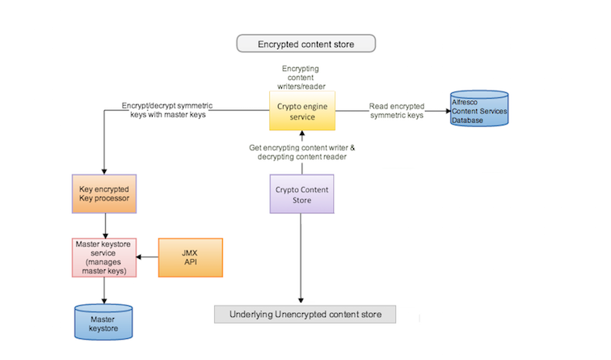

# Encrypted Content Store overview

This section explains Alfresco's implementation of Encrypted Content Store.

**Important:** Once you make the decision to use Encrypted Content Store, it is irrevocable. This is because when a document is written to the Encrypted Content Store, it is encrypted. If you decide to revert to an unencrypted content store, the content cannot be decrypted.

**Important:** If Encrypted Content Store is enabled on an existing or upgraded Alfresco installation, only new content will be encrypted but any existing content will not be encrypted.

**Alfresco cryptography process**

The Encrypted Content Store provides encryption at rest capability. This is done by scrambling plain text into cipher text \(encryption\) and then back again \(decryption\) with the help of symmetric and asymmetric keys.

When a document is written to the Encrypted Content Store, the Encrypted Content Store uses symmetric encryption to encrypt the document before it is written to the wrapped content store. A new symmetric key is generated each time a document is written to the content store. This means that every document in the system is encrypted with a different symmetric key. Further more, asymmetric encryption \(such as RSA\) is used to encrypt/decrypt those symmetric encryption/decryption keys. The asymmetric encryption uses a master key which is selected from a set of configured master keys.

The Encrypted content store encrypts content with a master key that is randomly selected from the pool of master keys. No control is provided for using a specific master key for a specific piece of content, as that would allow attackers to target specific master keys when attempting to access or tamper with content.

Alfresco uses a set of master keys, which are:

-   selected in a random fashion
-   stored in a password-protected keystore
-   can be retired, in the event of key theft or as part of a standard key retirement process. For more information, see [Encryption-related JMX operations](../tasks/encrypted-jmx.md).

The repository knows which master key was used to encrypt a given symmetric key so that when a user reads a particular document, the repository can decrypt the symmetric key \(using that master key\) and then use the decrypted symmetric key to decrypt the document content.

**Important:** Alfresco does not store the master key you provide. Instead, we access it from the keystore. If Alfresco cannot access that key, it cannot decrypt the content. So, make sure you maintain the master key and Alfresco has access to it. Otherwise, you will not be able to read the content.

The following diagram shows the application of Encrypted Content Store over your default Alfresco content store.

**Parent topic:**[Encrypted Content Store](../concepts/encrypted-cs-home.md)

