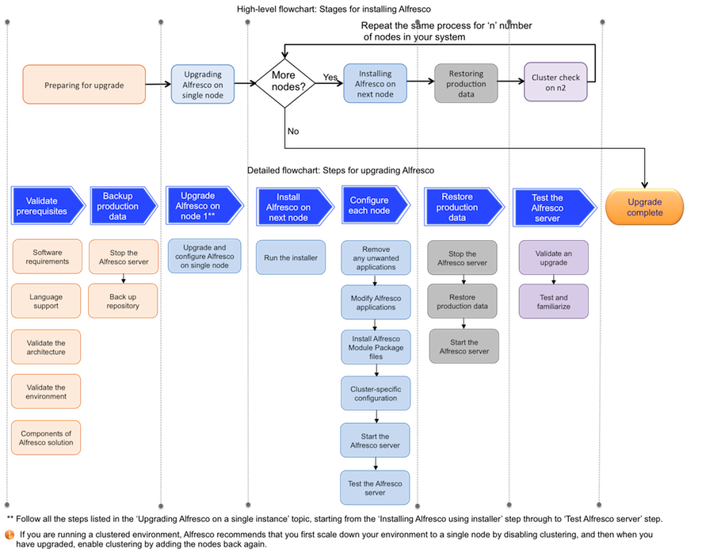

# Upgrading Alfresco in a distributed environment

This topic describes the steps for upgrading Alfresco in a distributed environment.

The main stages involved in installing Alfresco in a cluster are shown in the diagram. You must upgrade and configure your data on a single node first and then on the second node, and so on.

The main steps involved in the upgrading process include preparing your system for upgrade, [upgrading Alfresco on a single node](upgrade-singleinstance.md), installing Alfresco on node 2, restoring production data, and finally, testing and getting familiar to Alfresco. Repeat the last three steps on all the other nodes in your system in series.

Each of these main stages consist of sub-steps, as shown in the diagram, which displays the sub-steps that need to be performed in order to complete each main stage.

**Note:** Note that the steps shown in the diagrams have a colour code. For example, Restoring production data stage consists of three sub-steps, namely, Stop the Alfresco server, Restore production data, and Start the Alfresco server.

**Note:** Make sure you do not install and configure all the nodes in parallel. Follow in the installation process in series for all the nodes in your system.

**Note:** Alfresco recommends that you upgrade Alfresco in a test environment before you upgrade it in your production environment. This allows you to address any problems during the upgrade process more effectively. You can also verify that applications and scripts work properly before upgrading your production environment. In addition, you can assess the time that it takes to upgrade the database, to finalize your upgrade plan.

To get started quickly with upgrading Alfresco in a distributed environment, follow this process:

**Parent topic:**[QuickStart upgrading guide](../concepts/quick-upgrade.md)

