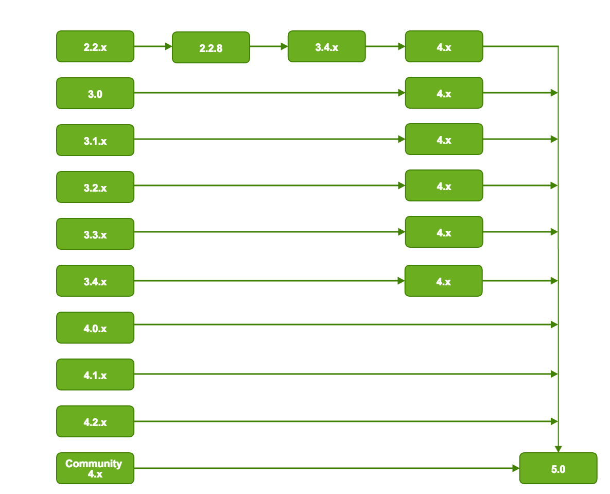

# Alfresco upgrade paths

When you upgrade Alfresco, it is recommended that you follow a structured upgrade path between versions.

The following diagram shows the upgrade paths for major versions:

 

The upgrade path recommendations are:

-   Upgrades from Alfresco 4.x using Lucene require migration to Solr 1.4 before being able to upgrade to Alfresco 5.0 with Solr1.4. Once Alfresco 5.0 and Solr1.4 are running, then migration to Alfresco 5.0 with Solr4 will complete the upgrade. See [Upgrading search subsystems](search-migration.md) for more information.
-   Direct upgrades to Alfresco 5.0 are supported from only 4.x and later, with the latest Service Pack applied.
-   Upgrades from Alfresco 3.x require the latest service pack of version 4.x before upgrading to version 5.0.
-   Upgrades from Alfresco 2.2.x require the service pack 2.2.8 to be applied first, followed by the latest service pack of version 3.4.x, and then the latest service pack of version 4.x before being able to upgrade to version 5.0.

**Note:** If you are upgrading from an earlier release that is not shown on this diagram, contact Support for assistance.

**Parent topic:**[Upgrading](../concepts/ch-upgrade.md)

