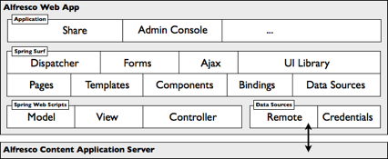
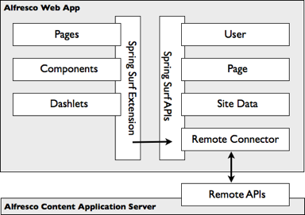
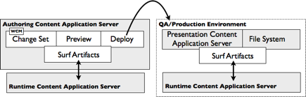

# Alfresco web application framework

Alfresco Share and all new Alfresco web applications are built on Alfresco Surf. This web application framework provides the typical features of this kind of framework and supports web content management needs.

At the heart of Alfresco Surf is a site assembly framework that bundles a full site construction object model and toolkit for building websites and applications.

Its features include:

-   A Site Dispatcher to create pages easily, link them to the overall navigation of a website, and build pages in a way that promotes reusability.
-   Templates for defining a page layout once and then reusing it across a large set of pages. You can develop pages using FreeMarker, JSP, HTML, or Java.
-   A UI Library containing reusable UI components comprising back-end application logic and front-end presentation code that can be bound into regions \(or slots\) within a page or template.
-   Pages that you can render in multiple formats, such as print, PDF, or mobile device.
-   AJAX support for integration with the Yahoo! User Interface \(YUI\) library.
-   Forms in a rich forms engine for rendering and collecting data.

Alfresco Surf embeds Spring web scripts, allowing developers to use the same techniques that were used when building Alfresco content application server RESTful APIs. Often, a Alfresco Surf website requires access to and management of content held within the application content server, such as to support user-generated content, dynamic site artifacts, personalized presentation, and tagging. To support this, Alfresco Surf provides the following integration services:

-   Remote: encapsulates any number of data sources with out-of-the-box support for the Alfresco content application server
-   Credentials: manages user authentication with out-of-the-box support for the Alfresco content application server

Alfresco Surf works with Alfresco web content management and provides virtualized content retrieval, preview, and test support for user sandboxes and web projects. Applications built with Alfresco Surf can be deployed from Alfresco web project spaces to production servers. To facilitate this, Alfresco Surf uses a lightweight XML-driven model to represent all site artifacts, such as pages, templates, themes, and chrome. This means that Alfresco services, such as change sets, preview, and deployment, can manage Alfresco Surf sites. In addition, an embedded API supports programmatic control of the same artifacts \(see the following figure\).

As Alfresco Surf sites are XML and file-based, they are easily managed in Alfresco WCM, as shown in the following figure:

It offers features such as:

-   Safe editing of all Alfresco Surf artifacts, including the ability to snapshot a site and roll it backward in time
-   Review and Approve workflow of Alfresco Surf site changes
-   Preview of site changes
-   Deployment of site changes to test or production servers

With the CMIS client API, Alfresco Surf provides an open stack for implementing web-based, content-enabled applications.

Alfresco 5.0 includes the new UI framework built on Alfresco Surf, [Aikau](aikau-intro.md). Aikau provides a modern, higher-level approach to developing custom UI applications, and features a simplified method for creating pages and widgets. New pages with standard widgets can be created through JSON code, and then extended as required using JavaScript.

**Parent topic:**[Alfresco architecture](../concepts/alfresco-arch-about.md)

**Related information**  

[Working with the Surf framework](surf-fwork-intro.md)

