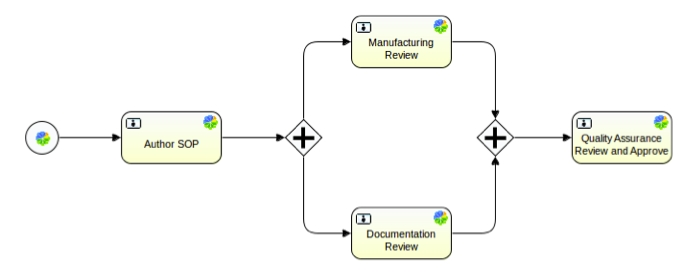

# Parallel gateways

A parallel gateway, models a fork into multiple paths of execution, or a join of multiple incoming paths of execution.

-   **fork**

    all outgoing sequence flows are followed in parallel, creating one concurrent execution for each sequence flow.

-   **join**

    all concurrent executions arriving at the parallel gateway wait at the gateway until execution has completed for each of the incoming sequence flows. The process then continues.

A parallel gateway can have both fork and join behavior, if there are multiple incoming and outgoing sequence flows for the same parallel gateway. In this case, the gateway will first join all the incoming sequence flows, before splitting into multiple concurrent paths of execution.

A parallel gateway does not evaluate conditions. If conditions are defined on the sequence flow connected with the parallel gateway, they are ignored.

The following diagram shows a definition with two parallel gateways.

The first gateway forks the flow of execution, generating two tokens for two review tasks. When these two tasks are completed, the second parallel gateway joins the two execution. Ssince there is only one outgoing sequence flow, no concurrent paths of execution will be created, and only the quality assurance task will be active.

Note that a parallel gateway does not need to be 'balanced'. You do not need to specify a matching number of incoming/outgoing sequence flows for corresponding parallel gateways.

**Parent topic:**[Gateways](../concepts/wf-process-def-gateways.md)

