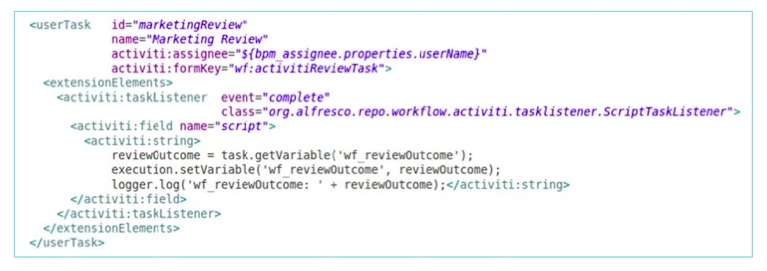

# Task listeners

A task listener must be added to a process definition within a user task. Note that the listener is a child of the BPMN 2.0 **extensionElements** element and is in the activiti namespace since a task listener is an Activiti BPMN 2.0 extension.

The following diagram shows an XML fragment from a process definition that contains Alfresco-specific task listener.

Listeners are described in detail in the Activiti user guide.

**Parent topic:**[Listeners](../concepts/wf-process-def-listeners.md)

**Related information**  

[Activiti user guide](http://www.activiti.org/userguide/)

