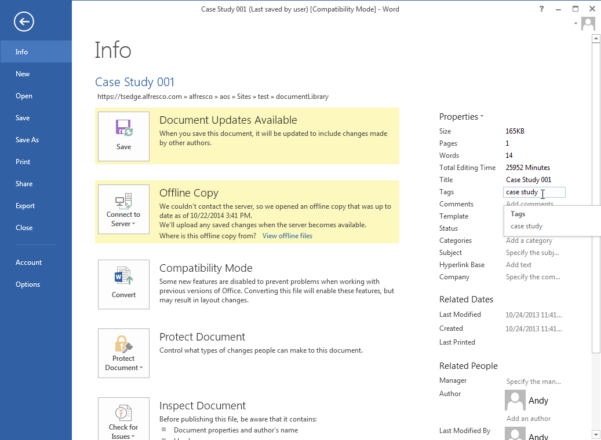

# Alfresco File Properties in Microsoft Office

Files stored in Alfresco can have lots of properties to help identify and track them. You can see these when you click the Info tab when you have a file open in Microsoft Office.

File properties can include things such as who created a file, the file title, and any categories or tags attributed to the file.

Your Alfresco administrator can choose to set up different content types. If they do then when you save a new file to Alfresco you'll be asked to select a content type to assign it to. The content type you select will give you the option to add additional content type-specific properties to the file.

You can change file properties when you have a file open in Microsoft Office by clicking on a property in the **Info** tab, or by selecting **File** then **Info**, then clicking **Properties** and selecting **Show Document Panel**. This shows the Document Panel above the open file, and you can modify file properties as required.

Some content types may require you to enter specific properties before you can even save a file; in these cases you'll receive a warning and a link to open the Document Panel.

Once you've saved the file you'll be able to see any changes you've made to the properties if you look at the file in Alfresco.

**Parent topic:**[Using Alfresco from Microsoft Office](../concepts/aos-user.md)

