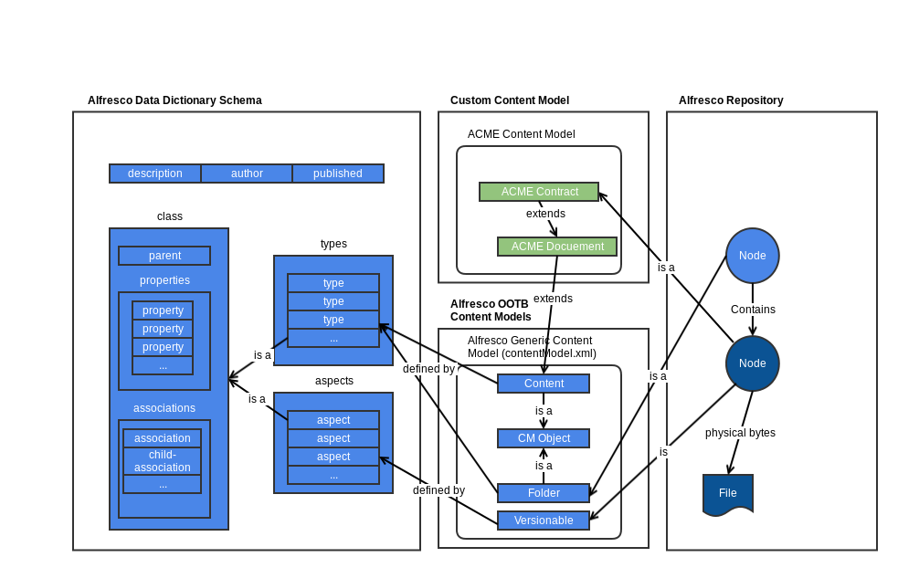
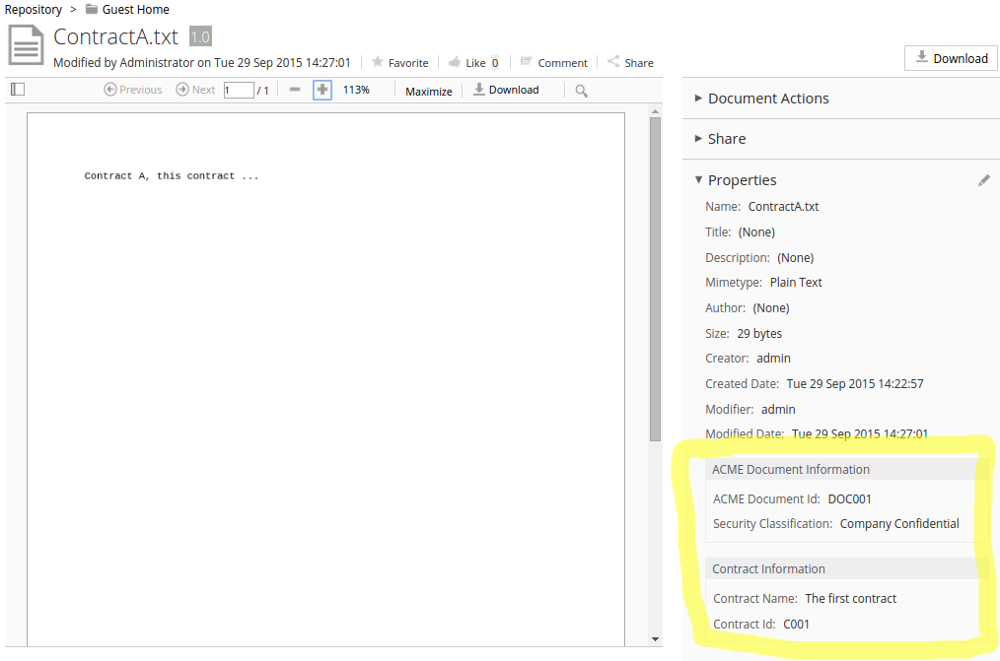
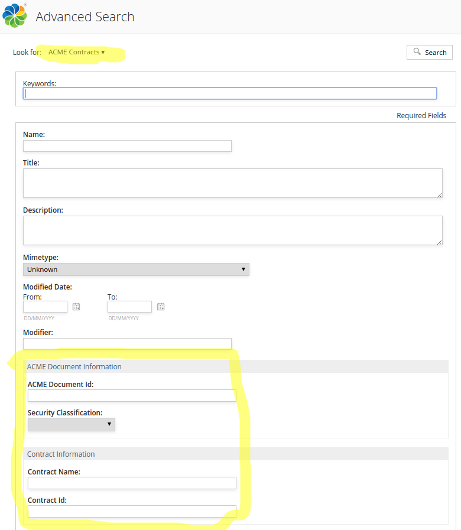

# Content Model

Defining a custom content model for the Alfresco Repository is a fundamental task in almost every content management project. It will allow you to build a robust system with content that can be classified, searched, structured, and processed in many different ways.

|Information|Content Model|
|-----------|-------------|
|Support Status|[Full Support](http://docs.alfresco.com/support/concepts/su-product-lifecycle.html)|
|Architecture Information|[Platform Architecture](../concepts/dev-platform-arch.md)|
|Description|One of the main differences between a network drive and a Content Management System \(CMS\) is that the latter provides extra classification features. If you look at a CMS behind the scenes, you can see that everything in the repository is typically a node \(a node is also sometimes referred to as an object\). Properties are then set on the nodes so they become folders, files, categories, rules, forums, web pages, e-mails, people, groups, and so on.

 Classifying nodes makes performing operations on them more precise, so it is easier to search for them, so they can be displayed in the user interface correctly, and node-specific operations can be carried out. The properties that can be used to classify nodes \(content\), cannot be selected at random, as then the system would not know what each one of these properties represents. Because of this a content management system usually comes preconfigured with properties that can be used to classify content in the repository. These properties are usually organized into two groups called *Types* and *Aspects*. The main difference between types and aspects is that a node can only have one type applied but it can have multiple aspects applied.

 Nodes are not isolated within the repository. They are related to one another in different ways. How the nodes are related to each other is defined using *Associations*. A typical association that comes out-of-the-box with Alfresco is the one between a folder node and its child nodes, this type of association is a `child-association`. So when you start using Alfresco you can immediately organize folders and files into a hierarchy, like with a file system.

 The Types, Aspects, Properties, and Associations are in turn organized into models that we call *Content Models*. Alfresco comes with a number of Content Models out of the box for different things like general folder and file content, workflow-related content, records content, web content, and so on.

 It is also useful to be able to create content models related to specific domains such as Finance or Marketing. As the type of content that may be stored in the repository can vary, generic standard content models are provided that provide a basis on which to build custom content models for domain-specific purposes.

 New types and aspects are defined forming new custom content models. But how do you know how to specify a type and a property with, for example, a data type integer? Alfresco also comes with a *Meta Model*. The Meta model defines what syntax you can use when defining your content models. It will, for example, define the syntax for how a type or an integer property should be defined. The following diagram gives a simplified overview of the relationship between Alfresco meta model, Alfresco content models, and custom content models:



 In the image, you can see two nodes in the repository: one folder node and one ACME Contract document node. The Contract type extends the ACME Generic Document type, or base type if you like, which in turn extends the Alfresco generic Content type. The Contract document node also has versioning turned on by having the Versionable aspect applied.

 Both the custom content model and the Alfresco content model is defined by the Alfresco Data Dictionary Schema, which is the same as the Meta Model.

 Content models, types, aspects, and properties are similar to object-oriented concepts in programming. If you are familiar with object-oriented modelling, then the concepts of content modelling should feel familiar.

 The Alfresco meta model contains the constructs or syntax that can be used to define content models, which are defined in XML.

 **Important:** From version 5.1 of Alfresco it is possible to create custom content models from the Alfresco Share UI without the need to use XML. These models can then be exported as XML and included in a build project. See the [Model Manager in Share Admin Tools documentation](../concepts/admintools-cmm-intro.md) for further information.

 The meta model is defined in an XML Schema definition file called modelSchema.xsd located in [this directory](https://github.com/Alfresco/community-edition/blob/master/projects/repository/config/alfresco/model), where you can also find the out-of-the-box content models. It is a good idea to load the schema file into your programming environment \(that is Eclipse, IDEA, and so on\) as it will then provide examples of the syntax when you create your own content models.

 A new custom content model starts with, you guessed it, a **`model`** element definition, which is the container for all other definitions as follows:

```
<?xml version="1.0" encoding="UTF-8"?>
<model name="acme:contentModel" xmlns="http://www.alfresco.org/model/dictionary/1.0">
   <description>Content model for the fictive company ACME</description>
   <author>Martin Bergljung</author>
   <version>1.0</version>
   <published>2015-09-01</published>
   <imports>...</imports>
   <namespaces>...</namespaces>
   <constraints>...</constraints>
   <types>...</types>
   <aspects>...</aspects>
</model>
```

 The order in which these elements are specified is important. It will not work to specify them in any other order than in this example. This is because in the meta model they are defined within a <xs:sequence\> element. This is true throughout the model schema so be careful to always use the elements in the right order.

 The **`imports`** definition is the container for import definitions of other content models referred to by the model being defined:

```
<imports>
    <!-- Import Alfresco Dictionary Definitions -->
    <import uri="http://www.alfresco.org/model/dictionary/1.0" prefix="d"/>
    <!-- Import Alfresco System Model Definitions -->
    <import uri="http://www.alfresco.org/model/system/1.0" prefix="sys"/>
    <!-- Import Alfresco Content Domain Model Definitions -->
    <import uri="http://www.alfresco.org/model/content/1.0" prefix="cm"/>
</imports>
```

This example imports the Data Dictionary model with all the `data-type` definitions, such as `d:text`. It also imports the system model with types such as `base`, `descriptor`, `container`, `reference`, and aspects such as `referenceable` and `temporary`. Finally you import the Alfresco generic content model \(cm\) with types such as `content` \(files\) and `folder` and aspects such as `versionable` and `dublincore`. As you can imagine, it is important to get familiar with the out-of-the-box content models so you do not start defining types and aspects that are already available.

 The **`namespaces`** definition is the container for all new custom namespace definitions that will be used by this model:

```
<namespaces>
   <namespace uri="http://www.acme.org/model/content/1.0" prefix="acme"/>
</namespaces>
```

This example defines the `namespace` for the new content model to `http://www.acme.org/model/content/1.0`. All definitions done in the model will be prefixed with `acme`. Any new name \(referred to as local name\) defined in the model for things like types, aspects, properties, etc. need to be unique. You could also define more than one namespace to be used in the model, such as in the following example:

```
<namespaces>
   <namespace uri="http://www.acme.org/model/content/1.0" prefix="acmec"/>
   <namespace uri="http://www.acme.org/model/workflow/1.0" prefix="acmew"/>
</namespaces>
```

Here, you have defined one namespace `acmec` that will be used for document content classification and another namespace `acmew` that will be used exclusively for workflow-related content. You could have the same local name in both these namespaces, such as `acmec:project` and `acmew:project`.

 A good idea is to use the following format for the URI:

```
http://<company website address>/model/[content|workflow|...]/1.0
```

 The **`constraints`** definition is the container for all new constraints to be used by the properties defined in the custom model. There are different types of constraints:

-   `LIST` = property value must match an entry in the list
-   `REGEXP` = property value must match the regular expression
-   `MIN-MAX` = property value must be numeric and within this range
-   `LENGTH` = property value must be a string and within `min` and `max` length
-   `java class` = a custom constraint implementation in the form of a Java class

The following is an example definition of a `LIST` constraint:

```
<constraints>
   <constraint name="acme:securityClassificationOptions" type="LIST">
      <parameter name="allowedValues">
            <list>
                <value></value> <!-- Empty for default search -->
                <value>Public</value>
                <value>Client Confidential</value>
                <value>Company Confidential</value>
                <value>Strictly Confidential</value>
            </list>
      </parameter>
   </constraint>
```

 The following is a `LENGTH` constraint example:

```
<constraints>
   <constraint name="acme:summary" type="LENGTH">
      <parameter name="minLength">
         <value>5</value>
      </parameter>
      <parameter name="maxLength">
         <value>100</value>
      </parameter>
   </constraint>
```

 And here is an example of a `MINMAX` constraint:

```
<constraints>
   <constraint name="acme:percentage" type="MINMAX">
      <parameter name="minValue">
         <value>0</value>
      </parameter>
      <parameter name="maxValue">
         <value>100</value>
      </parameter>
   </constraint>
```

 A regular expression \(`REGEXP`\) constraint looks like this:

```
<constraints>
   <constraint name="acme:contractIdFormat" type="REGEX">
      <parameter name="expression">
         <value><![CDATA[[^C\d{3}$]]></value>
      </parameter>
      <parameter name="requiresMatch">
         <value>true</value>
      </parameter>
   </constraint>
```

 Finally, you can define custom constraint implementations by supplying a Java class with the implementation. Here is an example from the out-of-the-box generic content model \(contentModel.xml\):

```
<constraints>
   <constraint name="cm:userNameConstraint" type="org.alfresco.repo.dictionary.constraint.UserNameConstraint" />
```

Being able to implement your own constraints is useful as it is common to want to set a property from a dynamic list of values, such as a 'project name'. It might not be possible to use a static `LIST` constraint for project names as new projects might be created frequently. And you do not want users to type in the project name manually as then you might get more than one version of the project name present in the repository, making search unpredictable.

 These constraints will have an effect on what controls and validation that are generated for the user interface \(that is for the Alfresco Share UI\).

 The **`types`** definition is the container for all new custom `type` definitions. A type models an object in the specific domain that your are implementing a content management solution for. This could be for example a project, marketing document, engineering drawing, software manual, legal case, book, chapter and so on. Remember also that an item \(node\) in the repository, such as a file or a folder, can only be assigned one type.

 Here are a couple of examples of how to define new types:

```
<types>
        <!--
            ACME Enterprise-wide Document root type.
            All other custom document types should extend this one.
        -->
        <type name="acme:document">
            <title>Base document type</title>
            <parent>cm:content</parent>
            <properties>
                <property name="acme:documentId">
                    <title>Document Identification Number</title>
                    <type>d:text</type>
                </property>
            </properties>
            <mandatory-aspects>
                <aspect>acme:securityClassified</aspect>
            </mandatory-aspects>
        </type>

        <type name="acme:contract">
            <title>Contract document</title>
            <parent>acme:document</parent>
            <properties>
                <property name="acme:contractName">
                    <title>Contract Name</title>
                    <type>d:text</type>
                    <mandatory>true</mandatory>
                </property>
                <property name="acme:contractId">
                    <title>Contract Identification Number</title>
                    <type>d:text</type>
                    <constraints>
                        <constraint ref="acme:contractIdFormat" />
                    </constraints>
                </property>
            </properties>
        </type>
        
        <!-- A folder can have this type applied to represent a project container. -->
        <type name="acme:project">
            <title>Project folder</title>
            <parent>cm:folder</parent>
            <properties>
                <property name="acme:projectName">
                    <type>d:text</type>
                    <mandatory>true</mandatory>
                </property>
                <property name="acme:projectDescription">
                    <type>d:text</type>
                </property>
                <property name="acme:projectStartDate">
                    <type>d:date</type>
                </property>
            </properties>
            <associations>
                <!-- Setup a child-association from the type folder to zero or more members.
                     Note. peer associations are not indexed and searchable, so using child-association instead.
                 -->
                <child-association name="acme:projectMember">
                    <source>
                        <mandatory>false</mandatory>
                        <many>true</many>
                    </source>
                    <target>
                        <class>cm:person</class>
                        <mandatory>false</mandatory>
                        <many>true</many>
                    </target>
                    <duplicate>false</duplicate>
                    <propagateTimestamps>false</propagateTimestamps>
                </child-association>
            </associations>
            <mandatory-aspects>
                <aspect>acme:projectIdentifier</aspect>
            </mandatory-aspects>
        </type>
</types>
```

Here you have first defined a base document type called `acme:document` that all your custom document types should extend. This is good practice as it allows you to search for all documents classified in some way as ACME documents, it will for example match the next type in the model called `acme:contract`, which extends the `acme:document` type. A base document type is also useful for keeping metadata that is applicable to all documents in the enterprise, such as some form of document identifier \(that is `acme:documentId`\) and security classification \(that is `acme:securityClassified`\).

 Note how the base type extends the out-of-the-box type `cm:content`. All types that should be applied to files need to eventually extend this type, and it in turn extends the `cm:cmobject` type, which has properties such as `cm:name` \(the name of the file or folder\), `cm:created`, `cm:creator`, `cm:modified`, and `cm:modifier`. The last four properties belong to the `cm:auditable` aspect, which is mandatory on the `cm:cmobject` type. The auditable properties are managed by the system and when you for example upload a file the created date will be set to now, not to when the file was initially created.

 **Important:** If you want the file to have the created date set to when the file was actually created, then you can use the Alfresco Bulk Import tool, which turns off the automatic system management of these properties, and grabs the file metadata instead.

 The last type that is defined is called `acme:project` and it extends the out-of-the-box type `cm:folder`, which extends the `cm:cmobject` type described previously. So you can actually use folders to represent objects such as a project, a legal case, or other "container" objects. Being able to classify folders according to a specific domain is particularly useful as you can then also create "auto-classifying" rules for the folder. These rules would classify any files dropped into the folder according to the folders type and properties. Which means that you get files automatically classified without the end-user having to fill anything in.

 The following table explains the sub-elements of the `type` element \(note that they are the same for an `aspect`\):

|Name|Type|Multiplicity|Description|
|----|----|------------|-----------|
|`name`|attribute \(string\)

|required|The name of the type including namespace and local name, such as `acme:project`|
|`title`

|element \(string\)

|\[0..1\]|The title of the type, will be used in the user interface if there are no i18n resources available.|
|`description`

|element \(string\)

|\[0..1\]|The description of the type, useful for documentation purposes.|
|`parent`

|element \(string\)

|\[0..1\]|Reference to another type that this type extends. Single inheritance is supported. A type usually extends the out-of-the-box `cm:content` type if it should be applied to files uploaded to the repository, and `cm:folder` if it should be applied to new folders in the repository.|
|`archive`

|element \(boolean\)

|\[0..1\]|-   `true` = content with this type should be archived when deleted. This means that it will end up in the Archive Store and it can be restored from the recycle bin. \(default\)
-   `false` = content with this type is not archived when deleted and is therefore permanently gone and can never be restored.

|
|`properties`

|element container

|\[0..1\]|Container for all custom properties that make up the metadata for this type.|
|`associations`

|element container

|\[0..1\]|Container for all parent-child and peer associations for this type. Such as the `acme:projectMember` child association that has been defined for the `cm:project` type.|
|`overrides`

|element container

|\[0..1\]|Property overrides of super type class properties. You can only override the `default` value, `mandatory` parameter, and `constraints` definitions for a property.

 It is quite common to override type properties when working with workflow content models, such as in the following example:

 ```
<type name="scwf:activitiRevise">
   <parent>bpm:activitiOutcomeTask</parent>
   <properties>
      <property name="scwf:reviseOutcome">
         <type>d:text</type>
         <default>Abort</default>
         <constraints>
            <constraint type="LIST">
               <parameter name="allowedValues">
                  <list>
                     <value>Re-submit</value>
                     <value>Abort</value>
                  </list>
               </parameter>
            </constraint>
         </constraints>
      </property>
   </properties>               
   <overrides>
      <property name="bpm:packageItemActionGroup">
         <default>edit_package_item_actions</default>
      </property>
      <property name="bpm:outcomePropertyName">
         <default>{http://www.someco.com/model/workflow/1.0}reviseOutcome</default>
      </property>
   </overrides>
</type>
```

 It is also common to do this for aspects. For example, the `cm:titled` aspect that is available out-of-the-box provides 2 properties to set the title and description for a node. These are non-mandatory properties.

 If you wanted to always have these properties as mandatory on types, then you could define your own titled aspect as follows:

```
<aspect name="acme:titled">
    <title>Titled</title>
    <parent>cm:titled</parent>
    <overrides>
       <property name="cm:title">
          <mandatory>true</mandatory>
       </property>
       <property name="cm:description">
          <mandatory>true</mandatory>
       </property>
    </overrides>
</aspect>
```

As the custom `acme:titled` aspect extends the out of the box `cm:titled` aspect it will work in all searches done on `cm:titled`.

|
|`mandatory-aspects`

|element container

|\[0..1\]|Mandatory aspects for this type. When content is created with this type applied, then these aspects will also be applied automatically.|

 The type `properties`, and also the aspect `properties` as we will see, play a central part of the content model definition as they depict the so called *metadata* that should be stored together with the file or the folder. Metadata is very important in a content management solution as it will determine what you can search on, create rules around, base policies on etc.

 The following table describes all the parameters that can be used when defining a new `property`\(metadata\) for a type or aspect:

 |Name|Type|Multiplicity|Description|
|----|----|------------|-----------|
|`name`|attribute \(string\)

|required|The name of the property. The name has to be unique between all types, aspects, constraints and so on that are defined in the namespace. It is different from object-oriented programming where a member variable of one class can be named the same as in another class.|
|`title`

|element \(string\)

|\[0..1\]|The title of the property. Will be used in the user interface as field label if there are no i18n resources available.|
|`description`

|element \(string\)

|\[0..1\]|The description of the property, useful for documentation purposes.|
|`type`

|element \(string\)

|\[1..1\]|Mandatory data type reference. This references a `data-type` definition in the dictionaryModel.xml content model. Here are some of the most commonly used data types: ```
d:text, d:int, d:long, d:float, d:double, d:date, d:datetime, d:boolean, d:encrypted, d:noderef
```

|
|`protected`

|element \(boolean\)

|\[0..1\]|-   `true` = this property cannot be edited after the value has been set. And it cannot be edited at all from the user interface \(that is Alfresco Share\). This is usually used for system properties such as `cm:created`, `cm:creator`. They are set by the system and can then not be touched. It is sometimes also used in custom content models to make a property read-only after it has been initially set via an API call.
-   `false` = the property can be updated as many times as you like. This is the default if this element is not specified.

|
|`mandatory`

|element \(boolean\)

|\[0..1\]|-   `true` = when a property is set as mandatory it tells Alfresco that the property is required. By default, this is not enforced. Instead, Alfresco marks content items with empty mandatory properties with the aspect `sys:incomplete`. This is done so that you can create items in Alfresco that have mandatory properties even if the value of the property is not known at the time of content creation, while still indicating that the property is required \(eventually\). Mandatory properties will have a \* next to them in the UI.
-   `false` = it is optional and this is the default if this element is not specified.

The `mandatory` element can also have a `boolean` attribute called `enforced`. If this is set to `true` then you cannot create a node without this property having a value.


|
|`multiple`

|element \(boolean\)

|\[0..1\]|-   `true` = this property can have a list of values.
-   `false` = only one value can be entered and this is the default if this element is not specified.

|
|`default`

|element \(any\)|\[0..1\]|Default value for this property if the user does not specify any value. The UI input field will be pre-populated with this value.|
|`index`

|element

|\[0..1\]|Solr/Lucene index configuration. The indexing behaviour of each property can be configured. If we do not configure any indexing behaviour then the default configuration is: ```
<index enabled="true">
   <atomic>true</atomic>
   <stored>false</stored>
   <tokenised>true</tokenised>
</index>
```

This basically means that the default index configuration for properties is as follows: -   Index the value of the property \(`enabled="true"`\)
-   Atomic is not used when Alfresco uses Solr for search. The default value is there to allow the continued use of the built in Lucene indexing engine when customers do not want to or cannot switch to Solr.
-   The property value is not stored in the index \(`<stored>false</stored>`\)
-   The property value is tokenized when it is indexed \(`<tokenized>true</tokenized>`\), so if the value is "Company Confidential" it will be tokenized into two strings that will be indexed separately, which might not always be what you want. You can also use `false`, which will just tokenize the value as one item. Further on, it also possible to set it to `both`, which means that "Company Confidential", "Company", and "Confidential" will be in the index.

There is also another sub-element that can be specified for the `index` element. It is called `facetable` and controls the faceting behaviour in Solr as follows: -   `<facetable>true</facetable>` = property is set up properly in Solr for faceting and is really fast, ordered, and sorted
-   `<facetable>false</facetable>` = property is not facetable, that is, you cannot create a facet from this property. In some cases it makes no sense to make a property facetable, for example if it is a unique property. Note that setting facetable to false will not save resources.
-   Unspecified as above \(default\) = faceting works but not as fast and efficient as when this element is explicitly specified and set to `true`.

|
|`constraints`

|element

|\[0..1\]|Container for property constraints.|

 The last thing that is defined in the model are the `**aspects**`. The definition of an aspect does not differ much from a type definition. In fact, in the schema they are both based on the same `class` definition. The main difference between an aspect and a type is that a content node can have multiple aspects applied to it but only one type applied to it. This is important to think about when you decide if you should use an aspect or a type in the model.

 One way of deciding if a domain object should be modelled as a type or an aspect is to think about if it is a *noun* or a *verb*. For example, a Legal document could be modelled as a type and a CAD drawing could be modelled as a type. And it is quite clear that it does not make much sense to apply both the legal document type and the CAD drawing type to the same file content item. Now, both these types of documents could be emailed into the system and if we wanted to model that it would probably be best done with an aspect called for example emailed. You might also want to version both of these types of documents. So it make sense to have a versioned aspect. You could then apply both the versioned and emailed aspects to for example a Legal document.

 Now, it is necessary to look at dealing with nouns such as client and supplier. If you model them as types you could have problems, as many different file nodes could be related to a client. For example, a Legal document and a CAD drawing could both be related to them same client, so if you modelled *client* as a type you could not classify a document as both Legal and being associated with a specific client. So in this case client and supplier would be better off modelled as aspects so they can both be applied to a node that already has a type applied.

 Another implementation difference between types and aspects is that an aspect does not extend another aspect, it is more common for them to be stand alone. Aspects are used to implement cross-cutting concerns independently of the type of node. Note that there are a number of aspects already available out of the box, for example the aspects mentioned above, `emailed` and `versionable` are already available out-of-the-box. The following is a list of some of the aspects that comes with Alfresco out-of-the-box:

 -   cm:titled
-   cm:auditable
-   cm:transformable
-   cm:templatable
-   cm:projectsummary
-   cm:complianceable
-   cm:author
-   cm:dublincore
-   cm:partable
-   cm:referencing
-   cm:replaceable
-   cm:effectivity
-   cm:summarizable
-   cm:countable
-   cm:copiedfrom
-   cm:workingcopy
-   cm:checkedOut
-   cm:versionable
-   cm:lockable
-   cm:subscribable
-   cm:classifiable
-   cm:taggable
-   cm:rateable
-   cm:attachable
-   cm:emailed
-   cm:geographic

 It is always preferable to use out-of-the-box aspects where possible.

 The following is an example of a custom aspect definition:

 ```
<aspect name="acme:securityClassified">
   <title>Security Classified</title>
   <description>Content has been security classified</description>
   <properties>
       <property name="acme:securityClassification">
           <type>d:text</type>
           <index enabled="true">
               <atomic>true</atomic>
               <stored>false</stored>
               <tokenised>false</tokenised>
               <facetable>true</facetable>
           </index>
           <constraints>
               <constraint ref="acme:securityClassificationOptions" />
           </constraints>
       </property>
   </properties>
</aspect>

<aspect name="acme:webPublished">
   <title>Web published</title>
   <description>Content has been published to website</description>
   <properties>
       <property name="acme:publishedDate">
           <type>d:datetime</type>
           <mandatory>true</mandatory>
       </property>
   </properties>
</aspect>
```

 Here an aspect has been defined to keep track of the security classification for content items. Any ACME document can have a security classification applied and you can then build rules, policies, processing and other entities based on these security classifications. Faceted search has been specifically enabled for best performance and the default `tokenized` value has also changed to `false` so you only index the whole value, such as "Company Confidential".

 There is also a simple `webPublished` aspect that could be used to indicate if a content item has been published on the web.

 After completing the aspect definitions you have almost finished the content model implementation. The only thing left to do is to bootstrap the content model into the Alfresco Repository. The content model can be bootstrapped and registered automatically via a Spring bean definition as follows:

 ```
<bean id="org.alfresco.tutorial.customcontentmodelrepo.dictionaryBootstrap"
   parent="dictionaryModelBootstrap"
   depends-on="dictionaryBootstrap">
   <property name="models">
      <list>
         <value>alfresco/module/<module-id>/model/content-model.xml</value>
      </list>
   </property>
</bean>
```

 The key is to define a Spring bean that extends \(sets as parent\) the out-of-the-box `dictionaryModelBootstrap` Spring bean. You also want your custom model to be bootstrapped after the out-of-the-box content models as you use them in your model. This is achieved via the `depends-on` definition. You specify the models that you want to bootstrap as a list contained in the `models` property.

 **Important:** A model cannot be contained in multiple XML files. The whole model needs to be deployed in one go, otherwise the next deployment overwrites the previous one. If your content model is very large then consider splitting it into multiple namespaces, such as document content model \(`acme:contentModel`\) and workflow content model \(`acmew:workflowModel`\) and deploy with multiple XML files.

 So you now have a content model defined in XML and registered with the Alfresco Repository. It is now possible to use one of the Alfresco APIs to create a node with a type from this content model, and one or more aspects applied from the model. Doing this via the Java API would for example look something like this:

 ```
private void createContractFile() {
  String acmeModelURI = "http://www.acme.org/model/content/1.0";
  String filename = "ContractA.txt";
  NodeRef parentFolderNodeRef =
          serviceRegistry.getNodeLocatorService().getNode(CompanyHomeNodeLocator.NAME, null, null);

  // Create Node
  QName associationType = ContentModel.ASSOC_CONTAINS;
  QName associationQName = QName.createQName(NamespaceService.CONTENT_MODEL_1_0_URI,
          QName.createValidLocalName(filename));
  QName nodeType = ContentModel.TYPE_CONTENT;
  Map<QName, Serializable> nodeProperties = new HashMap<QName, Serializable>();
  nodeProperties.put(ContentModel.PROP_NAME, filename);
  nodeProperties.put(QName.createQName(acmeModelURI, "documentId"), "DOC001");
  nodeProperties.put(QName.createQName(acmeModelURI, "securityClassification"), "Company Confidential");
  nodeProperties.put(QName.createQName(acmeModelURI, "contractName"), "The first contract");
  nodeProperties.put(QName.createQName(acmeModelURI, "contractId"), "C001");
  ChildAssociationRef parentChildAssocRef = serviceRegistry.getNodeService().createNode(
          parentFolderNodeRef, associationType, associationQName, nodeType, nodeProperties);

  NodeRef newFileNodeRef = parentChildAssocRef.getChildRef();

  // Set content for node
  boolean updateContentPropertyAutomatically = true;
  ContentWriter writer = serviceRegistry.getContentService().getWriter(newFileNodeRef, ContentModel.PROP_CONTENT,
          updateContentPropertyAutomatically);
  writer.setMimetype(MimetypeMap.MIMETYPE_TEXT_PLAIN);
  writer.setEncoding("UTF-8");
  String fileContent = "Contract A, this contract ...";
  writer.putContent(fileContent);

  // Add an aspect to the node
  Map<QName, Serializable> aspectProperties = new HashMap<QName, Serializable>();
  aspectProperties.put(QName.createQName(acmeModelURI, "publishedDate"), new Date());
  serviceRegistry.getNodeService().addAspect(newFileNodeRef, QName.createQName(acmeModelURI, "webPublished"), aspectProperties);
}
```

 In this case you are creating an ACME Contract document file. You set the properties for the security classification aspect when you create the Contract node as it is a mandatory aspect on the Contract type. If you want to add other aspects you can do that as shown for the `webPublished` aspect.

 What you have not yet done is configure the Alfresco Share UI to be able to display information related to your custom ACME content model. The Contract document you created with the above Java code would not be displayed in the Share UI as anything else then a standard generic document. You would not be able to see that it is actually an ACME Contract document. Also, there would not be any way of searching specifically for ACME Contract documents from the UI, such as from the Advanced Search page.

 To make the new custom content model known to the Share UI you have to do some additional configuration. If you wanted to see Contract document information as follows:

 

 Then you would have to configure a view form as follows:

 ```
<config evaluator="node-type" condition="acme:contract">
  <forms>
      <!-- Default form configuration -->
      <form>
          <field-visibility>
              <show id="cm:name" />
              <show id="cm:title" force="true" />
              <show id="cm:description" force="true" />
              <show id="mimetype" />
              <show id="cm:author" force="true" />
              <show id="size" for-mode="view" />
              <show id="cm:creator" for-mode="view" />
              <show id="cm:created" for-mode="view" />
              <show id="cm:modifier" for-mode="view" />
              <show id="cm:modified" for-mode="view" />

              <!-- tags and categories -->
              <show id="cm:taggable" for-mode="edit" force="true" />
              <show id="cm:categories" />

              <!-- cm:dublincore aspect -->
              <show id="cm:publisher"/>
              <show id="cm:contributor"/>
              <show id="cm:type"/>
              <show id="cm:identifier"/>
              <show id="cm:dcsource"/>
              <show id="cm:coverage"/>
              <show id="cm:rights"/>
              <show id="cm:subject"/>

              <!-- cm:complianceable aspect -->
              <show id="cm:removeAfter" />

              <!-- cm:effectivity aspect -->
              <show id="cm:from"/>
              <show id="cm:to"/>

              <!--  cm:summarizable aspect -->
              <show id="cm:summary" />

              <!-- cm:translatable aspect -->
              <show id="cm:translations" />

              <!-- cm:localizable aspect -->
              <show id="cm:locale" />

              <!-- cm:ownable aspect -->
              <show id="cm:owner" />

              <!-- cm:attachable aspect -->
              <show id="cm:attachments" />

              <!-- cm:emailed aspect -->
              <show id="cm:originator" />
              <show id="cm:addressee" />
              <show id="cm:addressees" />
              <show id="cm:sentdate" />
              <show id="cm:subjectline" />

              <!-- exif:exif aspect -->
              <show id="exif:dateTimeOriginal" />
              <show id="exif:pixelXDimension" />
              <show id="exif:pixelYDimension" />
              <show id="exif:exposureTime" />
              <show id="exif:fNumber" />
              <show id="exif:flash" />
              <show id="exif:focalLength" />
              <show id="exif:isoSpeedRatings" />
              <show id="exif:manufacturer" />
              <show id="exif:model" />
              <show id="exif:software" />
              <show id="exif:orientation" />
              <show id="exif:xResolution" />
              <show id="exif:yResolution" />
              <show id="exif:resolutionUnit" />

              <!-- audio:audio aspect -->
              <show id="audio:album" />
              <show id="audio:artist" />
              <show id="audio:composer" />
              <show id="audio:engineer" />
              <show id="audio:genre" />
              <show id="audio:trackNumber" />
              <show id="audio:releaseDate" />
              <show id="audio:sampleRate" />
              <show id="audio:sampleType" />
              <show id="audio:channelType" />
              <show id="audio:compressor" />

              <!-- cm:indexControl aspect -->
              <show id="cm:isIndexed" />
              <show id="cm:isContentIndexed" />

              <!-- cm:geographic aspect -->
              <show id="cm:latitude" />
              <show id="cm:longitude" />

              <!-- surf:widget aspect -->
              <show id="surf:widgetType"/>
              <show id="surf:mid"/>
              <show id="surf:label"/>

              <show id="acme:documentId" force="true"/>
              <show id="acme:securityClassification" />
              <show id="acme:contractName" />
              <show id="acme:contractId" />
          </field-visibility>
          <appearance>
              <field id="cm:name">
                  <control>
                      <control-param name="maxLength">255</control-param>
                  </control>
              </field>
              <field id="cm:title">
                  <control template="/org/alfresco/components/form/controls/textfield.ftl" />
              </field>
              <field id="cm:description">
                  <control>
                      <control-param name="activateLinks">true</control-param>
                  </control>
              </field>
              <field id="mimetype">
                  <control template="/org/alfresco/components/form/controls/mimetype.ftl" />
              </field>
              <field id="size">
                  <control template="/org/alfresco/components/form/controls/size.ftl" />
              </field>
              <field id="cm:taggable">
                  <control>
                      <control-param name="compactMode">true</control-param>
                      <control-param name="params">aspect=cm:taggable</control-param>
                      <control-param name="createNewItemUri">/api/tag/workspace/SpacesStore</control-param>
                      <control-param name="createNewItemIcon">tag</control-param>
                  </control>
              </field>
              <field id="cm:categories">
                  <control>
                      <control-param name="compactMode">true</control-param>
                  </control>
              </field>
              <field id="cm:originator" read-only="true" />
              <field id="cm:addressee" read-only="true" />
              <field id="cm:addressees" read-only="true" />
              <field id="cm:sentdate" read-only="true" />
              <field id="cm:subjectline" read-only="true" />

              <set id="acmeDocSet" appearance="bordered-panel" label-id="form.set.label.acme.document"/>
              <field id="acme:documentId"  label-id="form.field.label.acme.documentId" set="acmeDocSet">
                  <control template="/org/alfresco/components/form/controls/textfield.ftl"/>
              </field>
              <field id="acme:securityClassification" label-id="form.field.label.acme.securityClassification" set="acmeDocSet"/>

              <set id="contractDocSet" appearance="bordered-panel" label-id="form.set.label.acme.contract"/>
              <field id="acme:contractName"  label-id="form.field.label.acme.contractName" set="contractDocSet"/>
              <field id="acme:contractId" label-id="form.field.label.acme.contractId" set="contractDocSet"/>
          </appearance>
      </form>
  </forms>
</config>
```

 This is a copy of the view and edit form for the standard generic `cm:content` file type, with the additional ACME content model properties organized into two groups at the end. Configuring this form does not actually help out in being able to change the type for a file in the Repository.

 To change the type of a file from the Share UI you need to do some more configuration to make the custom types and aspects known:

 ```
<config evaluator="string-compare" condition="DocumentLibrary">
  <aspects>
      <visible>
          <aspect name="acme:webPublished"/>
          <aspect name="acme:securityClassified"/>
          <aspect name="acme:projectIdentifier"/>
      </visible>
      <addable> <!-- defaults to visible config -->
      </addable>
      <removeable> <!-- defaults to visible config -->
      </removeable>
  </aspects>
  <types>
      <type name="cm:folder">
          <subtype name="acme:project"/>
      </type>
      <!-- First define the ACME base doc type as decedent from cm:content -->
      <type name="cm:content">
          <subtype name="acme:document"/>
      </type>
      <!-- Then the ACME sub-types -->
      <type name="acme:document">
          <subtype name="acme:contract"/>
          <subtype name="acme:policy"/>
          <subtype name="acme:whitePaper"/>
      </type>
  </types>
</config>
```

 This configuration makes the custom ACME types and aspects visible in the "Change Type" and "Manage Aspects" user interface actions. Note that when you change type for a content file you will have to do it in steps, you can not change a file with type `cm:content` directly to `acme:contract`, you have to first change type to `acme:document`, and then to `acme:contract`. Now, if you wanted to be able to search for files with the ACME Contract type applied and do this directly from the Advanced Search form, such as in the following picture:

 

 Then you would have to add additional configuration as follows:

 ```
&lt;config evaluator="string-compare" condition="AdvancedSearch" replace="true">
  &lt;advanced-search>
      &lt;forms>
          &lt;form labelId="form.label.advancedsearch.acmeContract"
                descriptionId="form.description.advancedsearch.acmeContract">acme:contract
          &lt;/form>
      &lt;/forms>
  &lt;/advanced-search>
&lt;/config>

&lt;config evaluator="model-type" condition="acme:contract">
  &lt;forms>
      &lt;form id="search">
          &lt;field-visibility>
              &lt;show id="cm:name" />
              &lt;show id="cm:title" force="true" />
              &lt;show id="cm:description" force="true" />
              &lt;show id="mimetype" />
              &lt;show id="cm:modified" />
              &lt;show id="cm:modifier" />

              &lt;show id="acme:documentId" force="true"/>
              &lt;show id="acme:securityClassification" />
              &lt;show id="acme:contractName" />
              &lt;show id="acme:contractId" />
          &lt;/field-visibility>
          &lt;appearance>
              &lt;field id="mimetype">
                  &lt;control template="/org/alfresco/components/form/controls/mimetype.ftl" />
              &lt;/field>
              &lt;field id="cm:modifier">
                  &lt;control>
                      &lt;control-param name="forceEditable">true&lt;/control-param>
                  &lt;/control>
              &lt;/field>
              &lt;field id="cm:modified">
                  &lt;control template="/org/alfresco/components/form/controls/daterange.ftl" />
              &lt;/field>

              &lt;set id="acmeDocSet" appearance="bordered-panel" label-id="form.set.label.acme.document"/>
              &lt;field id="acme:documentId"  label-id="form.field.label.acme.documentId" set="acmeDocSet">
                  &lt;control template="/org/alfresco/components/form/controls/textfield.ftl"/>
              &lt;/field>
              &lt;field id="acme:securityClassification" label-id="form.field.label.acme.securityClassification" set="acmeDocSet"/>

              &lt;set id="contractDocSet" appearance="bordered-panel" label-id="form.set.label.acme.contract"/>
              &lt;field id="acme:contractName"  label-id="form.field.label.acme.contractName" set="contractDocSet"/>
              &lt;field id="acme:contractId" label-id="form.field.label.acme.contractId" set="contractDocSet"/>
          &lt;/appearance>
      &lt;/form>
  &lt;/forms>
&lt;/config>
```

 Here you are configuring the `acme:contract` type to be available in the Advanced Search page and you also configure the search form that should be used.

|
|Deployment - App Server|-   Content Model Definition: tomcat/shared/classes/alfresco/extension/myContentModel.xml \(File name can be anything you like as long as you refer to it in the Spring context file\)
-   Content Model Bootstrap: tomcat/shared/classes/alfresco/extension/my-content-model-context.xml \(File name has to end in -context.xml to be picked up as Spring Bean context file\)
-   Share UI configuration: tomcat/shared/classes/alfresco/web-extension/share-config-custom.xml

 These file locations are untouched by re-deployments and upgrades.|
|[Deployment Repo Content Model - SDK Project](../tasks/alfresco-sdk-tutorials-amp-archetype.md)

 [Deployment Share Config - SDK Project](../tasks/alfresco-sdk-tutorials-share-amp-archetype.md)

|-   Content Model Definition: repo-amp/src/main/amp/config/alfresco/module/repo-amp/model/content-model.xml
-   Content Model Bootstrap: repo-amp/src/main/amp/config/alfresco/module/repo-amp/context/bootstrap-context.xml
-   Share UI configuration: share-amp/src/main/resources/META-INF/share-config-custom.xml

 To implement and deploy a content model with full UI support you need both a Repo AMP and a Share AMP project.|
|More Information|-   [Out-of-the-box Content Models](../concepts/content-model-preconfigured.md)
-   [Deploying/Bootstrapping Content Models](../concepts/content-model-deploy.md)
-   [Displaying types](../tasks/forms-type-display.md)
-   [Displaying aspects](../tasks/forms-aspect-display.md)
-   [Grouping fields in forms](../tasks/forms-grouping-fields.md)
-   [Model Manager in Share Admin Tools](../concepts/admintools-cmm-intro.md)
-   [Data Lists content models](dev-extension-points-data-lists.md)

|
|Sample Code|-   [A complete ACME content model implementation.](https://github.com/Alfresco/alfresco-sdk-samples/tree/alfresco-50/all-in-one/custom-content-model-repo)
-   [Share UI configuration for the ACME content model implementation.](https://github.com/Alfresco/alfresco-sdk-samples/tree/alfresco-50/all-in-one/custom-content-model-share)
-   [Example of how to test your custom content model implementation.](https://github.com/Alfresco/alfresco-sdk-samples/blob/alfresco-50/all-in-one/integration-test-runner/src/test/groovy/org/alfresco/tutorials/testSpecs/context/CustomContentModelTestSpec.groovy)
-   [Data List content model implementation](https://github.com/Alfresco/alfresco-sdk-samples/tree/alfresco-50/all-in-one/custom-data-list-repo)

|
|Tutorials|-   [Jeff Potts Alfresco Developer Series: Working With Custom Content Types in Alfresco](http://ecmarchitect.com/alfresco-developer-series-tutorials/content/tutorial/tutorial.html) - a very thorough walk-through of how to develop custom Content Models, a must read.
-   [Creating and Deploying custom Content Models](../tasks/dev-extensions-content-models-tutorials-deploy-model.md) \(Note. uses old Ant script, Maven is used today in the SDK\)
-   [Adding a property with LIST constraint to a Content Model](../tasks/dev-extensions-content-models-tutorials-add-custom-property.md) \(Note. uses old Ant script, Maven is used today in the SDK\)
-   [Using JavaScript to create content with custom type](../tasks/dev-extensions-content-models-tutorials-create-custom-content.md)

|
|Alfresco Developer Blogs|-   [Content Modelling in 5.1 from the Share UI](http://www.bataon.com/blogs/bchevallereau/easy-content-modeling-alfresco-51) - Step by step guide with screenshots.

|

