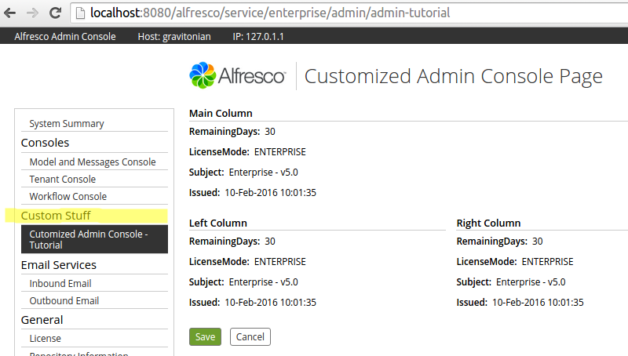
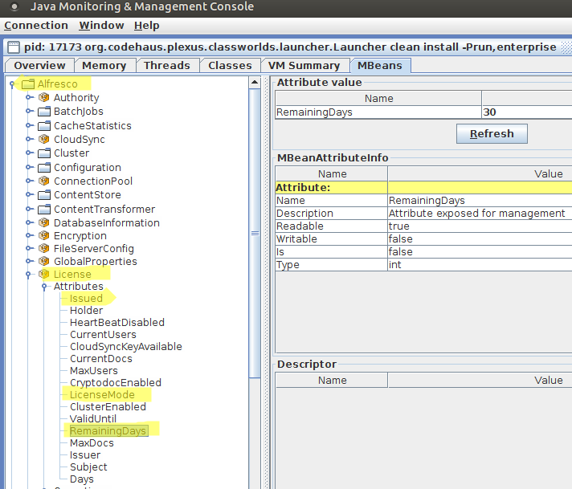

# Admin Console Components

Extension modules that needs some form of administration interface can be supported by a custom Admin Console Component.

|Information|Admin Console Component|
|-----------|-----------------------|
|Support Status|[Full Support](http://docs.alfresco.com/support/concepts/su-product-lifecycle.html)|
|Architecture Information|[Platform Architecture](../concepts/dev-platform-arch.md)|
|Description|The [Admin Console](../concepts/at-adminconsole.md) provides a way of managing services integrated into Alfresco, or built on as extensions. Installed modules can have a custom Admin Console component, so that they can be managed from the well-known interface of the Admin Console. You will see how to create a custom Admin Console component that displays already available MBean data but in a different layout. Displaying custom MBean data will be done in the same way.

 The finished result will look something like this:

 

 Here you have added a new section called *Custom Stuff* and as a sub-section we have *Customized Admin Console - Tutorial*. The custom page displays information already available in other sections, but is laid out differently.

 A custom component is added by implementing a [Repository Web scripts](dev-extension-points-webscripts.md). The descriptor is as follows:

 ```
<webscript>
   <shortname>Cutomized Admin Console - Tutorial</shortname>
   <description>Admin Console WebScript that displays a simple page.></description>
   <url>/enterprise/admin/admin-tutorial</url>
   <family>AdminConsole</family>
   <format default="html">argument</format>
   <authentication>admin</authentication>
   <lifecycle>internal</lifecycle>
   <transaction allow="readonly">required</transaction>
</webscript>
```

 There are several important things here that control if this component is going to work correctly and be visible on the Admin Console page:

 -   **url** - the Admin Console is available only in the Alfresco Enterprise edition, and as the name suggests, for administrators. So the `url` should begin with `/enterprise/admin`
-   **family** - if the custom component is going to be visible at all, then it needs to belong to the `AdminConsole` Web Script `family`
-   **authentication** - the Admin Console is for administrators only so `authentication` should be set to `admin`

 You will be able to access this Admin Console component page directly via the `http://localhost:8080/alfresco/service/enterprise/admin/admin-tutorial` url, this can be useful when we just want to make sure the page \(i.e. Web Script\) works.

 With this descriptor you have a component that will be added to the Admin Console page automatically, and by default located just under the *System Summary* section. To have the new component listed under a specific section you need to store the Web Script at a specific directory path. For example, to add your component to the *Consoles* section, you need to store the component Web Script in the alfresco/extension/templates/webscripts/org/alfresco/enterprise/repository/admin/consoles directory. If you wanted it located in the *Support Tools* section you should store it in the .../admin/support-tools directory and so on. To have the new component located in a new section like *Custom Stuff* you create a new directory that does not previously exist, such as .../admin/custom-stuff in our case.

 You can then localize the section name by providing a resource file with the following property set:

 ```
admin-console.tool.group.custom-stuff=Custom Stuff
```

 When the descriptor is finished and located in the appropriate directory you can continue with the Web Script controller:

 ```
<import resource="classpath:alfresco/enterprise/webscripts/org/alfresco/enterprise/repository/admin/admin-common.lib.js">
Admin.initModel(
   "Alfresco:Name=License",
   ["Subject", "LicenseMode", "Issued", "RemainingDays"],
   "admin-tutorial"
);
```

 What you do here is let the Admin Console system know what MBean properties you want to use in our custom component. In this case it is the "Subject", "LicenseModel", "Issued", and "RemainingDays" properties.

 These properties are available in the Alfresco MBean called "License", you can see it by running **JConsole** and connecting to Alfresco:

 

 After the controller you implement the Web Script template, which contains the page layout:

 ```
<#include "/org/alfresco/enterprise/repository/admin/admin-template.ftl" />

<@page title=msg("tutorial.title")>
   
   <div class="column-full">
      <@section label=msg("tutorial.column") />
      <#-- tutorial - Retrieve keys - which are attribute names - use to index into attribute hash -->
      <#list attributes?keys as a>
         <@control attribute=attributes[a] />
      </#list>
   </div>
   
   <div class="column-left">
      <@section label=msg("tutorial.leftcolumn") />
      <#-- tutorial - Retrieve values - which are attributes -->
      <#list attributes?values as a>
         <@control attribute=a />
      </#list>
   </div>
   <div class="column-right">
      <@section label=msg("tutorial.rightcolumn") />
      <#-- tutorial - Retrieve values - which are attributes -->
      <#list attributes?values as a>
         <@control attribute=a />
      </#list>
   </div>
   
</@page>
```

 Here you loop through the MBean properties \(attributes\), you can also obtain them directly like this:

 ```
<@control attribute=attributes["Subject"] />
```

 The template uses a number of resource properties that are fetched with the `msg` function.

 The Web Script i18n resource file need to have them specified as follows:

 ```
tutorial.title=Customized Admin Console Page
tutorial.column=Main Column
tutorial.leftcolumn=Left Column
tutorial.rightcolumn=Right Column
```

This is all there is to it. If you have your own services and module components exposing MBeans, then you can display and control them in a similar way, just change the controller to point to the MBean and the properties you want to display.

|
|Deployment - App Server|-   tomcat/shared/classes/alfresco/extension/templates/webscripts/... see SDK project below for directory path - Descriptor, JavaScript controller, template, properties files \(Untouched by re-deployments and upgrades\)

|
|[Deployment - SDK Project](../tasks/alfresco-sdk-tutorials-amp-archetype.md)|-   repo-amp/src/main/amp/config/alfresco/extension/templates/webscripts/org/alfresco/enterprise/repository/admin/\[general\|support-tools\|consoles\|email-services\|repository-services\|user-directories\|virtual-file-systems\|\{custom section id\}\] - Descriptor, JavaScript controller, template, properties files
-   repo-amp/src/main/amp/config/alfresco/module/repo-amp/messages/some-admin.console.properties - properties used in the Web Script template
-   repo-amp/src/main/amp/config/alfresco/module/repo-amp/context/bootstrap-context.xml - i18n resource loading Spring Bean

|
|More Information|-   [Using the Admin Console](../concepts/at-adminconsole.md)

|
|Sample Code|-   [Source code for the example in the above description.](https://github.com/Alfresco/alfresco-sdk-samples/tree/alfresco-50/all-in-one/add-admin-console-component-repo)
-   [Source code for the Alfresco Support Tools add-on.](https://github.com/Alfresco/alfresco-support-tools) - this extension project adds a lot of extra components to the admin console, so worth reading through to get ideas on how different admin console customizations can be done.

|
|Tutorials|None|
|Alfresco Developer Blogs|-   [Customizing Admin Tools Menu](https://www.alfresco.com/blogs/kevinr/2013/09/30/alfresco-repository-admin-console/)

|

