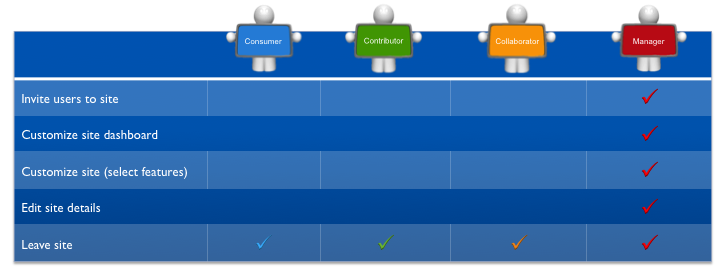
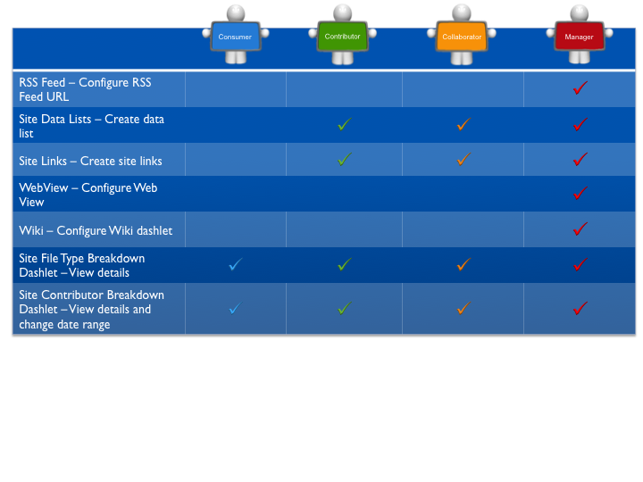
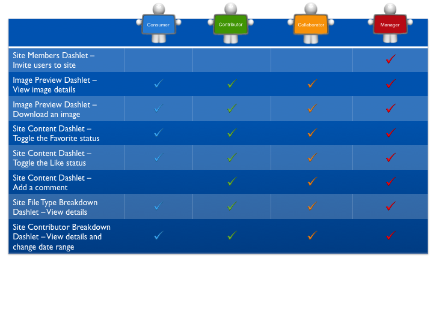

# Dashboards permissions

The following sections detail the user permissions for dashboards \(personal and site\) and dashlets.

## Personal dashboard and dashlets

Each user has full access to the toolbar and dashlet functionality available on the personal dashboard.

## Site dashboard

## Site dashlets

**Parent topic:**[User roles and permissions](../references/permissions_share.md)

