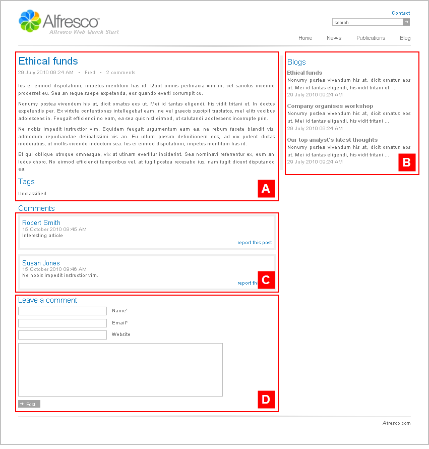

# articlepage2

The section **Alfresco Quick Start \> Quick Start Editorial \> root \> blog** has the template mapping `ws:article=articlepage2`.

This is a blog style article template with no image. This template page has a two column layout.

View any blog article on the Web Quick Start website to see a rendering of the `articlepage2` template.

|A|Component: `/article/style2`This component displays a blog style article with a comment count.

|
|B|Component: `/related/related`This component displays a list of related articles.

The content is populated from:

**Quick Start Editorial \> root \> blog \> collections \> latest.articles**This is a dynamic asset collection.

|
|C|Component: `/comments/display`This component displays a list of comments.

|
|D|Component: `/comments/form`This component displays a form for comment input.

|

**Parent topic:**[Templates](../references/qs-ref-templates.md)

