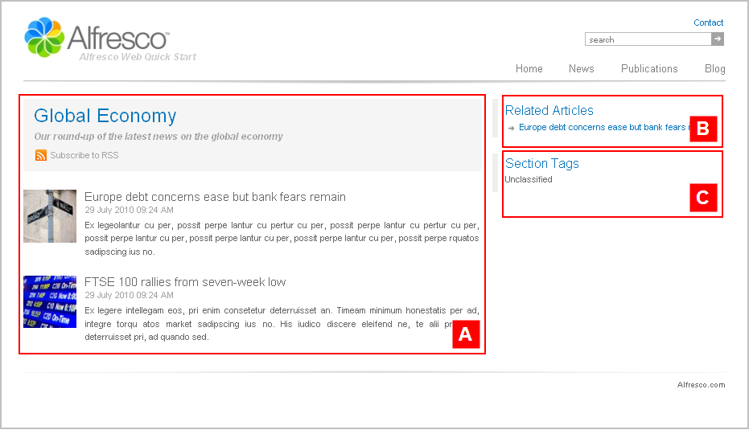

# sectionpage3

The following three sections are configured with the template mapping `ws:indexPage=sectionpage3`:

-   **Alfresco Quick Start \> Quick Start Editorial \> root \> news \> companies**
-   **Alfresco Quick Start \> Quick Start Editorial \> root \> news \> global**
-   **Alfresco Quick Start \> Quick Start Editorial \> root \> news \> markets**

This is a section landing page template that features a single column article list, a list of related content, and a list of section tags. This template page has a two column layout.

View any of the three News subsection landing pages—Global Economy, Companies, Markets—on the Web Quick Start website to see a rendering of the `sectionpage3` template.

|A|Component: `/list/wide`This component displays a wide list with thumbnail images.

The content is populated from:

**Quick Start Editorial \> root \> news \> global \> collections \> section.articles**This is a dynamic asset collection.

|
|B|Component: `/related/related`This component displays a list of related articles.

The content is populated from:

**Quick Start Editorial \> root \> news \> global \> collections \> related.articles**This is a static asset collection.

|
|C|Component: `/tags/list`This component displays a vertical list of tags suitable for the right region.

|

**Parent topic:**[Templates](../references/qs-ref-templates.md)

