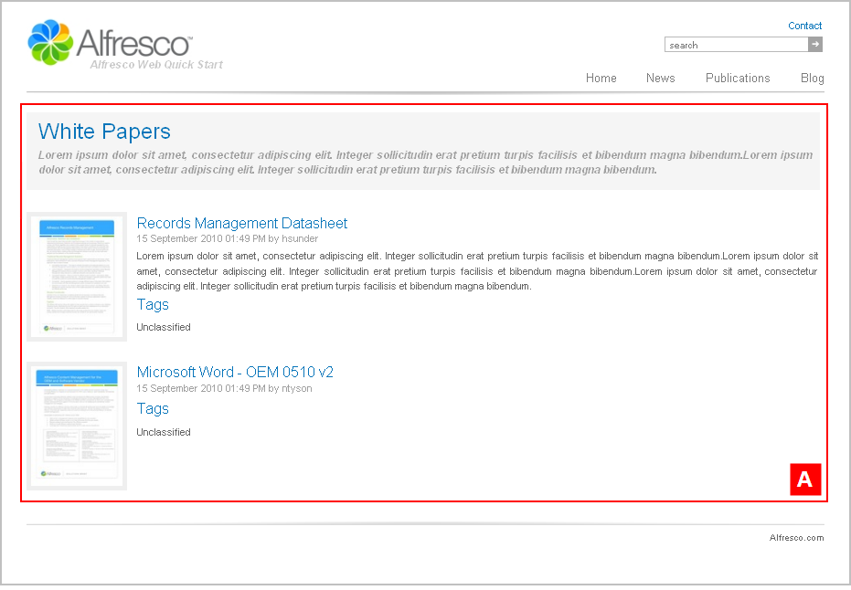

# sectionpage5

The following two sections are configured with the template mapping `ws:indexPage=sectionpage5`:

-   **Alfresco Quick Start \> Quick Start Editorial \> root \> publications \> research-reports**
-   **Alfresco Quick Start \> Quick Start Editorial \> root \> publications \> white-papers**

This is a section landing page template that features a publications list with thumbnails and details. This template page has a single column layout.

View either of the Publications subsection landing pages—Research Reports, White Papers—on the Web Quick Start website to see a rendering of the `sectionpage5` template.

|A|Component: `/list/full`This component displays a full width list with thumbnail images.

The content is populated from:

**Quick Start Editorial \> root \> publications \> white-papers \> collections \> section.articles**This is a static asset collection.

|

**Parent topic:**[Templates](../references/qs-ref-templates.md)

