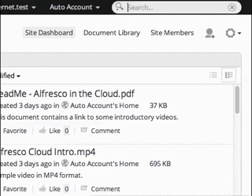

# What's new in Alfresco

We've spent the last year hard at work making Alfresco even better, and with all the new features you'll find inside, it might just be the biggest and best Alfresco release yet!See what we've been up to below, and follow our latest updates at [Alfrescodocs](https://twitter.com/Alfrescodocs).

**For everyone**

-   [New Google Docs integration \(April 2015\)](whats-new.md#1)
-   [Search improvements](whats-new.md#2)
-   [Analytics](whats-new.md#3)
-   [New HTML5 Previewer](whats-new.md#4)
-   [Sites Manager](whats-new.md#5)
-   [Quick site access](whats-new.md#6)
-   [Alfresco Office Services](whats-new.md#7)

**For Alfresco admins and developers**

-   [Alfresco Office Services](whats-new.md#7)
-   [Configuring search](whats-new.md#8)
-   [Encrypted content store](whats-new.md#9)
-   [Aikau](whats-new.md#10)
-   [Alfresco product support status](whats-new.md#11)
-   [Alfresco One API](whats-new.md#12)
-   [JavaScript Engine change](whats-new.md#13)
-   [Repository JavaScript API change](whats-new.md#14)

**New Google Docs integration \(April 2015\)**

Alfresco Google Docs integration has been updated because of recent changes to the Google APIs. From April 20 2015, Google is removing the Documents List API from service and previous versions of Alfresco Google Docs integration will no longer work.

The new Google Docs integration module works with the Google Drive API. This new module does not use iFrame, and so it now fixes some of the issues that were caused by the Google Docs user interface. For example, the **Share** button is now available within Docs, Sheets, or Slides. After opening the document in the appropriate Google app, use the **Share** button to collaborate with others.

You can also control the invited user's level of access with standard Google Docs settings, revoke access when the content is checked back into Alfresco, and it remembers who you have shared the document with in the past when editing sessions are renewed.

You can also now manage your Google Docs integration settings in the Repository Admin Console. Plus, site managers can cancel the checkout of content that is being edited in Google Docs.

[back to top](whats-new.md#)

**Search improvements**

Searching in Alfresco just took a giant leap forwards with live search, filtered search, spell-checking, suggestions, and more.

New search-as-you-type functionality displays results for matching files, sites, and people as you type. Select a result to go straight to a preview or press Enter to see the full list of results. And if you've made a typo then Alfresco gives you a list of results for similar words.

You can use filters to narrow down the full list, just as you would on a retail site, making it simple to find what you're looking for.

The search is now lightning-quick as it looks for content across your whole Alfresco system, before giving you the option to search on specific Alfresco sites. You can preview results in the search results screen and even do all the usual actions such as downloading and editing from right there.

And Alfresco now actively focuses your search. Previously when you searched for content in Alfresco using multiple words, the results would show content containing *any* of the words. Now it only shows content containing *all* the words. So the more words you search for, the more specific the results, just like Google.

There's even a new [Search Manager](../concepts/super-search-manager.md) feature so you can create your own search filters.

If you can't find what you want now in Alfresco, then it probably isn't there!

See [Searching in Alfresco](../concepts/searches.md) for more.

  

[back to top](whats-new.md#)

**Analytics**

There are now two new dashlets available so you can analyze exactly who's using your sites and what content they're adding, the Site File Type Breakdown and the Site Contributor Breakdown.

This is just a small taster of the incredible new analytics capabilities that will soon be available in Alfresco.

[back to top](whats-new.md#)

**New HTML5 Previewer**

Alfresco's new previewer renders your content with crystal-clear clarity. There's no need to download content now, you can view it perfectly, right in Alfresco. You can even run your presentations direct from the Alfresco preview.

When you preview a Microsoft Office, PDF, or other text-based file type \(not an image or video\) you can send links to your colleagues or customers to a specific page, save a page to come back to later, and even search for text within the file.

And of course if you want to you can always download the file in its original format, or as a PDF.

See [Previewing a file](../tasks/library-item-view.md) for more.

[back to top](whats-new.md#)

**Sites Manager**

As an Alfresco Administrator you want to have complete control of your network. You want visibility of all the sites in your network, and the ability to control individual site visibility, to make yourself a manager of specific sites, and to delete obsolete sites. Now, with the new [Sites Manager](../concepts/network-sites-manage.md), you can.

  

[back to top](whats-new.md#)

**Quick site access**

You can now access your sites quicker than ever from anywhere in Alfresco with the addition of a **My Sites** link from the toolbar. Just click **Sites** on the Alfresco toolbar then **My Sites** to see all the sites that you're a member of.

[back to top](whats-new.md#)

**Alfresco Office Services**

The new Microsoft SharePoint Protocol implementation, Alfresco Office Services \(AOS\) vastly improves access to your Microsoft Office applications from Alfresco.

Not only can you connect to Microsoft Office from Alfresco, but it's now really easy to upload content directly from Office applications to Alfresco, without going and opening Alfresco. Find out more about using it in [Using Alfresco Office Services](../concepts/aos-user.md)

Administrators can learn about installing and configuring [Alfresco Office Services](../concepts/aos-intro.md), including software prerequisites, and [upgrading from a previous version of Alfresco](../tasks/aos-upgrade.md).

[back to top](whats-new.md#)

**Configuring search**

We've completely rewritten the section on configuring search for the new Solr4 subsystem, including sections on [Migrating from Lucene to Solr4](../tasks/lucene-solr4-migration.md) and [Migrating from Solr to Solr4](../tasks/solr-solr4-migration.md).

[back to top](whats-new.md#)

**Encrypted content store**

For businesses concerned with data encryption, the new Encrypted Content Store provides encryption at rest capability across the content store level, rather than simply for individual files.

See [Encrypted Content Store](../concepts/encrypted-cs-home.md)

[back to top](whats-new.md#)

**Aikau**

The new UI framework, Aikau, provides a library of widgets that can be easily assembled into a web application for accessing an Alfresco repository.

See [Aikau](../concepts/aikau-intro.md) for background information and tutorials.

[back to top](whats-new.md#)

**Alfresco product support status**

Alfresco One 5.0 brings in changes to the product support status for some features and components, and the documentation has been removed for some of these features.

See [Alfresco Product Support Status](https://www.alfresco.com/alfresco-product-support-status) for further details.

[back to top](whats-new.md#)

**Alfresco One API**

There are some updates to the Alfresco One API, for example, a new request URL and support for cmis:item.

See [What's new in the Alfresco One API](../pra/1/topics/pra-whats-new.md) for more detail on the changes.

[back to top](whats-new.md#)

**JavaScript Engine change**

For Alfresco One 5.0 and Alfresco Community 5.0 the Rhino JavaScript engine was upgraded to version 1.7R4. This can in certain rare circumstances break existing web script code. This can happen where JavaScript-based web scripts pass a string to the model, prior to it being passed to the FreeMarker template. The string must be fully converted, using the `toString()` method. If you notice that previously working web scripts no longer work, then this possible reason should be investigated.

See [JIRA](https://issues.alfresco.com/jira/browse/ALF-20856) for more information.

[back to top](whats-new.md#)

**Repository JavaScript API change**

The `session` object was renamed to `sessionticket` as it was only supplying user ticket and was incorrectly shadowing the true `HttpSession` `session` API in the model.

The `session` object is now working correctly in the Repository JavaScript API - providing access to the actual servlet web-session for the current user.

See [Web Scripts](../concepts/ws-webscripts.md) for more information on developing JavaScript extensions.

[back to top](whats-new.md#)

**Parent topic:**[Alfresco One](../concepts/welcome.md)

