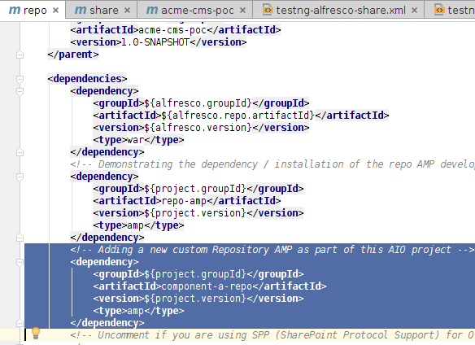
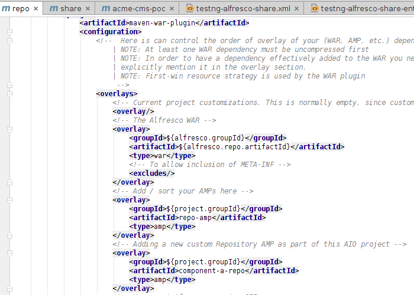
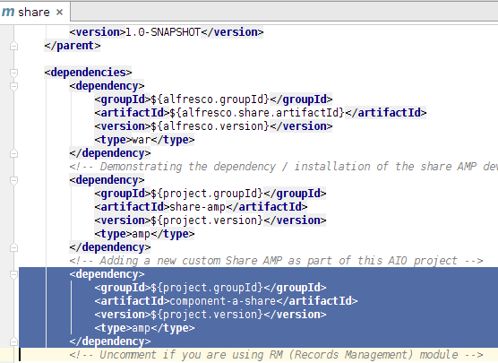
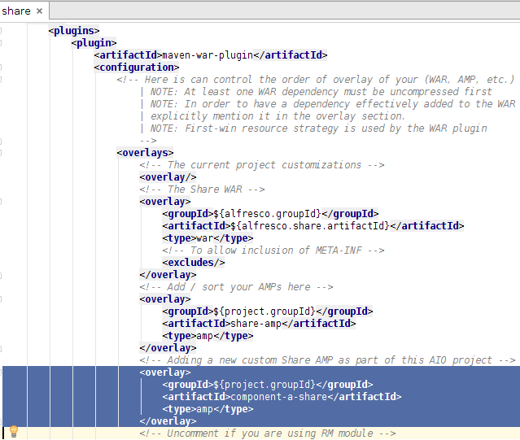

# Create new custom AMPs as part of the AIO project

This section goes through how to create a new custom Repository AMP project and a new custom Share AMP project and have them added as sub-projects of a multi module AIO project.

This task assumes you completed the [Installing and Configuring software](../concepts/alfresco-sdk-installing-prerequisite-software.md) section and generated an AIO project [as described in this section](alfresco-sdk-tutorials-all-in-one-archetype.md).

You will learn how to create new custom AMPs and have them be part of a multi module AIO project. These AMPs will not be built separately but as part of the AIO project build. And they will be SNAPSHOT references in the AIO project. They will be very similar to the `repo-amp` and `share-amp` demo extension projects that comes with the AIO archetype.

**Note:** If you only need to add a Repository AMP, then skip the steps related to the Share AMP, and vice versa.

1.  Generating a new custom Repository AMP and linking it to the Alfresco.war.
2.  Generate the custom Repository AMP as a sub-module to the AIO parent.

    Follow instructions in the [create Respository extension project \(AMP\)](alfresco-sdk-tutorials-amp-archetype.md) section. Give the new Repo AMP a unique artifact id that does not clash with any other ids or the one that is part of the AIO project \(i.e. repo-amp\). For this example I have used the id `component-a-repo`. Use the same group id as for the rest of your project artifacts, I'm using `com.acme`. The AMP is generated and stored in the alfresco-extensions/acme-cms-poc/component-a-repo folder and is going to **be part of the AIO multi module project**.

3.  Update parent definition in the Repository AMP pom.xml and remove group and version definition

    By default the Repository AMP will be generated with the SDK Parent set. We need to change it to be the AIO project parent instead. You can grab a parent defintion from one of the other sub-projects, such as the `repo-amp` project. The alfresco-extensions/acme-cms-poc/component-a-repo/pom.xml file should now start like this:

    ```
    
    <?xml version="1.0" encoding="UTF-8"?>
    <project xmlns="http://maven.apache.org/POM/4.0.0" xmlns:xsi="http://www.w3.org/2001/XMLSchema-instance"
             xsi:schemaLocation="http://maven.apache.org/POM/4.0.0 http://maven.apache.org/maven-v4_0_0.xsd">
        <modelVersion>4.0.0</modelVersion>
        <artifactId>component-a-repo</artifactId>
        <name>component-a-repo Repository AMP project</name>
        <packaging>amp</packaging>
        <description>Manages the lifecycle of the component-a-repo Repository AMP (Alfresco Module Package)</description>
    
        <parent>
            <groupId>com.acme</groupId>
            <artifactId>acme-cms-poc</artifactId>
            <version>1.0-SNAPSHOT</version>
        </parent>
        ...
    
    ```

    You should also remove <groupId\> and <version\> as these values will be picked up from the AIO parent.

4.  Make sure the new Repository AMP is included as a module in the AIO parent pom.xml

    This should happen automatically when you generate the new project in a sub-directory to the parent AIO project directory. Open up the alfresco-extensions/acme-cms-poc/pom.xml file and verify that the `component-a-repo` module is there:

    ```
    
    ...
      <modules>
        <module>repo-amp</module>
        <module>share-amp</module>
        <module>repo</module>
        <module>solr-config</module>
        <module>share</module>
        <module>runner</module>
        <module>component-a-repo</module>
      </modules>
    </project>
    
    ```

5.  Add the custom Repository AMP Dependency to Alfresco.war project

    In the IDE, open up the alfresco-extensions/acme-cms-poc/repo/pom.xml project file. Scroll down so you see the `dependencies` section. Then add a dependency to `component-a-repo`:

    

    Note that the dependency for the AMP uses the `project.groupId`, which is what we used for the custom AMP, `com.acme`. It will also use whatever `project.version` is currently used.

6.  Overlaying the custom Repository AMP on the alfresco.war

    The Repository AMP will not be automatically added to the alfresco.war by just adding the dependency. We need to add some configuration to the war plugin. Scroll further down in the alfresco-extensions/acme-cms-poc/repo/pom.xml file until you see the `maven-war-plugin` section. Then add a overlay for the `component-a-repo`:

    

7.  Enable the new custom Repository AMP for Rapid Application Development

    To be able to have hot-reloading work for the code that is going to be part of the new `component-a-repo` AMP, we need to update the virtual webapp context for the Repository webapp \(i.e. for the alfresco.war webapp\). In the IDE, open up the alfresco-extensions/acme-cms-poc/runner/tomcat/context-repo.xml file. Update the `Resource` section configuration with the new AMP's resource path:

    ```
       <!-- IMPORTANT! The extraResourcePaths string need to be on one continues line -->
        <Resources className="org.apache.naming.resources.VirtualDirContext"
                   extraResourcePaths="/=${project.parent.basedir}/repo-amp/target/repo-amp/web,/=${project.parent.basedir}/component-a-repo/target/component-a-repo/web" />
                            
    ```

    And update the `Loader` section configuration with the new AMP's classpaths:

    ```
    
        <Loader className="org.apache.catalina.loader.VirtualWebappLoader"
                searchVirtualFirst="true"
                virtualClasspath="${project.parent.basedir}/repo-amp/target/classes;
                ${project.parent.basedir}/repo-amp/target/repo-amp/config;
                ${project.parent.basedir}/repo-amp/target/test-classes;
                ${project.parent.basedir}/component-a-repo/target/classes;
                ${project.parent.basedir}/component-a-repo/target/component-a-repo/config;
                ${project.parent.basedir}/component-a-repo/target/test-classes" />
                
    ```

    **Note:** The Tomcat context file located in the alfresco-extensions/acme-cms-poc/component-a-repo/tomcat directory is obsolete when the AMP is contained within an AIO project, it is only used when the AMP is run stand-alone, and it can be deleted.

8.  Start it up and verify that the new AMP is installed

    ```
    
    ...                        
     2015-05-08 13:40:37,688  INFO  [repo.module.ModuleServiceImpl] [localhost-startStop-1] Found 2 module(s).
     2015-05-08 13:40:37,713  INFO  [repo.module.ModuleServiceImpl] [localhost-startStop-1] Upgrading module 'component-a-repo' version 1.0.1505081338 (was 1.0.1505071304).
     2015-05-08 13:40:37,746  INFO  [repo.module.ModuleServiceImpl] [localhost-startStop-1] Upgrading module 'repo-amp' version 1.0.1505081338 (was 1.0.1505081106).
    ...
    
    ```

9.  Generating a new custom Share AMP and and linking it to the Share.war.
10. Generate the custom Share AMP as a sub-module to the AIO parent.

    Follow instructions in the [create Share extension project \(AMP\)](alfresco-sdk-tutorials-share-amp-archetype.md) section. Give the new Share AMP a unique artifact id that does not clash with any other ids or the one that is part of the AIO project \(i.e. share-amp\). For this example I have used the id `component-a-share`. Use the same group id as for the rest of your project artifacts, I'm using `com.acme`. The AMP is generated and stored in the alfresco-extensions/acme-cms-poc/component-a-share folder and is going to **be part of the AIO multi module project**.

11. Update parent definition in the Share AMP pom.xml and remove group and version definition

    By default the Share AMP will be generated with the SDK Parent set. We need to change it to be the AIO project parent instead. You can grab a parent defintion from one of the other sub-projects, such as the `share-amp` project. The alfresco-extensions/acme-cms-poc/component-a-share/pom.xml file should now start like this:

    ```
    
    <?xml version="1.0" encoding="UTF-8"?>
    <project xmlns="http://maven.apache.org/POM/4.0.0" xmlns:xsi="http://www.w3.org/2001/XMLSchema-instance"
             xsi:schemaLocation="http://maven.apache.org/POM/4.0.0 http://maven.apache.org/maven-v4_0_0.xsd">
        <modelVersion>4.0.0</modelVersion>
        <artifactId>component-a-share</artifactId>
        <name>component-a-share AMP project</name>
        <packaging>amp</packaging>
        <description>Manages the lifecycle of the component-a-share AMP (Alfresco Module Package)</description>
    
        <parent>
            <groupId>com.acme</groupId>
            <artifactId>acme-cms-poc</artifactId>
            <version>1.0-SNAPSHOT</version>
        </parent>
        ...
    
    ```

    You should also remove <groupId\> and <version\> as these values will be picked up from the AIO parent.

12. Make sure the new Share AMP is included as a module in the AIO parent pom.xml

    This should happen automatically when you generate the new project in a sub-directory to the parent AIO project directory. Open up the alfresco-extensions/acme-cms-poc/pom.xml file and verify that the `component-a-share` module is there:

    ```
    
    ...
     <modules>
        <module>repo-amp</module>
        <module>share-amp</module>
        <module>repo</module>
        <module>solr-config</module>
        <module>share</module>
        <module>runner</module>
        <module>component-a-repo</module>
        <module>component-a-share</module>
      </modules>
    </project>
    
    ```

13. Add the custom Share AMP Dependency.

    In the IDE, open up the alfresco-extensions/acme-cms-poc/share/pom.xml project file. Scroll down so you see the `dependencies` section. Then add a dependency to `component-a-share`:

    

    Note that the dependency for the AMP uses the `project.groupId`, which is what we used for the custom AMP, `com.acme`. It will also use whatever `project.version` is currently used.

14. Overlaying the custom Share AMP on the share.war

    The Share AMP will not be automatically added to the share.war by just adding the dependency. We need to add some configuration to the war plugin. Scroll further down in the alfresco-extensions/acme-cms-poc/share/pom.xml file until you see the `maven-war-plugin` section. Then add a overlay for the `component-a-share`:

    

15. Enable the new custom Share AMP for Rapid Application Development

    To be able to have hot-reloading work for the code that is going to be part of the new `component-a-share` AMP, we need to update the virtual webapp context for the Share webapp \(i.e. for the share.war webapp\). Also, if we don't do this any web resources such as CSS, Images, JS etc located under /web in the AMP will not be available when we use the `run` profile \(this is because during hot reloading we only want them in one place, our project\). In the IDE, open up the alfresco-extensions/acme-cms-poc/runner/tomcat/context-share.xml file. Update the `Resource` section configuration with the new AMP's resource path:

    ```
       <!-- IMPORTANT! The extraResourcePaths string need to be on one continues line -->
        <Resources className="org.apache.naming.resources.VirtualDirContext"
                   extraResourcePaths="/=${project.parent.basedir}/share-amp/target/share-amp/web,/=${project.parent.basedir}/component-a-share/target/component-a-share/web" />
                            
    ```

    And update the `Loader` section configuration with the new AMP's classpaths:

    ```
    
        <Loader className="org.apache.catalina.loader.VirtualWebappLoader"
                searchVirtualFirst="true"
                virtualClasspath="${project.parent.basedir}/share-amp/target/classes;
                ${project.parent.basedir}/share-amp/target/share-amp/config;
                ${project.parent.basedir}/share-amp/target/test-classes;
                ${project.parent.basedir}/component-a-share/target/classes;
                ${project.parent.basedir}/component-a-share/target/component-a-share/config;
                ${project.parent.basedir}/component-a-share/target/test-classes;
                ${project.parent.basedir}/share/target/test-classes" />
                
    ```

    **Note:** The Tomcat context file located in the alfresco-extensions/acme-cms-poc/component-a-share/tomcat directory is obsolete when the AMP is contained within an AIO project, it is only used when the AMP is run stand-alone, and it can be deleted.

16. There is no logs indicating the AMPs that have been installed on the Alfresco Share web application, so the only way to test is to use whatever custom functionality it is implementing, and see if it works.


You have seen how to create new custom AMP projects that should be part of an All-in-One \(AIO\) project.

**Parent topic:**[Adding more custom AMPs to an AIO project](../concepts/alfresco-sdk-advanced-add-custom-amps.md)

