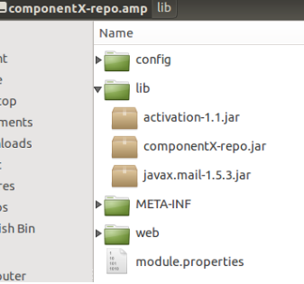
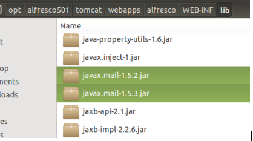
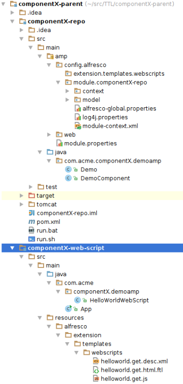
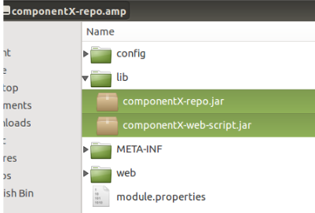
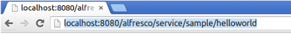

# Adding internal and external JARs to a Repository AMP project

This article explains how to add an *external* JAR to a Repository AMP project via a dependency. It also looks at how to extract some AMP code into its own JAR project, what we call an *internal* JAR, and then have the AMP project include it.

This task assumes you completed the [Installing and Configuring software](../concepts/alfresco-sdk-installing-prerequisite-software.md) section and generated an Repo AMP project [as described in this section](alfresco-sdk-tutorials-amp-archetype.md).To try out the examples in this article you will need to install a local SMTP server such as [Fake SMTP](https://nilhcem.github.io/FakeSMTP/).

Sometimes when you are developing a Repository AMP you need to include external libraries \(JARs\) that are not part/are not available in the tomcat/webapps/alfresco/WEB­INF/lib​directory. Being able to do this is one of the benefits of AMPs compared to other extension models. The Repository AMP might also start to grow to a size where it would make sense to move some of the functionality over to separate JAR projects, and have the AMP depend on them. This article goes through how to do these things.

1.  Adding an external JAR to a Repository AMP project.

    **Note:** An external JAR is needed when you want to use some library that is not part of the Alfresco Repository \(alfresco.war\) web application. Meaning it is not present in the tomcat/webapps/alfresco/WEB-INF/lib directory. So you should always first scan this directory in an Alfresco Community or Enterprise installation to see if the library is available. If it is available, then you can include it in the componentX-repo/pom.xml as a `provided` dependency.

    In the following example we will update the Hello World Web Script code \(it is part of the Repository AMP source code\) so that it can send emails. However, when we select a Mail library to use for this, we forget to check if the library is already available as part of the Alfresco Repository WAR. We will see what happens then and how to fix it:

2.  Stop the embedded Tomcat instance, if it is running \(i.e. via -Pamp-to-war\).

3.  Find a library that can be used to send emails from Java and add a dependency for it to the Repo AMP project.

    We know that the Java Mail library can be used for this, so we look up the maven dependency for it and add it to the componentX-repo/pom.xml:

    ```
    ...                            
    <dependencies>
        <dependency>
           <groupId>${alfresco.groupId}</groupId>
           <artifactId>alfresco-repository</artifactId>
       </dependency>
       <!-- Added a new dependency for Java Mail -->
       <dependency>
           <groupId>com.sun.mail</groupId>
           <artifactId>javax.mail</artifactId>
           <version>1.5.3</version>
       </dependency>
    </dependencies>
    ...
    ```

    We can now start implementing some code that uses the Java Mail library.

4.  Update the Hello World Web Script to send an email.

    The implementation can be done as follows in the Java controller \(componentX-repo/src/main/java/com/acme/componentX/demoamp/HelloWorldWebScript.java\):

    ```
    import javax.mail.*;
    import javax.mail.internet.InternetAddress;
    import javax.mail.internet.MimeBodyPart;
    import javax.mail.internet.MimeMessage;
    import javax.mail.internet.MimeMultipart;
    import java.util.HashMap;
    import java.util.Map;
    import java.util.Properties;
    
    /**
    * A demonstration Java controller for the Hello World Web Script.
    *
    * @author martin.bergljung@alfresco.com
    * @since 2.1.0
    */
    public class HelloWorldWebScript extends DeclarativeWebScript {
       protected Map<String, Object> executeImpl(
               WebScriptRequest req, Status status, Cache cache) {
           Map<String, Object> model = new HashMap<String, Object>();
           model.put("fromJava", "HelloFromJava");
           sendEmail();
           return model;
       }
    
       private void sendEmail() {
           String to = "somebody@example.com";
           String subject = "Test email from Web Script";
           String body = "Hello World!";
    
           try {
               // Create mail session
               Properties props = new Properties();
               props.put("mail.smtp.host", "<yourhost>");  // localhost will not work
               props.put("mail.smtp.port", "2525");        // non-privileged port
               Session session = Session.getDefaultInstance(props, null);
               session.setDebug(false);
    
               // Define message
               Message message = new MimeMessage(session);
               String fromAddress = "no-reply@alfresco.com";
               message.setFrom(new InternetAddress(fromAddress));
               message.addRecipient(Message.RecipientType.TO, new InternetAddress(to));
               message.setSubject(subject);
    
               // Create the message part with body text
               BodyPart messageBodyPart = new MimeBodyPart();
               messageBodyPart.setText(body);
               Multipart multipart = new MimeMultipart();
               multipart.addBodyPart(messageBodyPart);
    
               // Put parts in message
               message.setContent(multipart);
    
               // Send the message
               Transport.send(message);
    
           } catch (MessagingException me) {
               me.printStackTrace();
           }
       }
    }
    ```

    For the code to work you will need to update `<yourhost>` to whatever hostname your machine has. The code uses standard Java Mail classes to send a simple email without attachments.

5.  Build the Repository AMP.

    Standing in the Repo AMP project directory, type the following Maven command:

    ```
    
    componentX-repo$ mvn clean install -DskipTests=true
    
    ```

    What we end up with now is a Repository AMP with the following JARs:

    

    This might seem okay at first, but it is actually not a good idea. When we apply this AMP to an Alfresco5.WAR file, the JAR files will be added to the tomcat/webapps/alfresco/WEB-INF/lib directory, and we end up with duplicate Java Mail libraries as it already contains one version of the libarary:

    

    So the correct approach is to always check what JARs that are available in the Alfresco 5 WAR, and then for any JAR that is available use `<scope>provided</scope>` when specifying the dependency for it.

6.  Update the Java Mail dependency to have scope provided.

    Open up the componentX-repo/pom.xml and update the Java Mail dependency as follows:

    ```
    ...                        
    <dependencies>
       <dependency>
           <groupId>${alfresco.groupId}</groupId>
           <artifactId>alfresco-repository</artifactId>
       </dependency>
    
       <dependency>
           <groupId>com.sun.mail</groupId>
           <artifactId>javax.mail</artifactId>
           <version>1.5.3</version>
           <scope>provided</scope>
       </dependency>
    ...   
    </dependencies>
    ```

    This will mean that the Java Mail JAR is not included in the AMP but we can still compile and build against it, which is what we want.

    So to summarize, if the JAR is not in tomcat/webapps/alfresco/WEB-INF/lib, then do **not** use `provided` scope as you want it included with the AMP. On the other hand, if the JAR is available, then use `provided` scope to exclude it from the AMP deliverable.

7.  Adding an internal JAR to a Repository AMP project.

    **Note:** Another requirement that might come up when you are working with a Repository AMP project is that it is growing big, so big that it would make sense to move some AMP project code into its own JAR projects, but still have those part of the same AMP build. Basically turning the Repository AMP project into a multi-module project. So let’s demonstrate how to do this by moving the Hello World Web Script code into its own JAR module and have the AMP dependent on it.

8.  Create a Repository AMP parent project directory.

    To achieve what we want, we will have to turn the Repository AMP project into a multi-module project, and for this we need a parent project. Create a new directory called componentX-parent and then copy the Repository AMP directory into it:

    ```
    componentX-repo$ cd ..
    ~/src/$ mkdir componentX-parent
    ~/src/$ mv componentX-repo/ componentX-parent/
    ```

9.  Create a Repository AMP parent project POM file.

    Add the following pom.xml to the componentX-parent directory:

    ```
    <?xml version="1.0" encoding="UTF-8"?>
    <project xmlns="http://maven.apache.org/POM/4.0.0" xmlns:xsi="http://www.w3.org/2001/XMLSchema-instance"
            xsi:schemaLocation="http://maven.apache.org/POM/4.0.0 http://maven.apache.org/maven-v4_0_0.xsd">
       <modelVersion>4.0.0</modelVersion>
       <groupId>com.acme</groupId>
       <artifactId>componentX-parent</artifactId>
       <version>1.0-SNAPSHOT</version>
       <name>componentX-repo Repository AMP parent</name>
       <description>This is the parent project for the multi-module componentX-repo Repository AMP project</description>
       <packaging>pom</packaging>
    
       <parent>
           <groupId>org.alfresco.maven</groupId>
           <artifactId>alfresco-sdk-parent</artifactId>
           <version>2.1.0</version>
       </parent>
    
       <modules>
           <module>componentX-repo</module>
       </modules>
    </project>
    ```

    Note how this parent project now has the SDK Project as a parent. And it includes the Repository AMP project as a sub-module. The parent project packaging is `pom`, which means it is not producing an artefact like a JAR, AMP, or WAR, it just acts as a parent for other sub-modules.

10. Update parent definition in the Repository AMP project POM file.

    Open up the componentX-parent/componentX-repo/pom.xml file. Then update the `parent` definition as follows:

    ```
    <?xml version="1.0" encoding="UTF-8"?>
    <project xmlns="http://maven.apache.org/POM/4.0.0" xmlns:xsi="http://www.w3.org/2001/XMLSchema-instance"
            xsi:schemaLocation="http://maven.apache.org/POM/4.0.0 http://maven.apache.org/maven-v4_0_0.xsd">
       <modelVersion>4.0.0</modelVersion>
       <artifactId>componentX-repo</artifactId>
       <name>componentX-repo Repository AMP project</name>
       <packaging>amp</packaging>
       <description>Manages the lifecycle of the componentX-repo Repository AMP (Alfresco Module Package)</description>
    
       <parent>
           <groupId>com.acme</groupId>
           <artifactId>componentX-parent</artifactId>
           <version>1.0-SNAPSHOT</version>
       </parent>
       ...
    ```

    Note the `parent` section and how it now points to our new parent. Also, we have removed the `version` and `groupId` properties from the AMP project as they are inherited from the parent project.

11. Build the Repository AMP parent project.

    You should see something like this in the logs:

    ```
    componentX-parent$ mvn clean install -DskipTests=true
    . . .
    [INFO] Reactor Summary:
    [INFO]
    [INFO] componentX-repo Repository AMP parent .............. SUCCESS [  0.607 s]
    [INFO] componentX-repo Repository AMP project ............. SUCCESS [  6.850 s]
    [INFO] ------------------------------------------------------------------------
    [INFO] BUILD SUCCESS
    ```

    So we now got a parent project that can contain more sub-projects then just the Repository AMP project.

12. Add a JAR project and move the Hello World Web Script code.

    We are going to create a new JAR sub-project and then move the Hello World Web Script code over to it from the AMP. Let’s start by adding a new JAR project. Stand in the parent directory and issue the following command, which will generate a starting point for a JAR module:

    ```
    componentX-parent$ mvn archetype:generate -DgroupId=com.acme -DartifactId=componentX-web-script -DarchetypeArtifactId=maven-archetype-quickstart -DinteractiveMode=false
    ```

    We are using the Maven Quickstart archetype to generate the JAR module. Our parent directory now looks like this:

    ```
    componentX-parent$ ls -l
    total 16
    drwxrwxr-x 6 martin martin 4096 Jun  5 15:27 componentX-repo
    drwxrwxr-x 3 martin martin 4096 Jun  5 15:35 componentX-web-script
    -rw-rw-r-- 1 martin martin  881 Jun  5 15:35 pom.xml
    ```

    When we generate a new module from the parent directory it is automatically added to the `modules` section of the parent POM as follows:

    ```
    ...                        
    <modules>
           <module>componentX-repo</module>
           <module>componentX-web-script</module>
     </modules>
    </project>
    ```

    And the `parent` section is setup correctly also in the new JAR module, open up componentX-parent/componentX-web-script/pom.xml and have a look:

    ```
    <?xml version="1.0"?>
    <project xsi:schemaLocation="http://maven.apache.org/POM/4.0.0 http://maven.apache.org/xsd/maven-4.0.0.xsd"
            xmlns="http://maven.apache.org/POM/4.0.0"
            xmlns:xsi="http://www.w3.org/2001/XMLSchema-instance">
       <modelVersion>4.0.0</modelVersion>
    
       <parent>
           <groupId>com.acme</groupId>
           <artifactId>componentX-parent</artifactId>
           <version>1.0-SNAPSHOT</version>
       </parent>
    
       <artifactId>componentX-web-script</artifactId>
      <name>componentX-web-script JAR project</name>
       <url>http://maven.apache.org</url>
       ...
    ```

    You might notice that I have removed the `version` and `groupId` properties from the JAR project as they are inherited from our parent project. I also updated the name so it is easy to see what type of artefact that is produced.

13. Build the Repository AMP parent project.

    You should see something like this in the logs:

    ```
    componentX-parent$ mvn clean install -DskipTests=true
    . . .
    [INFO] Reactor Summary:
    [INFO]
    [INFO] componentX-repo Repository AMP parent .............. SUCCESS [  0.685 s]
    [INFO] componentX-repo Repository AMP project ............. SUCCESS [  7.131 s]
    [INFO] componentX-web-script JAR project .................. SUCCESS [  0.539 s]
    [INFO] ------------------------------------------------------------------------
    [INFO] BUILD SUCCESS
    ```

14. Move the Hello World Web Script files over to the new JAR project.

    Here we are doing this via command line:

    ```
    
    componentX-parent$ cd componentX-web-script/
    componentX-parent/componentX-web-script$ cd src/main/java/com/acme/
    componentX-parent/componentX-web-script/src/main/java/com/acme$ mkdir componentX
    componentX-parent/componentX-web-script/src/main/java/com/acme$ cd componentX/
    componentX-parent/componentX-web-script/src/main/java/com/acme/componentX$ mkdir demoamp
    componentX-parent/componentX-web-script/src/main/java/com/acme/componentX$ cd demoamp/
    componentX-parent/componentX-web-script/src/main/java/com/acme/componentX/demoamp$ mv ~/src/componentX-parent/componentX-repo/src/main/java/com/acme/componentX/demoamp/HelloWorldWebScript.java .
    componentX-parent/componentX-web-script/src/main/java/com/acme/componentX/demoamp$ cd ../../../../../
    componentX-parent/componentX-web-script/src/main$ mkdir resources
    componentX-parent/componentX-web-script/src/main$ cd resources/
    componentX-parent/componentX-web-script/src/main/resources$ mkdir alfresco
    componentX-parent/componentX-web-script/src/main/resources$ cd alfresco/
    componentX-parent/componentX-web-script/src/main/resources/alfresco$ mkdir extension
    componentX-parent/componentX-web-script/src/main/resources/alfresco$ cd extension/
    componentX-parent/componentX-web-script/src/main/resources/alfresco/extension$ mkdir templates
    componentX-parent/componentX-web-script/src/main/resources/alfresco/extension$ cd templates/
    componentX-parent/componentX-web-script/src/main/resources/alfresco/extension/templates$ mkdir webscripts
    componentX-parent/componentX-web-script/src/main/resources/alfresco/extension/templates$ cd webscripts/
    componentX-parent/componentX-web-script/src/main/resources/alfresco/extension/templates/webscripts$ mv ~/src/componentX-parent/componentX-repo/src/main/amp/config/alfresco/extension/templates/webscripts/* .
    ```

    If you have followed along, then you should see something like this in your IDE now:

    

    We are not moving the spring context file with the Java controller bean definition over to the JAR project as we want there only to be one module bringing in the spring context \(i.e. the Repository AMP Module\). We are just keeping the Web Script files in a separate JAR to be able to work with them in an easier way. It will also give us the opportunity to completely lift out this JAR as a stand-alone project in the future, and release it separately to Nexus, if we should want to do that.

15. Move the Java Mail dependency from the AMP project to the JAR project.

    Open up the componentX-parent/componentX-web-script/pom.xml file and update it so it looks like this:

    ```
    <?xml version="1.0"?>
    <project xsi:schemaLocation="http://maven.apache.org/POM/4.0.0 http://maven.apache.org/xsd/maven-4.0.0.xsd"
            xmlns="http://maven.apache.org/POM/4.0.0"
            xmlns:xsi="http://www.w3.org/2001/XMLSchema-instance">
       <modelVersion>4.0.0</modelVersion>
    
       <parent>
           <groupId>com.acme</groupId>
           <artifactId>componentX-parent</artifactId>
           <version>1.0-SNAPSHOT</version>
       </parent>
    
       <artifactId>componentX-web-script</artifactId>
       <name>componentX-web-script JAR project</name>
    
       <url>http://maven.apache.org</url>
    
       <dependencies>
           <dependency>
               <groupId>junit</groupId>
               <artifactId>junit</artifactId>
               <version>3.8.1</version>
               <scope>test</scope>
           </dependency>
    
           <dependency>
               <groupId>${alfresco.groupId}</groupId>
               <artifactId>alfresco-repository</artifactId>
           </dependency>
    
           <dependency>
               <groupId>com.sun.mail</groupId>
               <artifactId>javax.mail</artifactId>
               <version>1.5.3</version>
               <scope>provided</scope>
           </dependency>
       </dependencies>
    </project>
    ```

    We also needed to add the `alfresco-repository` dependency as the Java Web Script controller uses Declarative Web Script classes. It does not have `version` specified as part of dependency definition, so we need to make sure it works anyway.

16. Move the Dependency Management section from the AMP project to the Parent project.

    Open up the componentX-parent/pom.xml file and update it so it looks like this:

    ```
    <?xml version="1.0" encoding="UTF-8"?>
    <project xmlns="http://maven.apache.org/POM/4.0.0" xmlns:xsi="http://www.w3.org/2001/XMLSchema-instance"
            xsi:schemaLocation="http://maven.apache.org/POM/4.0.0 http://maven.apache.org/maven-v4_0_0.xsd">
       <modelVersion>4.0.0</modelVersion>
       <groupId>com.acme</groupId>
       <artifactId>componentX-parent</artifactId>
       <version>1.0-SNAPSHOT</version>
       <name>componentX-repo Repository AMP parent</name>
       <description>This is the parent project for the multi-module componentX-repo Repository AMP project</description>
       <packaging>pom</packaging>
    
       <parent>
           <groupId>org.alfresco.maven</groupId>
           <artifactId>alfresco-sdk-parent</artifactId>
           <version>2.1.0</version>
       </parent>
    
       <modules>
           <module>componentX-repo</module>
           <module>componentX-web-script</module>
       </modules>
    
       <dependencyManagement>
           <dependencies>
               <dependency>
                   <groupId>${alfresco.groupId}</groupId>
                   <artifactId>alfresco-platform-distribution</artifactId>
                   <version>${alfresco.version}</version>
                   <type>pom</type>
                   <scope>import</scope>
               </dependency>
           </dependencies>
       </dependencyManagement>
    </project>
    ```

    It’s a good idea to move the Dependency Management section to the parent POM as you might have more JAR extensions added that needs Alfresco libraries, and then you want to be consitent with what version of these libraries you are using. The Repository AMP POM now looks like this \(i.e. componentX-parent/componentX-repo/pom.xml\) after removing the Java Mail dependency, moving Dependency Management, and putting in the Web Script JAR dependency:

    ```
    <?xml version="1.0" encoding="UTF-8"?>
    <project xmlns="http://maven.apache.org/POM/4.0.0" xmlns:xsi="http://www.w3.org/2001/XMLSchema-instance"
            xsi:schemaLocation="http://maven.apache.org/POM/4.0.0 http://maven.apache.org/maven-v4_0_0.xsd">
       <modelVersion>4.0.0</modelVersion>
       <groupId>com.acme</groupId>
       <artifactId>componentX-parent</artifactId>
       <version>1.0-SNAPSHOT</version>
       <name>componentX-repo Repository AMP parent</name>
       <description>This is the parent project for the multi-module componentX-repo Repository AMP project</description>
       <packaging>pom</packaging>
    
       <parent>
           <groupId>org.alfresco.maven</groupId>
           <artifactId>alfresco-sdk-parent</artifactId>
           <version>2.1.0</version>
       </parent>
    
       <modules>
           <module>componentX-repo</module>
           <module>componentX-web-script</module>
       </modules>
    
       <dependencyManagement>
           <dependencies>
               <dependency>
                   <groupId>${alfresco.groupId}</groupId>
                   <artifactId>alfresco-platform-distribution</artifactId>
                   <version>${alfresco.version}</version>
                   <type>pom</type>
                   <scope>import</scope>
               </dependency>
           </dependencies>
       </dependencyManagement>
    </project>
    ```

    We are now ready to build the project again.

17. Build the Repository AMP parent project.

    You should see something like this in the logs:

    ```
    componentX-parent$ mvn clean install -DskipTests=true
    
    [INFO] Reactor Summary:
    [INFO]
    [INFO] componentX-repo Repository AMP parent .............. SUCCESS [  0.556 s]
    [INFO] componentX-web-script JAR project .................. SUCCESS [  2.662 s]
    [INFO] componentX-repo Repository AMP project ............. SUCCESS [  4.688 s]                
    ```

    The Repository AMP now contains the following libraries:

    

    Now it looks a bit better, we have split up the AMP code into two JARs and the Java Mail dependency is set to `provided` so no extra libraries are contained in the produced AMP.

18. Run and try out the Hello World Web Script.

    To make sure this really works we need to try out the Web Script. Step into the AMP directory and do run.sh:

    ```
    componentX-parent$ cd componentX-repo/
    componentX-parent/componentX-repo$ chmod +x run.sh
    componentX-parent/componentX-repo$ ./run.sh
    ```

    You can test the Web Script as follows from a web browser:

    

    Remember, if you got the send email code in there, then it will try to send an email. And if you don't have an email server \(SMTP\) running locally, then the Web Script call will eventually time-out as in the following example:

    ```
    2015-06-05 16:43:00,105  INFO  [alfresco.util.OpenOfficeConnectionTester] [DefaultScheduler_Worker-1] The OpenOffice connection was re-established.
     com.sun.mail.util.MailConnectException: Couldn't connect to host, port: brutor, 2525; timeout -1;
      nested exception is:
        java.net.ConnectException: Connection timed out 
    ```


We have now seen how external libraries can be used in a Repository AMP project. We have also looked at how to turn the AMP project into a multi-module project to be able to split up the AMP code into multiple JAR extensions.

**Parent topic:**[Advanced Topics](../concepts/alfresco-sdk-advanced-topics.md)

