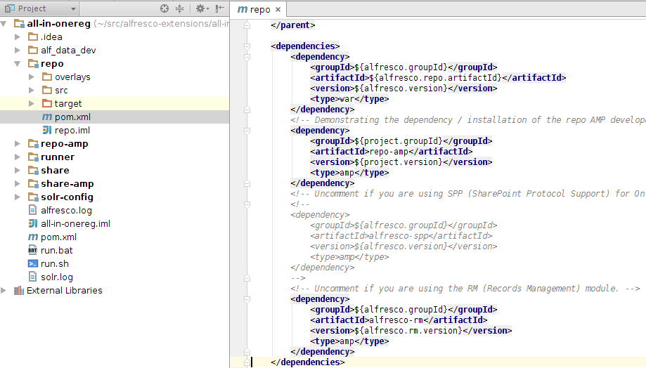
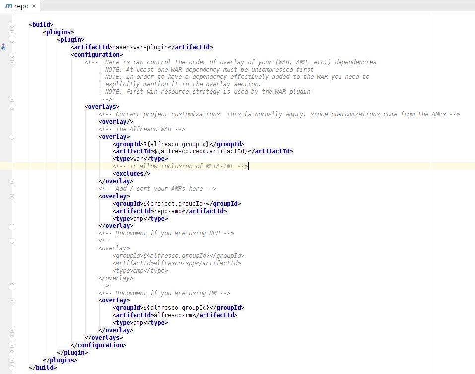
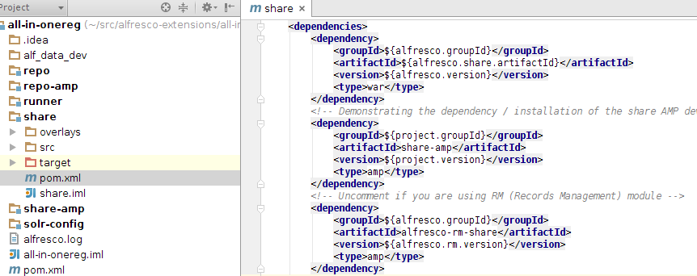
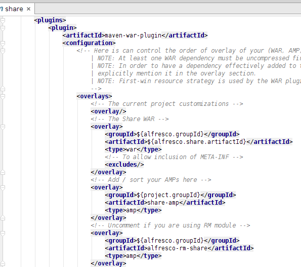

# Linking Standard Alfresco AMPs to an AIO project

Some functionality of the Alfresco content management system is delivered as extra modules, such as for example Records Management \(RM\), Google Docs Integration, and SharePoint Protocol \(SPP\) Support. This sections goes through how to link such modules to an All-in-One \(AIO\) project.

This task assumes you completed the [Installing and Configuring software](../concepts/alfresco-sdk-installing-prerequisite-software.md) section and generated an AIO project [as described in this section](alfresco-sdk-tutorials-all-in-one-archetype.md).

You will learn how to link standard Alfresco AMPs to the AIO project so you can use the extra Alfresco functionality that they provide. Most of these modules are implemented with two AMPs. One for server side \(Repository\) customizations that should be added to the alfresco.war, and one with the custom UI functionality that should be added to the share.war. **As an example we will add/link the Records Management \(RM\) module to the AIO project.** It comes implemented in two AMPs.

1.  Linking the RM repository AMP to the alfresco.war.
2.  Add the RM repository AMP dependency.

    In the IDE, open up the alfresco-extensions/acme-cms-poc/repo/pom.xml. Scroll down so you see the `dependencies` section:

    

    What you need to do here is uncomment the `alfresco-rm` dependency, which brings in the RM Repository AMP. Note that dependency `type` is set to `amp`, this is because by default Maven dependencies are assumed to be JARs.

3.  Overlaying the RM repository AMP on the alfresco.war.

    The RM repository AMP will not be automatically added to the alfresco.war by just adding the dependency. We need to add some configuration to the war plugin. Scroll further down in the alfresco-extensions/acme-cms-poc/repo/pom.xml file until you see the `maven-war-plugin` section:

    

    What you need to do here is uncomment the `alfresco-rm` overlay, which will overlay the RM repository AMP as the last operation to build the customized alfresco.war.

4.  Linking the RM Share AMP to the share.war.
5.  Add the RM Share AMP dependency.

    In the IDE, open up the alfresco-extensions/acme-cms-poc/share/pom.xml. Scroll down so you see the `dependencies` section:

    

    What you need to do here is uncomment the `alfresco-rm-share` dependency, which brings in the RM Share AMP.

6.  Overlaying the RM Share AMP on the share.war.

    The RM Share AMP will not be automatically added to the share.war by just adding the dependency. We need to add some configuration to the war plugin. Scroll further down in the alfresco-extensions/acme-cms-poc/share/pom.xml file until you see the `maven-war-plugin` section:

    

    What you need to do here is uncomment the `alfresco-rm-share` overlay, which will overlay the RM Share AMP as the last operation to build the customized share.war.

7.  Verify that the AIO project has been configured with the RM module.
8.  Build and Run the AIO project.

    Use the `acme-cms-poc/run.sh` script to run Alfresco Tomcat with the customized WARs.

9.  Check the logs for installation of RM module.

    ```
    
    2015-05-07 10:30:17,004  INFO  [repo.module.ModuleServiceImpl] [localhost-startStop-1] Found 2 module(s).
    2015-05-07 10:30:17,082  INFO  [repo.module.ModuleServiceImpl] [localhost-startStop-1] Installing module 'org_alfresco_module_rm' version 2.3.
    2015-05-07 10:30:18,560  INFO  [repo.module.ModuleServiceImpl] [localhost-startStop-1] Upgrading module 'repo-amp' version 1.0.1505071028 (was 1.0.1505070918).
    ....
    INFO: Starting ProtocolHandler ["http-bio-8080"]
    
    ```

    **Note:** We can see here that version 2.3 of the RM module has been installed.

10. Check that the Site Type `Records Management` is available.

    Login to Share via http://localhost:8080/share and then create a new site. When you create the site select `Records Management Site` from the **Type** drop down. If this type is not available then something is not configured correctly, go back and verify that you have followed all the steps correctly.


You have now seen how a standard Alfresco extension module, such as RM, can be brought into the All-in-One project. Other standard modules, such as SPP, can be added in a similar way. Note that some extension modules are implemented in only one AMP. For example, the SPP AMP in the above screen shots is implementing the SharePoint Protocol, which only touches the repository functionality, and so there is only an SPP dependency and overlay in the acme-cms-poc/repo/pom.xml project.

**Parent topic:**[Advanced Topics](../concepts/alfresco-sdk-advanced-topics.md)

