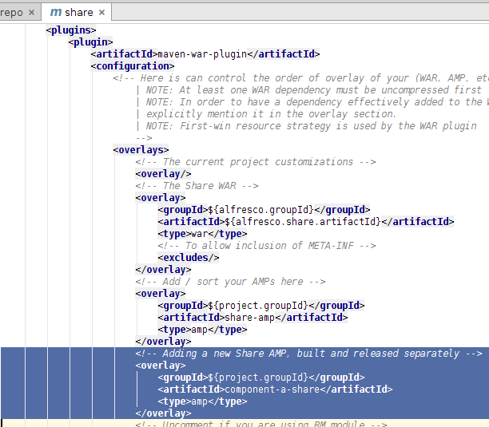

# Creating new stand-alone custom AMPs and linking them to the AIO project

This section goes through how to create a new custom Repository AMP project and a new custom Share AMP project and then link those as dependencies in the AIO project.

This task assumes you completed the [Installing and Configuring software](../concepts/alfresco-sdk-installing-prerequisite-software.md) section and generated an AIO project [as described in this section](alfresco-sdk-tutorials-all-in-one-archetype.md).

You will learn how to create separate AMPs, that are not part of the AIO project, and then how to link those AMPs as dependencies in the AIO project.

**Note:** If you only need to add a Repository AMP, then skip the steps related to the Share AMP, and vice versa.

1.  Generating a new custom Repository AMP and linking it to the Alfresco.war.
2.  Generate the custom Repository AMP.

    Follow instructions in the [create Respository extension project \(AMP\)](alfresco-sdk-tutorials-amp-archetype.md) section. Give the new Repo AMP a unique artifact id that does not clash with any other ids or the one that is part of the AIO project \(i.e. repo-amp\). For this example I have used the id `component-a-repo`. Use the same group id as for the rest of your project artifacts, I'm using `com.acme`. The AMP is stored in the alfresco-extensions/component-a-repo folder and is not part of the AIO build.

3.  Build and release version 1.0.0 of the Repository AMP. **\(Optional\)**

    It is best to avoid SNAPSHOTS when this AMP is included in the All-in-One project. So, use the `maven-release-plugin` and release and tag the AMP so it is ready to be include in the main AIO project.

    **Note:** Going through how to configure and setup the `maven-release-plugin` is out of scope for this article.

4.  Add the custom Repository AMP Dependency

    In the IDE, open up the alfresco-extensions/acme-cms-poc/repo/pom.xml project file. Scroll down so you see the `dependencies` section. Then add a dependency to `component-a-repo`:

    

    Note that dependency for the AMP uses the `project.groupId`, which is the same as what we used for the custom AMP, `com.acme`. If you skipped the build and release step \(2\), then use version 1.0-SNAPSHOT instead.

5.  Overlaying the custom Repository AMP on the alfresco.war

    The Repository AMP will not be automatically added to the alfresco.war by just adding the dependency. We need to add some configuration to the war plugin. Scroll further down in the alfresco-extensions/acme-cms-poc/repo/pom.xml file until you see the `maven-war-plugin` section. Then add a overlay for the `component-a-repo`:

    

6.  Run the AIO project and verify that the new repo module is recognized

    ```
    
    ...                        
    2015-05-07 14:18:44,770  INFO  [repo.module.ModuleServiceImpl] [localhost-startStop-1] Found 2 module(s).
    2015-05-07 14:18:44,791  INFO  [repo.module.ModuleServiceImpl] [localhost-startStop-1] Installing module 'component-a-repo' version 1.0.0.
    2015-05-07 14:18:44,808  INFO  [repo.module.ModuleServiceImpl] [localhost-startStop-1] Installing module 'repo-amp' version 1.0.1505071417.
    ....
    
    ```

7.  Generating a new custom Share AMP and adding it to the Share.war.
8.  Generate the custom Share AMP.

    Follow instructions in the [create Share extension project \(AMP\)](alfresco-sdk-tutorials-share-amp-archetype.md) section. Give the new Share AMP a unique artifact id that does not clash with any other ids or the one that is part of the AIO project \(i.e. share-amp\). For this example I have used the id `component-a-share`. Use the same group id as for the rest of your project artifacts, I'm using `com.acme`. The AMP is stored in the alfresco-extensions/component-a-share folder and is not part of the AIO build.

9.  Build and release version 1.0.0 of the Share AMP. **\(Optional\)**

    It is best to avoid SNAPSHOTS when this AMP is included in the All-in-One project. So, use the `maven-release-plugin` and release and tag the AMP so it is ready to be include in the main AIO project.

    **Note:** Going through how to configure and set up the `maven-release-plugin` is out of scope for this article.

10. Add the custom Share AMP Dependency.

    In the IDE, open up the alfresco-extensions/acme-cms-poc/share/pom.xml project file. Scroll down so you see the `dependencies` section. Then add a dependency to `component-a-share`:

    

    Note that dependency for the AMP uses the `project.groupId`, which is the same as what we used for the custom AMP, `com.acme`. If you skipped the build and release step \(2\), then use version 1.0-SNAPSHOT instead.

11. Overlaying the custom Share AMP on the share.war

    The Share AMP will not be automatically added to the share.war by just adding the dependency. We need to add some configuration to the war plugin. Scroll further down in the alfresco-extensions/acme-cms-poc/share/pom.xml file until you see the `maven-war-plugin` section. Then add a overlay for the `component-a-share`:

    

12. There is no logs indicating the AMPs that have been installed on the Alfresco Share web application, so the only way to test is to use whatever custom functionality it is implementing, and see if it works.


You have seen how to build AMP projects separately from the main AIO project, and then how you can incorporate those AMP projects in the main AIO project.

**Parent topic:**[Adding more custom AMPs to an AIO project](../concepts/alfresco-sdk-advanced-add-custom-amps.md)

