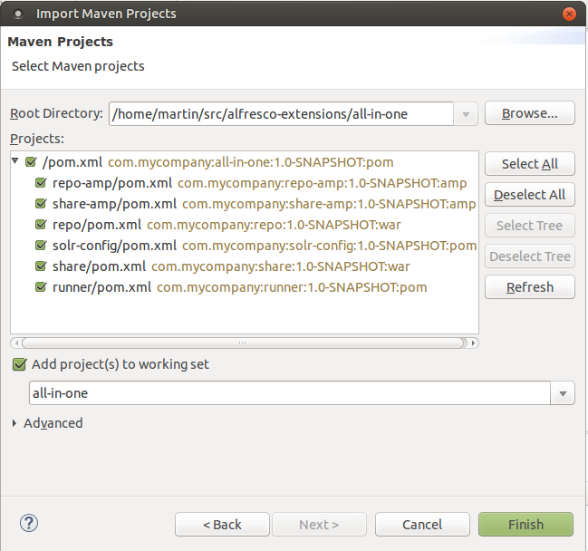
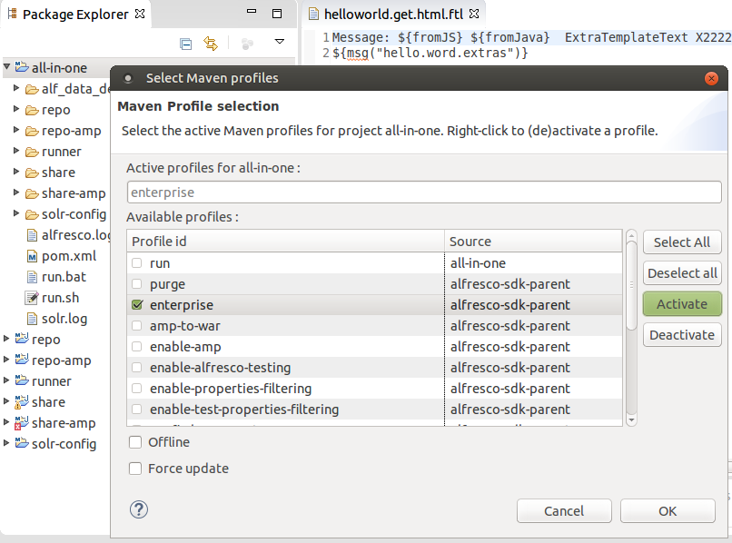
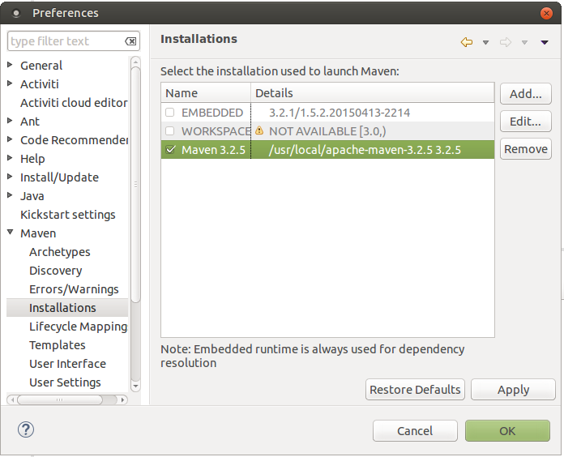
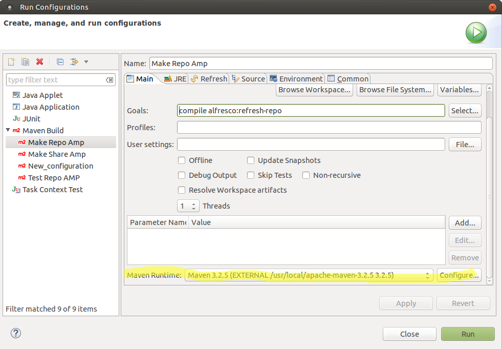

# Importing SDK projects into Eclipse

The Alfresco SDK is designed to work well with Eclipse. This support includes the ability to import existing SDK projects \(created via the command line\) into Eclipse.

This task assumes you completed the [Installing and Configuring software](../concepts/alfresco-sdk-installing-prerequisite-software.md) section and generated a project [as described in this section](../concepts/alfresco-sdk-tutorials-archetypes.md).

You will learn how to import an existing Maven project into Eclipse.

1.  In Eclipse, from the main menu select **File** \> **Import...** \> **Maven** \> **Existing Maven Projects**.

2.  Click **Next \>**

3.  Click **Browse...\>**

4.  Navigate to the directory where your Maven project is located. For example alfresco-extensions/all-in-one.

    You should see a dialog looking something like this when importing an All-in-One \(AIO\) project:

    

5.  Click **Finish**

    The project, and any sub-projects, will now be imported.

6.  Enable Alfresco Enterprise edition **\(Optional\)**

    If your project is using the Enterprise edition of Alfresco you also want Eclipse to load the enterprise versions of the Alfresco WARs and related libraries. You can do this by enable the `enterprise` profile. In the **Package Explorer** view to the left, right click on the **all-in-one** project, then select **Maven** from the popup menu. Now in the next popup menu choose **Select Maven Profiles...**. In the dialog that appears select the `enterprise` profile, you should see a dialog looking something like this now:

    

7.  Configure external Maven

    Use the external Maven installation. In the **Window** top menu to the right in Eclipse, click on the **Preferences** sub-menu item at the bottom, then select **Maven** from the pop-up dialog menu. Now in the Maven sub-menu choose **Installations**. In the dialog that appears to the right select the external Maven installation \(or add it if it is not in the list\), you should see a dialog looking something like this now:

    

    Now close this **Preferences** dialog and open the **Run Configurations** dialog. Make sure the external Maven configuration is used:

    

    **Warning:** If the EMBEDDED Maven installation is used then you might encounter the EXCEPTION\_ACCESS\_VIOLATION JRE error when running.

You have seen how to import your SDK project\(s\) into Eclipse. You can now build, run and debug them in the usual way, using RAD and TDD techniques.

**Parent topic:**[Rapid Application Development \(RAD\)](../concepts/alfresco-sdk-rad.md)

