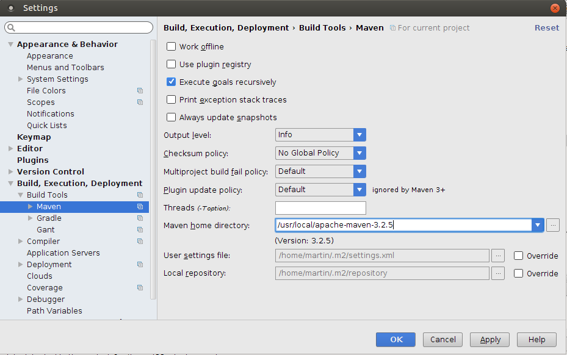
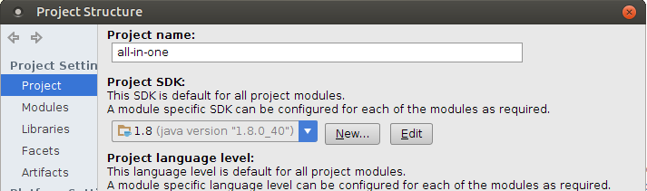
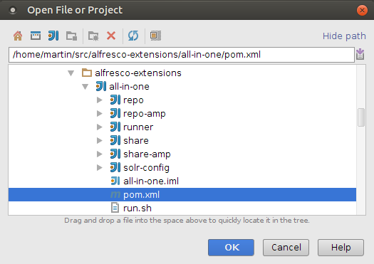
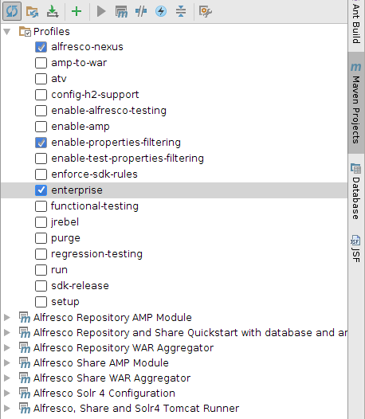
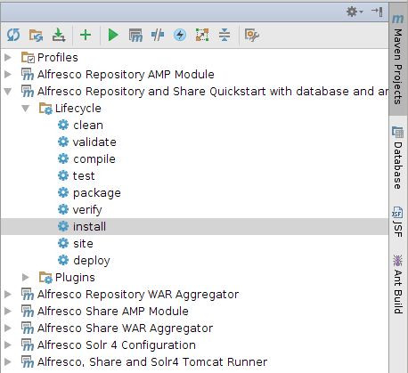

# Importing SDK projects into IntelliJ IDEA

The Alfresco SDK is designed to work well with IntelliJ IDEA. This support includes the ability to import existing SDK projects \(created via the command line\) into IDEA.

This task assumes you completed the [Installing and configuring software](../concepts/alfresco-sdk-installing-prerequisite-software.md) section and generated a project [as described in this section](../concepts/alfresco-sdk-tutorials-archetypes.md).

You will learn how to import an existing Maven project into IDEA.

1.  First, make sure IDEA is using the correct Maven installation \(3.2.5 or newer\). In the main menu, select **File** \> **Settings...**.

    In the IDEA Settings dialog you should see something like this:

    

2.  Then check that you are using JDK 8, In the main menu, select **File** \> **Project Structure...**.

    In the IDEA Project Structure dialog you should see something like this:

    

3.  Now, in the main menu, select **File** \> **Open...**

4.  Navigate to where the project's parent pom is located, in this case the AIO parent pom.

    You should see a dialog looking something like this when you have located an All-in-One \(AIO\) project:

    

5.  Select the pom.xml file for the All-in-One parent project.

6.  Click **OK**. The project is now imported and should appear in the **Project** tool view to the left.

7.  Enable Alfresco Enterprise edition **\(Optional\)**

    If your project is using the Enterprise edition of Alfresco you also want IDEA to load the enterprise versions of the Alfresco WARs and related libraries. You can do this by enable the `enterprise` profile. In the **Maven Projects** tool view to the right expand the **Profiles** folder, then check the **enterprise** profile. You should see a dialog looking something like this:

    

8.  Now use Maven to build the All-in-One \(AIO\) project. Do this by executing the `install` command on the parent AIO project. In the **Maven Projects** tool view to the right expand the parent pom, then expand the **Lifecycle** folder.

    You should see a dialog looking something like this:

    

9.  Double-click the `install` plugin goal.

    The project will build, and information will be displayed in the Console. You will see a message similar to the following, indicating that the project was successfully built.

    ```
    
                            
    /usr/lib/jvm/java-8-oracle/bin/java -Xms256m -Xmx1G -XX:PermSize=500m -javaagent:/home/martin/libs/springloaded-1.2.3.RELEASE.jar -noverify -Dmaven.home=/usr/local/apache-maven-3.2.5 ......  install
                            
    [INFO] Reactor Summary:
    [INFO] 
    [INFO] Alfresco Repository and Share Quickstart with database and an embedded Tomcat runner. SUCCESS [  0.387 s]
    [INFO] Alfresco Repository AMP Module ..................... SUCCESS [ 38.368 s]
    [INFO] Alfresco Share AMP Module .......................... SUCCESS [  0.734 s]
    [INFO] Alfresco Repository WAR Aggregator ................. SUCCESS [ 11.000 s]
    [INFO] Alfresco Solr 4 Configuration ...................... SUCCESS [  0.028 s]
    [INFO] Alfresco Share WAR Aggregator ...................... SUCCESS [  9.903 s]
    [INFO] Alfresco, Share and Solr4 Tomcat Runner ............ SUCCESS [  0.007 s]
    [INFO] ------------------------------------------------------------------------
    [INFO] BUILD SUCCESS
    [INFO] ------------------------------------------------------------------------
    [INFO] Total time: 01:01 min
    [INFO] Finished at: 2015-05-06T11:28:02+01:00
    [INFO] Final Memory: 61M/503M
    [INFO] ------------------------------------------------------------------------
    
    Process finished with exit code 0
    
                        
    ```

    **Attention:** You should see that the `MAVEN_OPTS` setting has been picked up by IDEA, look at the first line of the log.


You have seen how to import your SDK project into IntelliJ and how to build it.

**Parent topic:**[Rapid Application Development \(RAD\)](../concepts/alfresco-sdk-rad.md)

