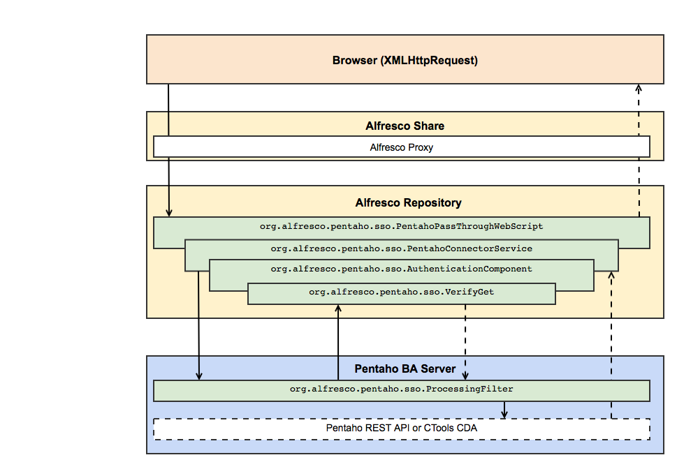

# Web services and Alfresco Analytics

When a user views a report in Alfresco Share, the content is pulled from either the Pentaho User Console, or from the Pentaho REST API, depending on whether the report is pre-defined or custom. To ensure continuity, web services enable SSO \(single sign-on\) filtering through Alfresco.

The SSO flow for pre-defined reports uses the Pentaho REST API or Pentaho CTools Community Data Access \([CDA](http://www.webdetails.pt/ctools/cda/)\):

1.  The browser sends a request to Alfresco Share.

2.  Alfresco Share sends a request to the Alfresco repository.

3.  The Alfresco repository uses `org.alfresco.pentaho.sso.PentahoPassThroughWebScript` to send a request to the Analytics server.

4.  `org.alfresco.pentaho.sso.PentahoConnectorService` looks for a Pentaho session ID, and requests a new token for the logged in user if it finds no session ID.

5.  `org.alfresco.pentaho.sso.AuthenticationComponent` creates a token for a user, and stores session IDs.

6.  If the user is logged in and a token is present:

    1.  The Analytics server sends a request to the Alfresco repository \(`org.alfresco.pentaho.sso.ProcessingFilter`\) to exchange the token for a user name and roles. It also remembers the session ID for future requests.

    2.  The Alfresco repository responds with the user name and roles if the token is recognized \(`org.alfresco.pentaho.sso.VerifyGet`\), and discards the token so that it cannot be used again.

7.  The Analytics server returns the data.

The diagram shows how data is either passed from the Pentaho REST API for pre-defined reports or for custom reports \(as defined in [Create a custom REST service in Alfresco Analytics](analytics-rest-service.md)\):

