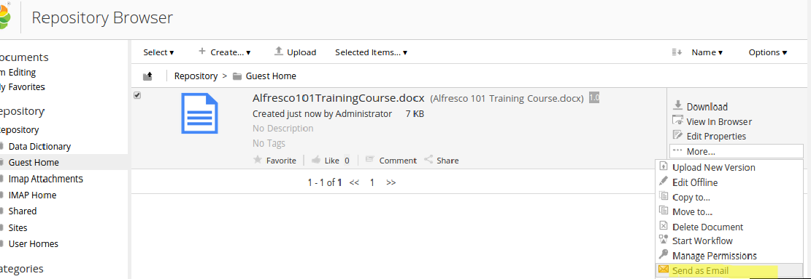
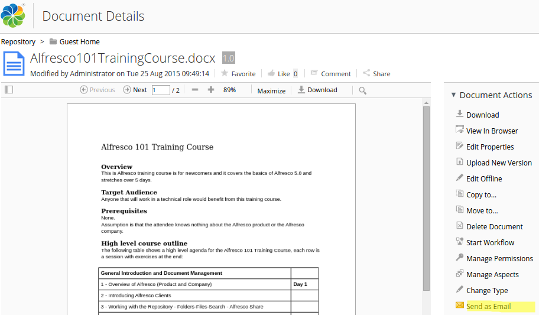
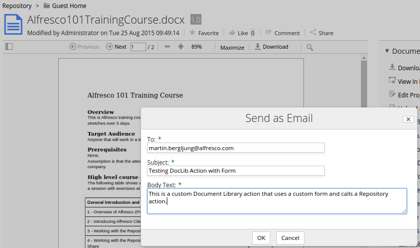
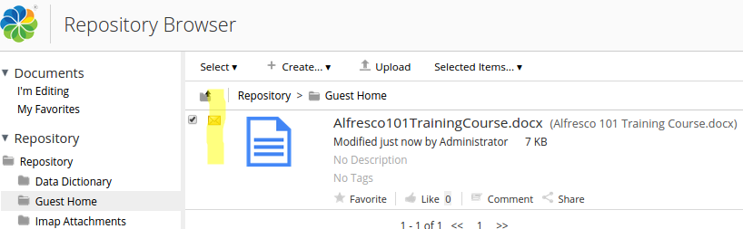
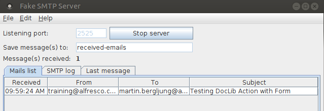
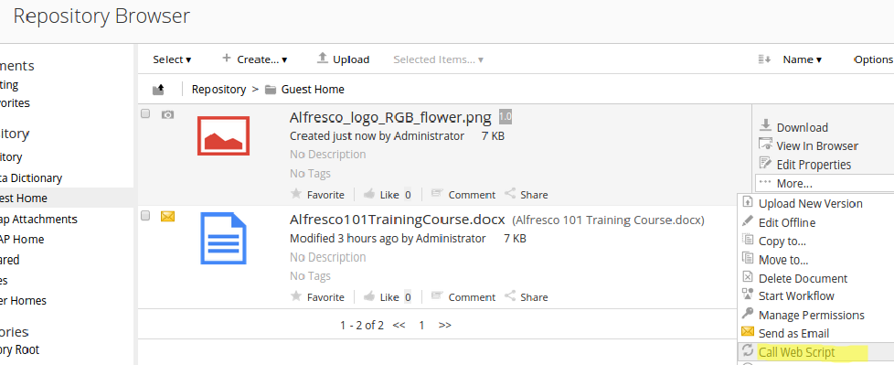
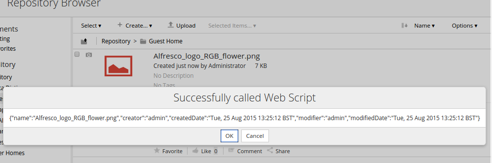
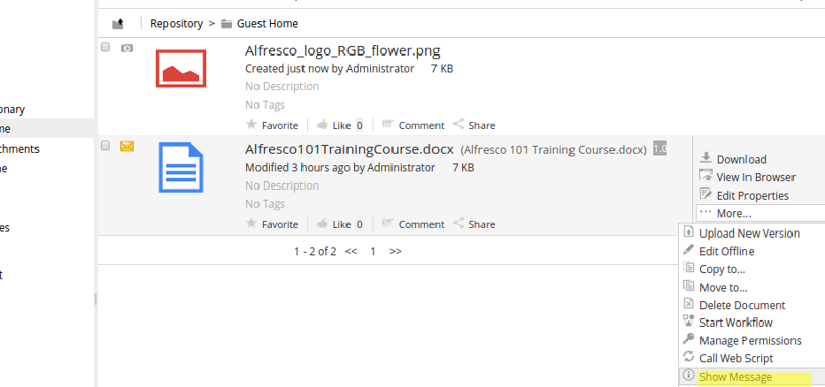
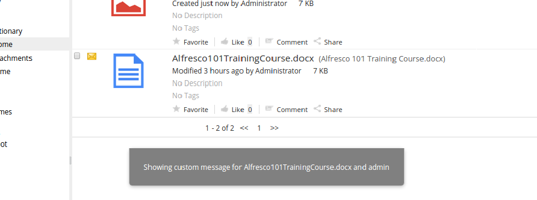
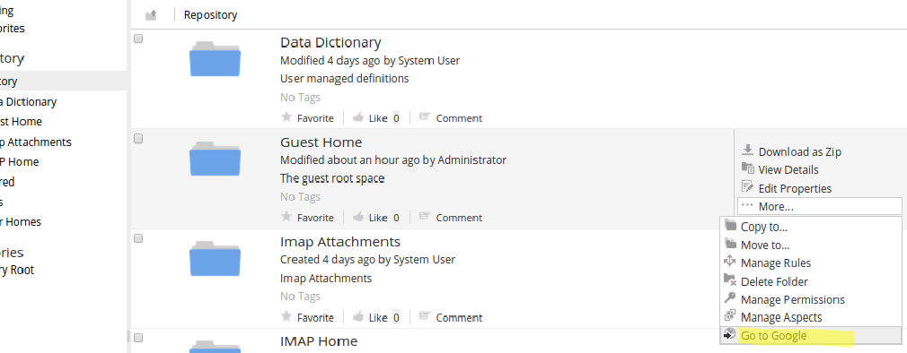

# Adding new actions to the Document Library

|**Name**|Adding new actions to the Document Library|
|**Extension Point**|[Document Library](../concepts/dev-extensions-share-doclib-actions.md)|
|**Description**|In many Alfresco extension projects you want to customize the Document Library in Alfresco Share. And quite often this involves adding new actions that can be applied to the content in the library. These actions are referred to as "DocLib" actions, and unlike a lot of other functionality in Alfresco, they do not use Web Scripts to implement their business logic, at least not directly, instead they hook into custom, or out-of-the-box, client-side JavaScript code.

 Each action has a 16x16 icon, one or more text labels, and configuration to hook them into the Share application. Most actions by their nature do something, and it’s likely that they will make a call back to the repository to perform their work, which may require a custom Repository Action or a custom Repository Web Script.

 This tutorial will demonstrate how to add a DocLib action that can be used to send documents as attachments in an email. The "Send-as-Email" action will be available for documents in Browse view and Details view. The implementation of this action will make use of a form to collect the email data, such as where to send the email, subject, etc. The email will be sent by a custom Repository Action that is invoked by an out-of-the-box JavaScript function.

 The tutorial will also show how a Web Script can be called from a DocLib action in a an easy way. And finally we will look at how to create an action that displays an external Web page.

|
|**Implementation Steps**|Adding a new DocLib action to the Document Library involves the following steps: 1.  Configure the action so it is known to Share \(typically in a Surf Extension Module\)
2.  Configure where the action should be visible \(typically in a Surf Extension Module\)
3.  \(Optionally\) Configure a form for the action if it requires input from the end-user, such as asking for email address, email subject, etc \(typically in a Surf Extension Module\)
4.  Add a custom icon
5.  \(Optionally\) Add an evaluator if the action should be visible based on a condition, such as previously executed or not
6.  \(Optionally\) Add a status indicator, can for example be used to show if an action has been applied to a content item
7.  Implement custom client side JavaScript code that should be called when action is invoked, or use one of the out-of-the-box JavaScript functions \(e.g. `onActionFormDialog` - displays a form and then calls a Repo Action, `onActionSimpleRepoAction` - calls a Repo Action\)
8.  \(Optionally\) Implement any Repository Action or Repository Web Script that should be invoked by the action

As we can see, implementing a DocLib action can involve quite a few steps and take some time. However, it can also be very simple as we will see with our DocLib action example that navigates to the Google search home page.|
|**Related Information**|This tutorial assumes that you are familiar with the Document Library in Alfresco Share. If you are new to it read up on it [here](library-access.md) before starting this tutorial. Also, familiar yourself with how [Surf Extension Modules](../concepts/dev-extensions-share-surf-extension-modules.md) work as we will be creating one of those.|
|**Source Code**|[Go to code](https://github.com/Alfresco/alfresco-sdk-samples/tree/alfresco-50/all-in-one/add-action-doclib-share)|

This tutorial assumes you completed the [Installing and Configuring software](../concepts/alfresco-sdk-installing-prerequisite-software.md) section and generated an AIO project [as described in this section](alfresco-sdk-tutorials-all-in-one-archetype.md). To try out the Send-As-Email DocLib action in this tutorial you will need to install a local SMTP server such as [Fake SMTP](https://nilhcem.github.io/FakeSMTP/).

This tutorial will demonstrate the following:

-   How to create a DocLib action that uses the out-of-the-box `onActionFormDialog` JavaScript function to collect data from the user via a form and then call a Repository action with this data \(Send-As-Email\).
-   How to create a DocLib action that invokes a custom JavaScript function and displays a message \(Show-Custom-Message\)
-   How to create a DocLib action that invokes a custom Repository Web Script \(Call-Web-Script\)
-   How to create a DocLib action that navigates to an external web page \(Go-To-Google\)

Tutorial implementation steps:

1.  Preparations for the Send-As-Email DocLib action.
2.  Add a project with a Repository Action that can send emails with attachments.

    This tutorial assumes that we have a Repository Action available that can send emails with attachments. Currently the out-the-box `mail` Repository action cannot send emails with attachments. So we need to include another custom Repo action that can do this. The SDK sample code has a Repository AMP project with such an action that we can use. It is available [here](https://github.com/Alfresco/alfresco-sdk-samples/tree/alfresco-50/all-in-one/add-action-repo) .

    Copy the whole `add-action-repo` AMP project into your All-In-One project. Then include it in the Repository WAR project by updating the all-in-one/repo/pom.xml file as follows:

    ```
           ...
            <dependency>
                <groupId>${project.groupId}</groupId>
                <artifactId>repo-amp</artifactId>
                <version>${project.version}</version>
                <type>amp</type>
            </dependency>
    
            <!-- The new Repo action project is added here -->
            <dependency>
                <groupId>${project.groupId}</groupId>
                <artifactId>add-action-repo</artifactId>
                <version>${project.version}</version>
                <type>amp</type>
            </dependency>
            ...
                            <overlay>
                                <groupId>${project.groupId}</groupId>
                                <artifactId>repo-amp</artifactId>
                                <type>amp</type>
                            </overlay>
                    
                            <!-- The new Repo action project is added here -->
                            <overlay>
                                <groupId>${project.groupId}</groupId>
                                <artifactId>add-action-repo</artifactId>
                                <type>amp</type>
                            </overlay>
            
            
    ```

    A Repository action with the `send-as-email` ID is now available and we can call it from a DocLib action. It takes three parameters as can be seen in the implementation:

    ```
    public class SendAsEmailActionExecuter extends ActionExecuterAbstractBase {
        private static Log logger = LogFactory.getLog(SendAsEmailActionExecuter.class);
    
        public static final String PARAM_EMAIL_TO_NAME = "to";
        public static final String PARAM_EMAIL_SUBJECT_NAME = "subject";
        public static final String PARAM_EMAIL_BODY_NAME = "body_text";
    
        ...
    
        @Override
        protected void addParameterDefinitions(List<ParameterDefinition> paramList) {
            for (String s : new String[]{PARAM_EMAIL_TO_NAME, PARAM_EMAIL_SUBJECT_NAME, PARAM_EMAIL_BODY_NAME}) {
                paramList.add(new ParameterDefinitionImpl(s, DataTypeDefinition.TEXT, true, getParamDisplayLabel(s)));
            }
        }               
            
    ```

    Our Send-As-Email DocLib action will collect the values for these three parameters via a form.

3.  Start up the SMPT Server

    After downloading the FakeSMTP server, see link in the beginning of this tutorial, unpack and then start it with the following command:

    ```
    martin@gravitonian:~/apps/fakeSMTP$ java -jar fakeSMTP-1.13.jar -s -p 2525 
    ```

    It should start up immediately and listen on port 2525, you should see a UI that will display any incoming emails.

4.  Implementing the Send-As-Email DocLIb Action.
5.  Add a new Share AMP module called `add-action-doclib-share` to the AIO project. Instructions for how to do that can be found [here](alfresco-sdk-advanced-add-custom-amps-aio.md) \(Note. do not add a Repository AMP\). This Share AMP project will contain the implementation for all the DocLib actions we create in this tutorial, not just the Send-As-Email action.

6.  Add a new Surf Extension Module file and define the Send-As-Email action

    Call the file add-doclib-actions-extension-modules.xml and save it in the all-in-one/add-action-doclib-share/src/main/amp/config/alfresco/web-extension/site-data/extensions directory \(note. it is important to give this file a unique name when several Share AMPs are installed, otherwise the last one wins\).

    Then define the Send-As-Email DocLib action as follows:

    ```
    <extension>
        <modules>
            <module>
                <id>Add Document Libarary Actions (Send-as-Email, Call WS, Show Msg, Go to Google)</id>
                <version>1.0</version>
                <auto-deploy>true</auto-deploy>
                <configurations>
                    <config evaluator="string-compare" condition="DocLibActions">
                        <actions>
                            <action id="alfresco.tutorials.doclib.action.sendAsEmail"
                                    icon="email"
                                    type="javascript"
                                    label="alfresco.tutorials.doclib.action.sendAsEmail.label">
                                <param name="function">onActionFormDialog</param>
                                <param name="itemKind">action</param>
                                <param name="itemId">send-as-email</param> <!-- Repository action id = Spring Bean id -->
                                <param name="mode">create</param>
                                <param name="destination">{node.nodeRef}</param>
                                <param name="successMessage">alfresco.tutorials.doclib.action.sendAsEmail.msg.success</param>
                                <param name="failureMessage">alfresco.tutorials.doclib.action.sendAsEmail.msg.failure</param>
                                <evaluator negate="true">alfresco.tutorials.evaluator.isEmailed</evaluator>
                            </action>
                        </actions>
                    </config>
                </configurations>
            </module>
        </modules>
    </extension> 
    ```

    The different attributes and sub-elements for the `action` element have the following meaning:

    |Name|Description|
    |----|-----------|
    |`id`|The global identifier for this action. It's used when you refer to this action in other parts of the configuration, such as when defining where it should be visible.

|
    |`icon`

|Share will look for an icon that starts with this name and ends with “-16.png”. So it will look for email-16.png in our case. Alfresco expects the image file to be located in the /components/documentlibrary/actions directory. If not set, the id is used.

|
    |`type`

|Sets the type of action; this can be either `javascript` \(as in our example\) if you want the action to execute some Java Script code, `link` if you want to invoke some external URL, or `pagelink` if you want to invoke a URL within the Share web application. More details around the different types:

    -   `link` - accepts a `href` parameter that will be passed a `nodeRef` token for substitution, used for external links.
    -   `pagelink` - accepts a `page` parameter that will be passed a `nodeRef` token for substitution, used for Share links.
    -   `javascript` - accepts a `function` parameter with a JavaScript function that will get the current folder item as first argument.
|
    |`label`

|Points to a property name in a resource file. The value of this property will be displayed in the UI as the action’s label. In our case the resource file is all-in-one/add-action-doclib-share/src/main/amp/config/alfresco/web-extension/messages/add-doclib-actions-custom.properties

|
    |`param`

|There can be one or more parameters set for an action. In case of a `javascript` action they will be passed into the Java Script code, there is one special parameter with the name `function` that sets the Java Script function that should be called when the action is executed. In case of a `link` action the parameters would typically be used to specify `href` and `target`. In case of a `pagelink` action a `page` parameter is used to specify a relative URL within the Share web application.

|
    |`evaluator`

|Spring Bean id for an evaluator that is called by the system to find out if the action should be visible or not in the UI. An evaluator extends the `org.alfresco.web.evaluator.BaseEvaluator` class. You can negate the result of calling the evaluator by setting the `negate` attribute to `true`. In our case we do not want to show the Send-As-Email action if it has already been invoked on a content file.

|

    When the Send-As-Email action is invoked we want it to do the following:

    1.  Display a form where the end-user can type in the values for the email address, email subject, and email body text.
    2.  When the form is submitted it should automatically call a by us defined Repository action with the information collected via the form.
    We achieve this by using the out-of-the-box JavaScript function called `onActionFormDialog`. The following table explains the parameters used with this function:

    |Name|Description|
    |----|-----------|
    |`itemKind`|The “kind” of item that the form is for, and that should be invoked when the form is submitted. For example, `node`, `task`, `type`, `action` \(i.e. Repository Action\), `mbean`. In our case we are going to show a form that collects values for parameters used when invoking a Repository action, so we specify `itemKind` as `action`.

 If you need multiple forms for the same `itemKind` and `itemId` then you can also add an extra parameter called `formId`. It is the form configuration to lookup, refers to the `id` attribute of the `form` element. If omitted the `default` form is used, i.e. the form element without an `id` attribute.

|
    |`itemId`

|The identifier for the item the form is for, this will be different for each “kind” of item, for an `action` it would be the Spring bean ID for the Repository action definition, for a `node` it would be a NodeRef etc. In our case it is set to `send-as-email`, which matches a Spring Bean ID in the all-in-one/add-action-repo/src/main/amp/config/alfresco/module/add-action-repo/context/service-context.xml context file.

|
    |`mode`

|Mode the current form is in, can be `view`, `edit` or `create`, defaults to `edit`. In our case we are using the `create` mode as we want the form to be empty so we can collect new email information.

|
    |`destination`

|Provides a destination for any new items created by the form. When present a hidden field is generated with a name of `alf_destination`. Note. This parameter is necessary even if the action is not creating any new items/nodes.

|
    |`successMessage`

|A message to display when the DocLib action is executed successfully. It actually points to a property name in a resource file. In our case the resource file is all-in-one/add-action-doclib-share/src/main/amp/config/alfresco/web-extension/messages/add-doclib-actions-custom.properties

|
    |`failureMessage`

|A message to display when the DocLib action execution failed. It actually points to a property name in a resource file. In our case the resource file is all-in-one/add-action-doclib-share/src/main/amp/config/alfresco/web-extension/messages/add-doclib-actions-custom.properties

|

7.  Add an i18n resource file that will contain all the labels and messages for the Send-As-Email action.

    We can use the existing all-in-one/add-action-doclib-share/src/main/amp/config/alfresco/web-extension/messages/custom.properties file for this, we just need to update its name so it does not clash with other Share AMPs that might be deployed **\(Not needed if using SDK 2.1.1\)**. Change the name to add-doclib-actions-custom.properties. Then add the following properties to it:

    ```
    alfresco.tutorials.doclib.action.sendAsEmail.label=Send as Email
    alfresco.tutorials.doclib.action.sendAsEmail.msg.success='{0}' successfully sent in email to {1}.
    alfresco.tutorials.doclib.action.sendAsEmail.msg.failure=Couldn't send '{0}' in email to {1}.
    ```

8.  Update the name of the custom-slingshot-application-context.xml file **\(Not needed if using SDK 2.1.1\)**.

    Change it to all-in-one/add-action-doclib-share/src/main/amp/config/alfresco/web-extension/add-action-doclib-context.xml. This way it will not clash with the same file from other deployed Share AMPs. We also need to update the resource bundle name that it should load as we changed it in previous step:

    ```
    <property name="resourceBundles">
                <list>
                    <value><pre>alfresco.web-extension.messages.add-doclib-actions-custom</pre></value>
    ```

9.  Define where in the user interface the Send-As-Email action should be displayed.

    This is also done in the add-doclib-actions-extension-modules.xml file in a new section called `actionGroups`::

    ```
    <extension>
        <modules>
            <module>
                <id>Add Document Libarary Actions (Send-as-Email, Call WS, Show Msg, Go to Google)</id>
                <version>1.0</version>
                <auto-deploy>true</auto-deploy>
                <configurations>
                    <config evaluator="string-compare" condition="DocLibActions">
                        <actions>
                         ...
                        </actions>
                        
                         <actionGroups>
                            <actionGroup id="document-browse">
                                <action index="400" id="alfresco.tutorials.doclib.action.sendAsEmail" />
                            </actionGroup>
                            <actionGroup id="document-details">
                                <action index="400" id="alfresco.tutorials.doclib.action.sendAsEmail" />
                            </actionGroup>
                        </actionGroups>
                    </config>
                </configurations>
            </module>
        </modules>
    </extension>
    ```

    In this sub-section we configure in what document library views the action should be visible and where in the list of actions it should be displayed \(ordering\). To refer to the action we use the `id` that was specified when the `action` was defined. The following table shows available `actionGroups`:

    |Action Group Id|Default usage|
    |---------------|-------------|
    |`document-browse`|Action is visible for documents on the Browse page

|
    |`document-details`

|Action is visible for document on the Document Details page

|
    |`folder-browse`

|Action is visible for folders on the Browse page

|
    |`folder-details`

|Action is visible for folder on the Folder Details page

|
    |`document-link-browse`

|Action is visible for links to documents on the Browse page

|
    |`document-link-details`

|Action is visible for link to document on the Document Details page|
    |`folder-link-browse`

|Action is visible for links to folders on the Browse page

|
    |`folder-link-details`

|Action is visible for link to folder on the Folder Details page|

    The `index` argument is specifying the order of this action in the list of actions. The higher the number the lower it will be displayed in the action list. By having a look in the share-documentlibrary-config.xml configuration file located in the alfresco/tomcat/webapps/share/WEB-INF/classes/alfresco directory of your Alfresco 5.0 installation, you can find out that the highest index for `document-browse` actions is 360 and for `document-details` actions 390. So if we set our `index` for the Send-As-Email action to 400 it should end up last in both of these action lists.

    If you want more examples of how Document Library actions can be defined and configured, have a look in the share-documentlibrary-config.xml file and the `DocLibActions` section.

10. Add a custom icon for the Send-As-Email action.

    The icons for all the Document Library actions are stored in the tomcat/webapps/share/components/documentlibrary/actions directory in your Alfresco installation. The system will try and load any custom Document Library action icons from this directory. Icons are loaded via the resource Servlet and action icons related to the Document Library are loaded with the http://localhost:8080/share/res/components/documentlibrary/actions/<icon\>-16-png URL. This article is not about how to create a 16x16 icon in PNG format so copy one from the SDK sample source. In fact, copy all the icons that we need for all actions in this tutorial from this [folder](https://github.com/Alfresco/alfresco-sdk-samples/tree/alfresco-50/all-in-one/add-action-doclib-share/src/main/amp/web/components/documentlibrary/actions) and put them in the all-in-one/add-action-doclib-share/src/main/amp/web/components/documentlibrary/actions directory of your project \(you might have to create this directory path\).

11. Add an Evaluator for the Send-As-Email action.

    For demonstration purpose the `send-as-email` Repository action is implemented so it sets the `cm:emailed` aspect on the document after it has been sent in an email. This will then be checked by this evaluator, which will disable the Send-As-Email DocLib action if the document has the `cm:emailed` aspect already applied.

    There are three parts to setting up an evaluator for a Document Library action:

    1.  Configure it with the <evaluator\> element in the action configuration \(We have already done this\)
    2.  Create a Java class that extends the `org.alfresco.web.evaluator.BaseEvaluator` class
    3.  Define a spring bean with an id matching the <evaluator\> configuration element’s value and then set the class for the Spring bean to the one implemented in step 2
    Create a new Java class called `CheckIfDocIsEmailedEvaluator` in the all-in-one/add-action-doclib-share/src/main/java/org/alfresco/tutorial/doclibaction/evaluator/ package \(you will have to create the package path\). Then implement the Java class like this:

    ```
    package org.alfresco.tutorial.doclibaction.evaluator;
    
    import org.alfresco.web.evaluator.BaseEvaluator;
    import org.json.simple.JSONArray;
    import org.json.simple.JSONObject;
    
    public class CheckIfDocIsEmailedEvaluator extends BaseEvaluator {
        private static final String ASPECT_EMAILED = "cm:emailed";
    
        @Override
        public boolean evaluate(JSONObject jsonObject) {
            try {
                JSONArray nodeAspects = getNodeAspects(jsonObject);
                if (nodeAspects == null) {
                    return false;
                } else {
                    if (nodeAspects.contains(ASPECT_EMAILED)) {
                        return true;
                    } else {
                        return false;
                    }
                }
            } catch (Exception err) {
                throw new RuntimeException("JSONException whilst running action evaluator: " + err.getMessage());
            }
        }
    }
    ```

    The `evaluate` method gets a JSON object passed in from which you can get all the information you need about the node that the action is being applied to. Here we use the `getNodeAspects` method to get all the aspects that have been applied to the node \(for more methods look in the `BaseEvaluator` class\). Then we just check if the `cm:emailed` aspect has been applied to the node \(i.e. file\).

    Next thing we need to do is define a Spring Bean for this evaluator, this is done in the add-action-doclib-context.xml file located in the all-in-one/add-action-doclib-share/src/main/amp/config/alfresco/web-extension. directory. Define the bean as follows:

    ```
    <bean id="alfresco.tutorials.evaluator.isEmailed"
           class="org.alfresco.tutorial.doclibaction.evaluator.CheckIfDocIsEmailedEvaluator" />
    ```

    Note here that the `id` has to match what was specified for the `<evaluator>` element in the `action` definition.

    It is not always necessary to create evaluators from scratch. There are a number of predefined evaluators \(i.e. out of the box evaluators ready to use\):

    -   Has aspect
    -   Is mimetype
    -   Property not Null
    -   Site preset
    -   Site / No Site
    -   Container Type
    -   Node Type
    -   Always false
    -   Value-based
    -   Metadata value
    -   Is Browser \(type\)
    -   Is Portlet mode
    See the slingshot-documentlibrary-context.xml file located in the alfresco/tomcat/webapps/share/WEB-INF/classes/alfresco directory of your Alfresco 5 installation for more information about out-of-the-box evaluators.

12. Add a Status Indicator for the Send-As-Email action.

    Sometimes you might want to know if a document has been emailed without going in and checking if the `cm:emailed` aspects has been applied. This can be achieved by adding a so called status indicator. An indicator is displayed in the Document Library browse view and builds on the work we have already done with the evaluator.

    There are four parts to setting up an indicator for a Document Library action:

    1.  Make sure you got an `<evaluator>` element in the `action` configuration \(We have already done this\) and that this evaluator has been implemented \(We have already done this\)
    2.  Add an `indicator` configuration to the `DocumentLibrary` section configuration
    3.  Add i18n label to the resource property file
    4.  Add an image to be used as indicator to the components/documentlibrary/indicators directory
    The `indicator` configuration is also done in the add-doclib-actions-extension-modules.xml file and points to the evaluator previously implemented. It looks like this in the new `DocumentLibrary` section:

    ```
    <extension>
        <modules>
            <module>
                <id>Add Document Libarary Actions (Send-as-Email, Call WS, Show Msg, Go to Google)</id>
                <version>1.0</version>
                <auto-deploy>true</auto-deploy>
                <configurations>
                    <config evaluator="string-compare" condition="DocumentLibrary">
                        <indicators>
                            <indicator id="alfresco.tutorials.indicator.isEmailed"
                                       icon="email-16.png"
                                       index="100"
                                       label="alfresco.tutorials.indicator.isEmailed.label">
                                <evaluator>alfresco.tutorials.evaluator.isEmailed</evaluator>
                            </indicator>
                        </indicators>
                    </config>
    
                    <config evaluator="string-compare" condition="DocLibActions">
                    ...
                    </config>
    
                </configurations>
            </module>
        </modules>
    </extension>
    ```

    The different attributes and sub-elements for the `indicator` element have the following meaning:

    |Name|Description|
    |----|-----------|
    |`id`|The global identifier for this indicator.

|
    |`icon`

|The name of the icon to display as the status indicator. Alfresco expects the image file to be located in the /components/documentlibrary/indicators directory. If not specified, “id” is used. Note. In this case Alfresco does not assume \*-16.png format but you have to specify the complete file name.

|
    |`index`

|Is used to order the indicator in the UI when there are several indicators displayed for a document. If we look in the share-documentlibrary-config.xml \(in the alfresco5/tomcat/webapps/share/WEB-INF/classes/alfresco directory\) configuration file we can see that the largest index for out-of-the-box indicators is 90, so by using 100 the emailed indicator will always be displayed last in the list.

|
    |`label`

|Points to a property name in a resource file. The value of this property will be displayed in the UI as the indicators tool-tip. In our case the resource file is all-in-one/add-action-doclib-share/src/main/amp/config/alfresco/web-extension/messages/add-doclib-actions-custom.properties

|
    |`evaluator`

|Spring Bean id for an evaluator that is called by the system to find out if the indicator should be visible or not in the UI. An evaluator extends the `org.alfresco.web.evaluator.BaseEvaluator` class. You can negate the result of calling the evaluator by setting the `negate` attribute to `true`. In our case we do want to show the indicator if the Send-As-Email action has been invoked on a content file, so we don't negate.

|

    Now update the resource properties file with the value for the label, open the add-doclib-actions-custom.properties file and add the following property to it:

    ```
    alfresco.tutorials.indicator.isEmailed.label=This document has been emailed
    ```

    As an indicator image we will use the same one as is used for the action. Copy the email-16.png icon from the all-in-one/add-action-doclib-share/src/main/amp/web/components/documentlibrary/actions directory to the all-in-one/add-action-doclib-share/src/main/amp/web/components/documentlibrary/indicators directory \(you might have to create the indicators directory\).

13. Add the form for the Send-As-Email action.

    The Send-As-Email action invokes the out-of-the-box `onActionFormDialog` JavaScript function, which expects there to be a form registered for the Repository action that is invoked.

    The Repository action that sends emails with attachments is registered with the id `send-as-email` \(see all-in-one/add-action-repo/src/main/amp/config/alfresco/module/add-action-repo/context/service-context.xml\). We define a form for it as follows in the add-doclib-actions-extension-modules.xml file:

    ```
    <extension>
        <modules>
            <module>
                <id>Add Document Libarary Actions (Send-as-Email, Call WS, Show Msg, Go to Google)</id>
                <version>1.0</version>
                <auto-deploy>true</auto-deploy>
                <configurations>
                    <config evaluator="string-compare" condition="DocumentLibrary">
                    ...
                    </config>
    
                    <config evaluator="string-compare" condition="DocLibActions">
                    ...                
                    </config>
    
                    <config evaluator="string-compare"
                            condition="send-as-email"> <!-- ID for the Repository Action that this form is associated with -->
                        <forms>
                            <form>
                                <field-visibility>
                                    <show id="to"/>
                                    <show id="subject"/>
                                    <show id="body_text"/>
                                </field-visibility>
                                <appearance>
                                    <field id="to" label-id="alfresco.tutorials.doclib.action.sendAsEmail.form.field.to"/>
                                    <field id="subject" label-id="alfresco.tutorials.doclib.action.sendAsEmail.form.field.subject"/>
                                    <field id="body_text" label-id="alfresco.tutorials.doclib.action.sendAsEmail.form.field.body_text">
                                        <control template="/org/alfresco/components/form/controls/textarea.ftl" />
                                    </field>
                                </appearance>
                            </form>
                        </forms>
                    </config>
    
                </configurations>
            </module>
        </modules>
    </extension>
    ```

    Note here that the field identifiers \(i.e. the `id` attribute\) need to match the parameters sent into the send-as-email Repository action. See all-in-one/add-action-repo/src/main/java/org/alfresco/tutorial/repoaction/SendAsEmailActionExecuter.java.

    Update the resource properties file with the field labels as follows, the property names must match what we defined in the form definition above \(i.e. the `label-id` values\). In the add-doclib-actions-custom.properties file add the following properties:

    ```
    alfresco.tutorials.doclib.action.sendAsEmail.form.field.to=To
    alfresco.tutorials.doclib.action.sendAsEmail.form.field.subject=Subject
    alfresco.tutorials.doclib.action.sendAsEmail.form.field.body_text=Body Text
    ```

14. The implementation of the Send-As-Email DocLib action is now complete, build and start the application server as follows:

    ```
    /all-in-one$ mvn clean install -Prun
    ```

15. Now, login to Alfresco Share \(http://localhost:8080/share\) and upload a document to some folder. You will see the new Send-As-Email action in the Browse view when hovering over the document and clicking **More...** in the pop-up menu:

    

    Clicking on the file name displays the Document Details view, where the Send-As-Email action should also be visible:

    

    Clicking on the Send-As-Email action will display the form for collecting email information:

    

    Filling in the form and clicking **OK** will call the `send-as-email` Repository action, which will send the email with the file as attachment. The Repo action will also apply the `cm:emailed` aspect to the document. So we should be able to see the indicator on the file telling us the Send-As-Email action has been applied to it:

    

    If the FakeSMTP server is running we should see a new email picked up:

    

16. Implementing the Call-Web-Script DocLib Action.
17. Define and configure the Call-Web-Script action

    Open the add-doclib-actions-extension-modules.xml Surf Extension module file that we have used so far in the tutorial, it is located in the all-in-one/add-action-doclib-share/src/main/amp/config/alfresco/web-extension/site-data/extensions directory.

    Then define the Call-Web-Script DocLib action as follows:

    ```
    <extension>
        <modules>
            <module>
                <id>Add Document Libarary Actions (Send-as-Email, Call WS, Show Msg, Go to Google)</id>
                <version>1.0</version>
                <auto-deploy>true</auto-deploy>
                <configurations>
                    <config evaluator="string-compare" condition="DocLibActions">
                        <actions>
                        ...
                            <action id="alfresco.tutorials.doclib.action.callWebScript"
                                    icon="callws"
                                    type="javascript"
                                    label="alfresco.tutorials.doclib.action.callWebScript.label">
                                <param name="function">onActionCallWebScript</param>
                                <param name="successMessage">alfresco.tutorials.doclib.action.callWebScript.msg.success</param>
                                <param name="failureMessage">alfresco.tutorials.doclib.action.callWebScript.msg.failure</param>
                            </action>
                        </actions>
                    </config>
                </configurations>
            </module>
        </modules>
    </extension> 
    ```

    This action is also of type `javascript` in the same way the Send-As-Email action was. However, this action will call a custom JavaScript function called `onActionCallWebScript`. The callws-16.png icon for this action should already be available if you implemented the Send-As-Email action above.

18. Add labels and messages for the Call-Web-Script to the i18n resource file .

    Open up the add-doclib-actions-custom.properties file locate din the all-in-one/add-action-doclib-share/src/main/amp/config/alfresco/web-extension/messages directory. Then add the following properties to it:

    ```
    alfresco.tutorials.doclib.action.callWebScript.label=Call Web Script
    alfresco.tutorials.doclib.action.callWebScript.msg.success=Successfully called Web Script
    alfresco.tutorials.doclib.action.callWebScript.msg.failure=Failed to invoke Web Script
    ```

19. Define where in the user interface the Call-Web-Script action should be displayed.

    This is done in the add-doclib-actions-extension-modules.xml file in the section called `actionGroups`::

    ```
    <extension>
        <modules>
            <module>
                <id>Add Document Libarary Actions (Send-as-Email, Call WS, Show Msg, Go to Google)</id>
                <version>1.0</version>
                <auto-deploy>true</auto-deploy>
                <configurations>
                    <config evaluator="string-compare" condition="DocLibActions">
                        <actions>
                         ...
                        </actions>
                        
                         <actionGroups>
                            <actionGroup id="document-browse">
                                ...
                                <action index="401" id="alfresco.tutorials.doclib.action.callWebScript" />
                            </actionGroup>
                            <actionGroup id="document-details">
                                ...
                                <action index="401" id="alfresco.tutorials.doclib.action.callWebScript" />
                            </actionGroup>
                        </actionGroups>
                    </config>
                </configurations>
            </module>
        </modules>
    </extension>
    ```

    The Call-Web-Script action will be displayed in the same views as the Send-As-Email action. We give it an `index` of `401` so it is displayed just after the Send-As-Email action.

20. Implement the custom JavaScript function that is invoked by the Call-Web-Script action.

    This is the first custom JavaScript function that we implement so we need a new file for it, call it custom-doclib-actions.js and put it in the all-in-one/add-action-doclib-share/src/main/amp/web/components/documentlibrary directory.

    The implementation of the `onActionCallWebScript` function looks like this:

    ```
    (function () {
        YAHOO.Bubbling.fire("registerAction",
            {
                actionName: "onActionCallWebScript",
                fn: function org_alfresco_training_onActionCallWebScript(file) {
                    this.modules.actions.genericAction(
                        {
    
                            success: {
                                callback: {
                                    fn: function org_alfresco_training_onActionCallWebScriptSuccess(response) {
                                        Alfresco.util.PopupManager.displayPrompt(
                                            {
                                                title: this.msg("alfresco.tutorials.doclib.action.callWebScript.msg.success"),
                                                text: JSON.stringify(response.json),
                                                buttons: [
                                                    {
                                                        text: this.msg("button.ok"),
                                                        handler: function org_alfresco_training_onActionCallWebScriptSuccess_success_ok() {
                                                            this.destroy();
                                                        },
                                                        isDefault: true
                                                    },
                                                    {
                                                        text: this.msg("button.cancel"),
                                                        handler: function org_alfresco_training_onActionCallWebScriptSuccess_cancel() {
                                                            this.destroy();
                                                        }
                                                    }]
                                            });
    
                                    },
                                    scope: this
                                }
                            },
                            failure: {
                                message: this.msg("alfresco.tutorials.doclib.action.callWebScript.msg.failure",
                                    file.displayName, Alfresco.constants.USERNAME)
                            },
                            webscript: {
                                name: "sample/fileinfo?nodeRef={nodeRef}",
                                stem: Alfresco.constants.PROXY_URI,
                                method: Alfresco.util.Ajax.GET,
                                params: {
                                    nodeRef: file.nodeRef
                                }
                            },
                            config: {}
                        });
                }
            });
    })();
    ```

    The way we plug-in custom JavaScript action handlers is to call the `YAHOO.Bubbling.fire(“registerAction”…)` method. This will tell the system about the new action JavaScript code, and it will be plugged in after the out- of-the-box code to allow for customization and extensions.

    In the `org_alfresco_training_onActionCallWebScript` function we use the `this.modules.actions.genericAction` function to call a specific custom Web Script \(or an out-of-the-box Web Script if we wanted to\). The `genericAction` function is defined in the doclib-actions.js file located in the alfresco/tomcat/webapps/share/modules/documentlibrary directory of an Alfresco 5 installation. This function sets up the Web Script call based on the passed in parameters \(i.e. success.callback.fn, failure.message, webscript.name, etc\). There are a lot more parameters that we can use if we wanted to more stuff when calling the Web Script, such as firing an event after successful invocation.

    Here is a list from the documentation:

    ```
     /**
           * ACTION: Generic action.
           * Generic DocLib action based on passed-in parameters
           *
           * @method genericAction
           * @param action.success.event.name {string} Bubbling event to fire on success
           * @param action.success.event.obj {object} Bubbling event success parameter object
           * @param action.success.message {string} Timed message to display on success
           * @param action.success.callback.fn {object} Callback function to call on success.
           * <pre>function(data, obj) where data is an object literal containing config, json, serverResponse</pre>
           * @param action.success.callback.scope {object} Success callback function scope
           * @param action.success.callback.obj {object} Success callback function object passed to callback
           * @param action.success.activity.siteId {string} Site associated with activity
           * @param action.success.activity.activityType {string} Activity type to post
           * @param action.success.activity.page {string} Page to generate activity link to
           * @param action.success.activity.activityData {object} Metadata for activity type
           * @param action.failure.event.name {string} Bubbling event to fire on failure
           * @param action.failure.event.obj {object} Bubbling event failure parameter object
           * @param action.failure.message {string} Timed message to display on failure
           * @param action.failure.callback.fn {object} Callback function to call on failure.
           * <pre>function(data, obj) where data is an object literal containing config, json, serverResponse</pre>
           * @param action.failure.callback.scope {object} Failure callback function scope
           * @param action.failure.callback.obj {object} Failure callback function object passed to callback
           * @param action.webscript.stem {string} optional webscript URL stem
           * <pre>default: Alfresco.constants.PROXY_URI + "slingshot/doclib/action/"</pre>
           * @param action.webscript.name {string} data webscript URL name
           * @param action.webscript.method {string} HTTP method to call the data webscript on
           * @param action.webscript.queryString {string} Optional queryString to append to the webscript URL
           * @param action.webscript.params.siteId {string} current site
           * @param action.webscript.params.containerId {string} component container
           * @param action.webscript.params.path {string} path where file is located
           * @param action.webscript.params.file {string} file to be deleted
           * @param action.webscript.params.nodeRef {string} noderef instead of site, container, path, file
           * @param action.wait.message {string} if set, show a Please wait-style message during the operation
           * @param action.config {object} optional additional request configuration overrides
           * @return {boolean} false: module not ready
           */
    ```

    The Web Script we are going to call is registered on the `sample/fileinfo?nodeRef={nodeRef}` URL. This is a new custom Web Script that just takes a node reference as a parameter and then fetches some properties for this node in the controller. The Web Script template will send back a JSON response with the data for these properties. We will implement it in the next step. The full Web Script URL that is invoked when the action is executed looks something like this:

    `http://localhost:8080/share/proxy/alfresco/sample/fileinfo?nodeRef=workspace://SpacesStore/cbb63e68-9884-4d24-abb3-28aaf8677169`

    The call to the Alfresco Repository Web Script is proxied via Alfresco Share so authentication credentials etc are managed automatically for us. There will be no Login dialog popping up :-\)

    If the Web Script is invoked successfully we call the `Alfresco.util.PopupManager.displayPrompt(` function from the success callback to display the response from the Web Script. The success callback is implemented with the `org_alfresco_training_onActionCallWebScriptSuccess` function.

21. Implement the File Info Web Script that is indirectly invoked by the Call-Web-Script action.

    We will add this Web Script to the Repo AMP project that comes with the All-In-One project when it is generated.

    Add a Web Script descriptor file called file-info.get.desc.xml to the all-in-one/repo-amp/src/main/amp/config/alfresco/extension/templates/webscripts directory. Define it as follows:

    ```
    <webscript>
        <shortname>Sample Webscript that returns Audit data</shortname>
        <description>Returns the audit data for file with passed in node reference</description>
        <url>/sample/fileinfo?nodeRef={nodeRef}</url>
        <authentication>user</authentication>
        <format default="json"></format>
    </webscript>
    ```

    Then add the controller file called file-info.get.js:

    ```
    var nodeRef = args["nodeRef"];
    var fileNode = search.findNode(nodeRef);
    
    model["name"] = fileNode.name;
    model["creator"] = fileNode.properties.creator;
    model["createdDate"] = fileNode.properties.created;
    model["modifier"] = fileNode.properties.modifier;
    model["modifiedDate"] = fileNode.properties.modified; 
    ```

    Finally add the template file called file-info.get.json.ftl:

    ```
    <#assign datetimeformat="EEE, dd MMM yyyy HH:mm:ss zzz">
    {
        "name"          : "${name}",
        "creator"       : "${creator}",
        "createdDate"   : "${createdDate?string(datetimeformat)}",
        "modifier"      : "${modifier}",
        "modifiedDate"  : "${modifiedDate?string(datetimeformat)}"
    }
    ```

22. The implementation of the Call-Web-Script DocLib action is now complete, build and start the application server as follows:

    ```
    /all-in-one$ mvn clean install -Prun
    ```

23. Now, login to Alfresco Share \(http://localhost:8080/share\) and upload a file to some folder. You will see the new Call-Web-Script action in the Browse view when hovering over the file and clicking **More...** in the pop-up menu:

    

    Note that the Send-As-Email action might not be displayed in the pop-up menu if it has already been invoked. Invoking the "**Call Web Script**" action will display the following dialog with the Web Script JSON response \(if the invocation was successful\):

    

24. Implementing the Show-Custom-Message DocLib Action.
25. Define and configure the Show-Custom-Message action

    This action is just executing some JavaScript code that shows a message, it will not call a Repository action or a Repository Web Script. It just demonstrates how to invoke some JavaScript code on the client side without involving the Repository and the server side.

    Open the add-doclib-actions-extension-modules.xml Surf Extension module file that we have used so far in this tutorial, it is located in the all-in-one/add-action-doclib-share/src/main/amp/config/alfresco/web-extension/site-data/extensions directory.

    Then define the Show-Custom-Message DocLib action as follows:

    ```
    <extension>
        <modules>
            <module>
                <id>Add Document Libarary Actions (Send-as-Email, Call WS, Show Msg, Go to Google)</id>
                <version>1.0</version>
                <auto-deploy>true</auto-deploy>
                <configurations>
                    <config evaluator="string-compare" condition="DocLibActions">
                        <actions>
                        ...
                            <action id="alfresco.tutorials.doclib.action.showCustomMessage"
                                    icon="showmsg"
                                    type="javascript"
                                    label="alfresco.tutorials.doclib.action.showCustomMessage.label">
                                <param name="function">onShowCustomMessage</param>
                            </action>
                        </actions>
                    </config>
                </configurations>
            </module>
        </modules>
    </extension> 
    ```

    This action is also of type `javascript` in the same way the previous actions have been.This action will call a custom JavaScript function called `onShowCustomMessage`. The showmsg-16.png icon for this action should already be available if you implemented the Send-As-Email action above.

26. Add labels and messages for the Show-Custom-Message to the i18n resource file .

    Open up the add-doclib-actions-custom.properties file locate din the all-in-one/add-action-doclib-share/src/main/amp/config/alfresco/web-extension/messages directory. Then add the following properties to it:

    ```
    alfresco.tutorials.doclib.action.showCustomMessage.text=Showing custom message for {0} and {1}
    alfresco.tutorials.doclib.action.showCustomMessage.label=Show Message
    ```

27. Define where in the user interface the Show-Custom-Message action should be displayed.

    This is done in the add-doclib-actions-extension-modules.xml file in the section called `actionGroups`::

    ```
    <extension>
        <modules>
            <module>
                <id>Add Document Libarary Actions (Send-as-Email, Call WS, Show Msg, Go to Google)</id>
                <version>1.0</version>
                <auto-deploy>true</auto-deploy>
                <configurations>
                    <config evaluator="string-compare" condition="DocLibActions">
                        <actions>
                         ...
                        </actions>
                        
                         <actionGroups>
                            <actionGroup id="document-browse">
                                ...
                                <action index="402" id="alfresco.tutorials.doclib.action.showCustomMessage" />
                            </actionGroup>
                            <actionGroup id="document-details">
                                ...
                                <action index="402" id="alfresco.tutorials.doclib.action.showCustomMessage" />
                            </actionGroup>
                        </actionGroups>
                    </config>
                </configurations>
            </module>
        </modules>
    </extension>
    ```

    The Show-Custom-Message action will be displayed in the same views as the other actions that we have implemented. We give it an `index` of `402` so it is displayed just after the Call-Web-Script action.

28. Implement the custom JavaScript function that is invoked by the Show-Custom-Message action.

    This JavaScript function can go into the same file as the Call-Web-Script function, open the custom-doclib-actions.js file located in the all-in-one/add-action-doclib-share/src/main/amp/web/components/documentlibrary directory and add the code as follows:

    ```
    (function () {
        YAHOO.Bubbling.fire("registerAction",
            {
                actionName: "onShowCustomMessage",
                fn: function org_alfresco_training_onShowCustomMessage(file) {
                    Alfresco.util.PopupManager.displayMessage(
                        {
                            text: this.msg("alfresco.tutorials.doclib.action.showCustomMessage.text",
                                file.displayName, Alfresco.constants.USERNAME)
                        });
                }
            });
    
        YAHOO.Bubbling.fire("registerAction",
            {
                actionName: "onActionCallWebScript",
               ...
            });
    })();
    ```

    The only thing we do in this action code is to display a message with the help of the `Alfresco.util.PopupManager.displayMessage` function.

29. The implementation of the Show-Custom-Message DocLib action is now complete. This is probably the smallest DocLib action backed by JavaScript code that you might come across. To try it out build and start the application server as follows:

    ```
    /all-in-one$ mvn clean install -Prun
    ```

30. Now, login to Alfresco Share \(http://localhost:8080/share\). You will see the new Show-Custom-Message action in the Browse view when hovering over a file and clicking **More...** in the pop-up menu:

    

    Note that the Send-As-Email action is not displayed in the pop-up menu as it has already been invoked, see the indicator. Invoking the "**Show Message**" action will display the following message temporary:

    

31. Implementing the Go-to-Google DocLib Action.
32. Define and configure the Go-to-Google action.

    This action is different from all the others that we have implemented in that it is not backed by a specific JavaScript function. Instead it is of type `link` and just takes you to the Google search home page when clicked.

    Open the add-doclib-actions-extension-modules.xml Surf Extension module file that we have used so far in this tutorial, it is located in the all-in-one/add-action-doclib-share/src/main/amp/config/alfresco/web-extension/site-data/extensions directory.

    Then define the Go-to-Google DocLib action as follows:

    ```
    <extension>
        <modules>
            <module>
                <id>Add Document Libarary Actions (Send-as-Email, Call WS, Show Msg, Go to Google)</id>
                <version>1.0</version>
                <auto-deploy>true</auto-deploy>
                <configurations>
                    <config evaluator="string-compare" condition="DocLibActions">
                        <actions>
                        ...
                            <action id="alfresco.tutorials.doclib.action.goToGoogle"
                                    icon="google"
                                    type="link"
                                    label="alfresco.tutorials.doclib.action.goToGoogle.label">
                                <param name="href">http://www.google.com</param>
                                <param name="target">_blank</param>
                            </action>
                        </actions>
                    </config>
                </configurations>
            </module>
        </modules>
    </extension> 
    ```

    The google-16.png icon for this action should already be available if you implemented the Send-As-Email action above.

33. Add the label for the Go-to-Google action to the i18n resource file .

    Open up the add-doclib-actions-custom.properties file locate din the all-in-one/add-action-doclib-share/src/main/amp/config/alfresco/web-extension/messages directory. Then add the following property to it:

    ```
    alfresco.tutorials.doclib.action.goToGoogle.label=Go to Google
    ```

34. Define where in the user interface the Go-to-Google action should be displayed.

    This is done in the add-doclib-actions-extension-modules.xml file in the section called `actionGroups`::

    ```
    <extension>
        <modules>
            <module>
                <id>Add Document Libarary Actions (Send-as-Email, Call WS, Show Msg, Go to Google)</id>
                <version>1.0</version>
                <auto-deploy>true</auto-deploy>
                <configurations>
                    <config evaluator="string-compare" condition="DocLibActions">
                        <actions>
                         ...
                        </actions>
                        
                         <actionGroups>
                            <actionGroup id="document-browse">
                                ...
                                <action index="403" id="alfresco.tutorials.doclib.action.goToGoogle" />
                            </actionGroup>
                            <actionGroup id="document-details">
                                ...
                                <action index="403" id="alfresco.tutorials.doclib.action.goToGoogle" />
                            </actionGroup>
                            <actionGroup id="folder-browse">
                                <action index="403" id="alfresco.tutorials.doclib.action.goToGoogle" />
                            </actionGroup>
                        </actionGroups>
                    </config>
                </configurations>
            </module>
        </modules>
    </extension>
    ```

    The Go-to-Google action will be displayed in the same views as the other actions that we have implemented, plus for folders when in Browse view. We give it an `index` of `403` so it is displayed after all the other custom DocLib actions that we have implemented.

35. The implementation of the Go-to-Google DocLib action is now complete, not much to it really, it's very easy to add a DocLib action for navigating to an external page. To try it out build and start the application server as follows:

    ```
    /all-in-one$ mvn clean install -Prun
    ```

36. Now, login to Alfresco Share \(http://localhost:8080/share\). You will see the new Go-to-Google action in the Browse view when hovering over for example a folder and clicking **More...** in the pop-up menu:

    

    Note that the other DocLib actions are not visible when you look at the Folder actions. This is because they have not been configured to be visible for this view type. Invoking the "**Go to Google**" action will open up `www.google.com` in a different tab in the Browser.


**Parent topic:**[Document Library](../concepts/dev-extensions-share-tutorials-document-library.md)

