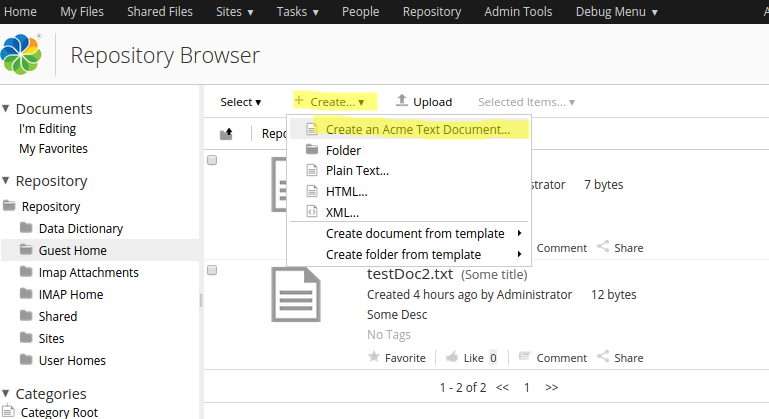
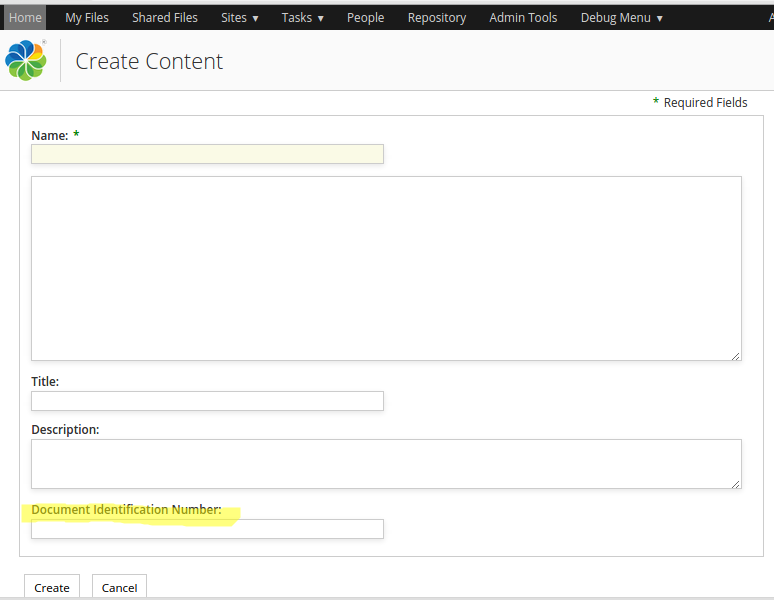

# Adding a menu item to the "Create..." menu in DocLib

|**Name**|Adding a menu item to the "Create..." menu in Document Library|
|**Extension Point**|[Surf Extension Modules](../concepts/dev-extensions-share-surf-extension-modules.md)|
|**Description**|This tutorial demonstrates how to add a new menu item called "Create an Acme Text Document" to the "Create..." menu that is available in the browse view in the Document Library. When the new menu item is selected it will prompt the user for document name, title, description, and text content. When the user clicks **Create** to create the document it will be created with a custom type set. Because the document is created with a custom type we also need to configure a "create" form for this type, which this tutorial shows how to do.The general take away from this tutorial is that most of the configuration that is normally done in the share-config-custom.xml file can also be done with Surf Extension Modules, which makes it possible to enable and disable the configuration at runtime.

|
|**Implementation Steps**|Adding a new content create item in the Document Library usually involves the following steps:1.  Create a custom content model, with the type that should be set on content when using the new create content action.
2.  Generate/Use a Repo AMP project to contain the custom model
3.  Create a Surf Extension Module containing the create action definition and the form definition.
4.  Generate/Use a new Share AMP project to contain the Surf Extension Module

|
|**Related Information**|This tutorial assumes that you are familiar with the Document Library in Alfresco Share. If you are new to it read up on it [here](../concepts/share-repodoclib.md) before starting this tutorial. Also, familiar yourself with how you can create a text document via the **Create... \| Plain Text...** menu item as it is similar to what we are going to do in this tutorial.|
|**Source Code**|[Go to code](https://github.com/Alfresco/alfresco-sdk-samples/tree/alfresco-50/all-in-one/add-create-menuitem-doclib-share)|

This tutorial assumes you completed the [Installing and Configuring software](../concepts/alfresco-sdk-installing-prerequisite-software.md) section and generated an AIO project [as described in this section](alfresco-sdk-tutorials-all-in-one-archetype.md).

Sometimes when you have a custom content model it is useful to be able to create new documents with a custom type set automatically, and at the same time also collect values for the type's custom properties. All directly from the Share user interface. This can be done by adding menu items to the **Create...** menu in the Document Library.

Tutorial implementation steps:

1.  Add a custom content model and type.

    This tutorial assumes that we have a custom type to work with. So we are going to create one in a new custom content model and include it in the Repo AMP that comes with the All-In-One project.

    The Repo AMP already got a file where we can start adding our custom content model. Open up the all-in-one/repo-amp/src/main/amp/config/alfresco/module/repo-amp/model/content-model.xml file and update it so it looks like this:

    ```
    <?xml version="1.0" encoding="UTF-8"?>
    <model name="acme:contentModel" xmlns="http://www.alfresco.org/model/dictionary/1.0">
    
        <!-- Optional meta-data about the model -->
        <description>Document Model for the fictive company Acme</description>
        <author>James Alfresco</author>
        <version>1.0</version>
    
        <imports>
            <!-- Import Alfresco Dictionary Definitions -->
            <import uri="http://www.alfresco.org/model/dictionary/1.0" prefix="d"/>
            <!-- Import Alfresco Content Domain Model Definitions -->
            <import uri="http://www.alfresco.org/model/content/1.0" prefix="cm"/>
            <!-- Import Alfresco System Model Definitions -->
            <import uri="http://www.alfresco.org/model/system/1.0" prefix="sys"/>
        </imports>
    
        <!-- Custom namespace for your domain -->
        <namespaces>
            <namespace uri="http://www.acme.org/model/content/1.0" prefix="acme"/>
        </namespaces>
    
        <!-- ===============================================================================================================
            Constraints, Types, and Aspects go here...
            -->
        <types>
            <!--
                Enterprise-wide Document root type
            -->
            <type name="acme:document">
                <title>Base document type</title>
                <parent>cm:content</parent>
                <properties>
                    <property name="acme:documentId">
                        <title>Document Identification Number</title>
                        <type>d:text</type>
                    </property>
                </properties>
            </type>
    
        </types>
    </model>
    ```

    Here we have defined a new name space for the model called `acme`, and then added a new type to it called `document`. The type has one custom property called `documentId` that can be used to keep an identifier for the document for easier lookup. We will use this type when creating the text document from the Share UI.

2.  Add a new Share AMP module called `add-create-menuitem-doclib-share` to the AIO project. Instructions for how to do that can be found [here](alfresco-sdk-advanced-add-custom-amps-aio.md) \(Note. do not add a Repository AMP\).

3.  Add a new Surf Extension Modules file called add-create-menuitem-doclib-extension-modules.xml to the all-in-one/add-create-menuitem-doclib-share/src/main/amp/config/alfresco/web-extension/site-data/extensions directory \(note. it is important to give this file a unique name when several Share AMPs are installed, otherwise the last one wins\):

    ```
    <extension>
        <modules>
            <!-- This module is dependent on the custom content model setup in the repo-amp module -->
            <module>
                <id>Add a new menu item to Create... menu in DocLib</id>
                <version>1.0</version>
                <auto-deploy>true</auto-deploy>
                <configurations>
                    <config evaluator="string-compare" condition="DocumentLibrary">
                        <create-content>
                            <content id="acme-plain-text" label="create.acmedoc.menu.item.label" icon="text" type="pagelink">
                                <param name="page">create-content?destination={nodeRef}&amp;itemId=acme:document&amp;mimeType=text/plain</param>
                            </content>
                        </create-content>
                    </config>
    
                    <config evaluator="model-type" condition="acme:document">
                        <forms>
                            <form>
                                <field-visibility>
                                    <show id="cm:name"/>
                                    <show id="cm:content" force="true"/>
                                    <show id="cm:title" force="true"/>
                                    <show id="cm:description" force="true"/>
                                    <show id="acme:documentId" force="true"/>
                                    <show id="mimetype"/>
                                    <show id="app:editInline" force="true"/>
                                </field-visibility>
                                <appearance>
                                    <field id="cm:name">
                                        <control>
                                            <control-param name="maxLength">255</control-param>
                                        </control>
                                    </field>
                                    <field id="cm:title">
                                        <control template="/org/alfresco/components/form/controls/textfield.ftl"/>
                                    </field>
                                    <field id="cm:content" label-id="">
                                        <control>
                                            <control-param name="editorAppearance">explorer</control-param>
                                        </control>
                                    </field>
                                    <field id="acme:documentId">
                                        <control template="/org/alfresco/components/form/controls/textfield.ftl"/>
                                    </field>
                                    <field id="mimetype">
                                        <control template="/org/alfresco/components/form/controls/hidden.ftl">
                                            <control-param name="contextProperty">mimeType</control-param>
                                        </control>
                                    </field>
                                    <field id="app:editInline">
                                        <control template="/org/alfresco/components/form/controls/hidden.ftl">
                                            <control-param name="contextProperty">editInline</control-param>
                                        </control>
                                    </field>
                                </appearance>
                            </form>
                        </forms>
                    </config>
                </configurations>
            </module>
        </modules>
    </extension>
    ```

    This extension module first configures the new menu item for the **Create...** menu. These `create-content` menu items can be of three different types \(matching the usual DocLib action configuration\):

    -   **link** - accepts a `href` param that will be passed a `nodeRef` token for substitution, used for external links.
    -   **pagelink** - accepts a `page` param that will be passed a `nodeRef` token for substitution, used for Share links.
    -   **javascript** - accepts a `function` param of an action that will get the current folder item as first argument.
    This new menu item should create a new text document with a custom type applied so the `page` parameter is set to point to the create form page in Share \(i.e. `/create-content?destination={nodeRef}...`\). And the`itemId=acme:document` parameter specifies what custom type that should be applied to the new text document. The `create-content` page has a form manager that will look for a create form matching the `acme:document` type, so we need to define one.

    To create a new form for the `create-content` page we define a configuration section matching the `<config evaluator="model-type" condition="{content model type}">` pattern. The easiest way to get going with these types of forms is to lookup the form for the type that the new custom type is extending, in our case the `cm:content` type. All the out-of-the-box form definitions can be found in the tomcat/webapps/share/WEB-INF/classes/alfresco/share-form-config.xml file. Search for `<config evaluator="model-type" condition="cm:content">` to get the form. Then just change the `condition` and add any custom properties such as `acme:documentId`.

4.  Add an i18n resource file with the create content action label.

    We can use the existing all-in-one/add-create-menuitem-doclib-share/src/main/amp/config/alfresco/web-extension/messages/custom.properties file for this, we just need to update its name so it does not clash with other Share AMPs that might be deployed **\(Not needed if using SDK 2.1.1\)**. Change the name to add-create-menuitem-doclib-custom.properties. Then add the following property to it:

    ```
    create.acmedoc.menu.item.label=Create an Acme Text Document
    ```

    It is also possible to skip these resource label properties all together, and just type in the label directly in the create action definition, if for example the system should only support English:

    ```
    <content id="acme-plain-text" label="Create an Acme Text Document" icon="text" type="pagelink"> 
    ```

5.  Update the name of the custom-slingshot-application-context.xml file **\(Not needed if using SDK 2.1.1\)**.

    Change it to all-in-one/add-create-menuitem-doclib-share/src/main/amp/config/alfresco/web-extension/add-create-menuitem-doclib-context.xml. This way it will not clash with the same file from other deployed Share AMPs. We also need to update the resource bundle name that it should load as we changed it in previous step:

    ```
    <property name="resourceBundles">
                <list>
                    <value>alfresco.web-extension.messages.add-create-menuitem-doclib-custom</value>
    ```

6.  The implementation of this sample is now done, build and start the application server as follows:

    ```
    /all-in-one$ mvn clean install -Prun
    ```

7.  Now, login to Alfresco Share \(http://localhost:8080/share\) and you will see the new **Create... \| Create an Acme Text Document** menu item as follows:

    

    Clicking the new menu item brings up a form that looks like this:

    

    Note the custom field for the document identifier at the bottom of the form.

    **Note:** A Surf Extension module like this can be deployed and undeployed during runtime. And this means that an Administrator can control when different customizations should be visible or hidden. This is managed via the Module deployment page that can be found at: `http://localhost:8080/share/service/modules/deploy`.


**Parent topic:**[Document Library](../concepts/dev-extensions-share-tutorials-document-library.md)

