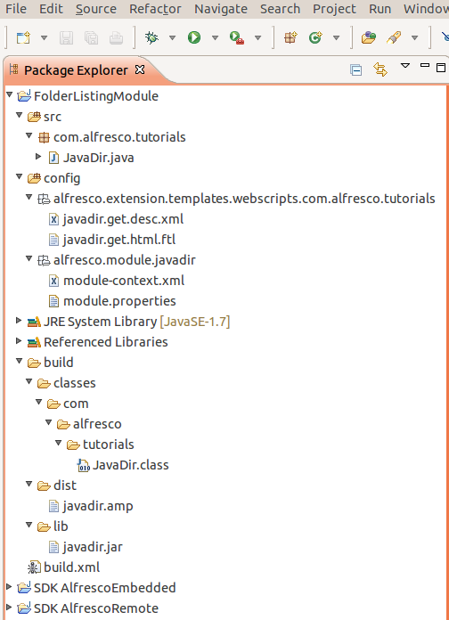

# Creating a Java-backed web script module with Ant

In this task you learn how to create a module containing a Java-backed web script. You will create a module that encompasses a Java-backed web script. For ease of development the project will be created in Eclipse and building the AMP file \(and installing the module with MMT\) will be performed by an Ant script you can run in Eclipse.

This tutorial assumes you have completed the tutorial [Creating a simple module](dev-extensions-tutorials-simple-module.md). You should have some familiarity with web scripts. It will also help if you have previously completed [this tutorial](ws-folderListing-Java-scripting.md). You will also need Eclipse, the Alfresco SDK and the Spring Framework installed.

The purpose of this tutorial is to show you how to create a module that contains a Java-backed web script, and show how you can lay out your project within Eclipse. The web script that will be used is the Folder Listing web script developed in [this tutorial](ws-folderListing-Java-scripting.md).

The web script used in this tutorial has a controller implemented in Java.

Creating the project in Eclipse is more convenient, as Eclipse can allow you to identify compile time errors quickly, as well as providing all the convenience of an IDE.

1.  Download and install the Alfresco SDK that matches the version of Alfresco you are running.

    You will need to link against libraries found in this distribution.

2.  Download and install the Spring Framework.

    You will need to link against libraries found in this distribution.

3.  Start Eclipse.

4.  Create a new Java Project in Eclipse. In this tutorial it is called `FolderListingModule`.

5.  In the Eclipse Package Explorer, create a new Source Folder called `config`.

6.  Create a new package in the `config` folder called `alfresco.extension.templates.webscripts.com.alfresco.tutorials`.

    This package will contain the web script description file and web script FreeMarker template file.

7.  Create a new package in the config folder called `alfresco.module.javadir`.

    This package will contain the important module-context.xml file and the module.properties file.

    **Attention:** In this tutorial `javadir` is the module ID.

8.  In Eclipse, in the `src` folder create a new package `com.alfresco.tutorials`.

    This package will contain the Java web script controller class.

    At this point the basic directory structure will be in place. You can use the following image as a guide \(you will populate the directory structure with files in the following tasks\):

    

At this point you have created the basic directory structure required in Eclipse to start with. Several other directories will be created, but this will be done is later tasks using a simple Ant script.

-   **[Adding the web script files](../tasks/dev-extensions-tutorials-java-web-script-module-web-script-files.md)**  
In this task you add the necessary files that make up the web script.
-   **[Adding the module files](../tasks/dev-extensions-tutorials-java-web-script-module-module-files.md)**  
In this task you add the necessary files that make up the module.
-   **[Link the library files](../tasks/dev-extensions-tutorials-java-web-script-module-link-libs.md)**  
In this task you link in the required libraries.
-   **[Create the Ant build script](../tasks/dev-extensions-tutorials-java-web-script-module-create-build-file.md)**  
In this task you create a simple Ant build script that can be run from Eclipse.
-   **[Test your module](../tasks/dev-extensions-tutorials-java-web-script-module-test.md)**  
In this task you test your module.

**Parent topic:**[Module Tutorials](../concepts/dev-extensions-modules-tutorials.md)

