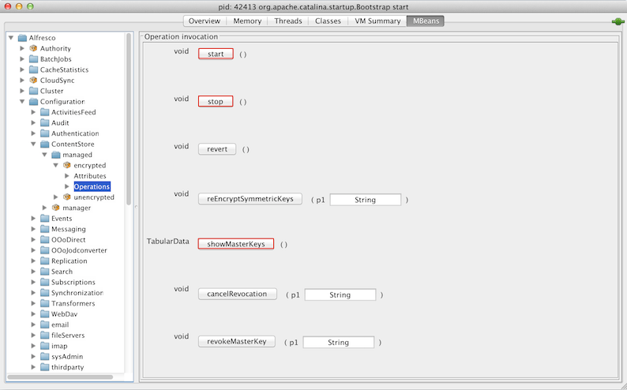
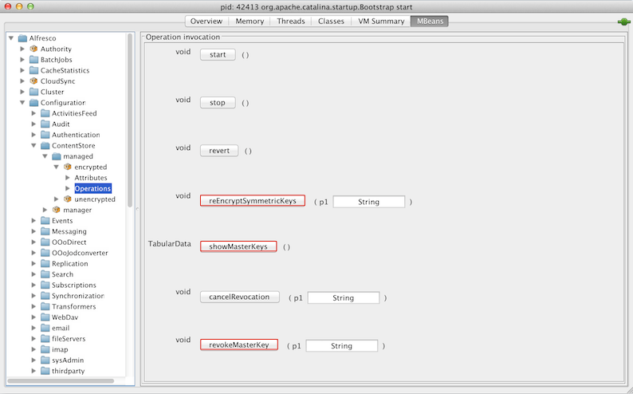

# Encryption-related JMX operations

If you have installed the Oracle Java SE Development Kit \(JDK\), you can use JMX operations to perform some common tasks for Encrypted Content Store.

The JMX client, JConsole, allows the user to see the set of current master keys and the total number of symmetric keys encrypted by each master key. It also enables the users to revoke a master key and to add a new master key alias.

**Parent topic:**[Encrypted Content Store](../concepts/encrypted-cs-home.md)

## Add a new master key

To add a master key, follow the steps below:

1.  Add the new master key to the master keystore file.

2.  Define the new master key alias and password by one of the following ways:

    -   Add the key alias and password in the alfresco-global.properties file; or
    -   Add the key alias and password by using the JMX operations. Follow the sequence of steps from Step 3 onwards.
    **Note:** The values set on a subsystem will mean that the property values from configuration files may be overwritten or ignored. Use the JMX client to set the configuration properties.

3.  On the **JConsole** window, select the **MBeans** tab.

    The available managed beans are displayed in JConsole.

4.  Navigate to **Alfresco** **\>** **Configuration** **\>****ContentStore** **\>** **managed** **\>** **encrypted** **\>** **Attributes**.

    The **Attribute values** window is displayed.

5.  

6.  On the **Operation invocation** window, click **stop** to stop the Alfresco subsystem.

7.  

8.  On the **Attribute values** window, add a new key alias in the **cryptodoc.jce.key.aliases** field and its password in the **cryptodoc.jce.key.passwords** field. Both these fields accept comma-separated list of values.

    **Note:** While adding a new master key alias, if you add the alias but not the password, the master key will fail to register.

9.  Click **start** to restart and reinitialize the Encrypted Content Store subsystem.

10. Click **showMasterKeys** to check that the new master key is now being used.

## Retire a master key

To retire a master key, follow the sequence of JMX operations below:

1.  On the **JConsole** window, select the **MBeans** tab.

    The available managed beans are displayed in JConsole.

2.  Navigate to **Alfresco** **\>** **Configuration** **\>****ContentStore** **\>** **managed** **\>** **encrypted** **\>** **Operations**.

    The **Operation invocation** window is displayed.

3.  

4.  For operation **revokeMasterKey**, enter the alias of the master key to be revoked as parameter **p1** and click **revokeMasterKey**.

    The relevant master key will not be used for encryption.

5.  For operation **reEncryptSymmetricKeys**, enter the alias of the revoked master key as parameter **p1** and click **reEncryptSymmetricKeys**.

    This will reencrypt the symmetric keys of this master key with a new master key.

6.  Click **showMasterKeys** to check that there are no outstanding symmetric keys for the revoked master key and that the total number of files that were encrypted using the revoked master key is zero.

7.  Click **stop** to stop the Encrypted content store subsystem.

8.  Remove the relevant alias and related password from **MBeans** **\>** **Alfresco** **\>** **Configuration** **\>****ContentStore** **\>** **managed** **\>** **encrypted** **\>** **Attributes** **\>** **Attribute values** window.

9.  Click **start** to restart and reinitialize the Encrypted Content Store subsystem.

    **Note:** If you update or remove a master key using the JMX client on an Enterprise installation, those updates override the values in the alfresco-global.properties file. Alternatively, one can delete the master key alias and password by editing the alfresco-global.properties file and restarting the repository.

    **Note:** Key revocation is not persisted. If you restart this subsystem \(or Alfresco\) between revoking a master key \(Step 3\) and removing that key \(Step 7\), the key will be used again for encryption when this subsystem is initialized again from the key alias list.

## Expiry of a master key

The Encrypted content store subsystem does not support automatic expiry of the master key. When a master key expires from the keystore, you must follow the sequence of JMX operations mentioned in the **Retire a master key** section above to manually retire the master key.

## Additional JMX operations

-   Click **cancelRevocation** to cancel revocation of the master key. This ensures that the previously revoked master key is now being used.

-   Click **reloadMasterKeys** to reload the master keys from the keystore file.

