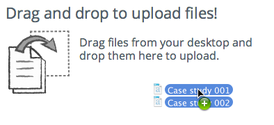

# Adding content to Alfresco

First you'll look at adding content items such as documents, spreadsheets, presentations, and images to a site.

You're going to add two documents that you created previously to your site.

**Note:** To help you follow this example you'll need to have two documents available on your computer that you can add to the site.

1.  Click **Document Library** to display the document library.

    Alfresco gives you lots of options for getting content into the library. You can upload files, create folders, drag and drop files and even create content directly from Alfresco.

2.  You're going to drag and drop the content in - go to the location where you saved your two files, select them, and drag and drop them directly to the drag and drop area on the Document Library.

    

    It's as simple as that. Your documents are now uploaded to the site library.

This video shows the steps in the tutorial.

  

**Parent topic:**[Working with content](../concepts/gs-site-prepare.md)

