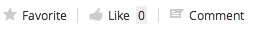

# Using social features

When you look at the site dashboard you can see site activity and details of content that has been added or edited.

1.  If you aren't already on it, click **Site Dashboard**.

    You can see on the Site Content and Site Activities dashlets details of activity on the site such as adding documents and creating calendar events.

2.  On the Site Content dashlet click the sorting menu - by default it shows content **I've Recently Modified**.

3.  Select **My Favorites** from the sorting menu.

    You haven't marked any documents as favourites yet so the Site Content dashlet has nothing to display. Marking items as favorites is a great way to keep track of items you're really interested in, so you're now going to select an item as a favorite.

4.  Click the sorting menu again and select **I've Recently Modified**, to display the modified content.

    Once that's done you can see there are **Favorite**, **Like** and **Comment** options.

    

5.  Now click the **Favorite** option for one of the documents.

    A gold star now indicates that this document is a favorite.

6.  Click **Like** as well to show that you approve of the document.

7.  Next click Comment.

    Alfresco switches to the Comments field in the document preview.

8.  Type "This is great!" and click **Add Comment**.

    Your comment is displayed under the document - you can use the comment feature to have discussions with other users about content items.

9.  Now click **Site Dashboard** and on the Site Content dashlet select **My Favorites** from the view menu, and now only the document you made a favorite is displayed.

**Parent topic:**[Being social](../concepts/gs-being-social.md)

