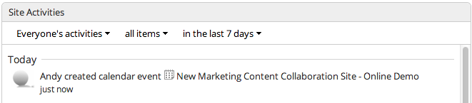

# Scheduling events

Having previously added a calendar to your site, you can now use it to schedule events for your team.

You can schedule an online meeting to welcome new users and discuss the purpose of the site.

1.  Click **More** then **Calendar** to open the calendar.

2.  Hover over a date on the calendar and click the **Add Event** icon \(\).

3.  Add an event title as the What; because you're holding the meeting online you don't need to enter a Where, but you can enter a description if you like.

4.  The date you choose is pre-selected, with the time set at 12:00 PM till 1:00 PM. That sounds good so leave it and click **OK**.

    You can see that the event has been created and scheduled in the calendar. If you want to increase visibility of the events you schedule you can always add a calendar dashlet to the dashboard.

5.  Click **Home** and you'll see the meeting in the Site Activities dashlet.

    

**Parent topic:**[Being social](../concepts/gs-being-social.md)

