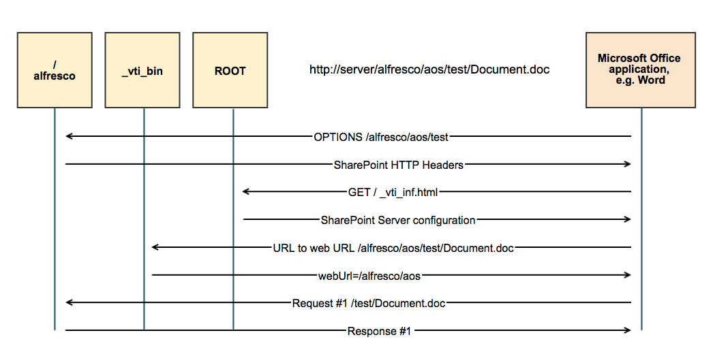

# Installing Alfresco into an existing web application

If you install Alfresco manually, you must deploy the `ROOT.war` application to the server root. If you already have an application running in the server root, you can merge the Alfresco function into your existing web application.

The `ROOT.war` application is required to enable Alfresco Office Services \(AOS\). If you have a custom application that is running in the server root directory, it is important that you modify this application to enable AOS.

There are two types of requests that are sent to the server root directly by Microsoft Office and Windows:

1.  A request for the `_vti_inf.html` file that contains configuration information
2.  `OPTIONS` and `PROPFIND` requests

The following diagram shows the information flow between Microsoft Office and Alfresco, including interactions with the `/alfresco`, `_vti_bin` and `ROOT` applications:



1.  Extract the `_vti_inf.html` file from the <TOMCAT\_HOME\>webapps/ROOT.war archive file and add it to your web application.

2.  In your web application, modify the service that responds to requests to the server root, so that it sends `PROPFIND` and `OPTIONS` requests to the /alfresco application.

    If you have a `.jsp` page responding to the server root, you can add this code example to that page:

    ```
    <% 
    if(request.getMethod().equals("PROPFIND") || request.getMethod().equals("OPTIONS")) 
    {     
      ServletContext alfrescoContext = application.getContext("/alfresco");     
      if( (alfrescoContext != null) && !alfrescoContext.equals(getServletContext()) )     
      {         
         RequestDispatcher rd = alfrescoContext.getRequestDispatcher("/AosResponder_ServerRoot");
         if(rd != null)
         {
                 rd.forward(request, response);
                 return;
         }
      }
    } 
    %>   
    ```

    and add this import statement to the top of the `.jsp` page:

    ```
    <%@page session="true" import="javax.servlet.ServletContext, javax.servlet.RequestDispatcher” %>
    ```

    If you have deployed alfresco to a different context path \(something other than `/alfresco`\), make sure that you edit the `application.getContext` value to represent this.

    If you have a servlet responding to these requests, integrate the Java code from these JSP code examples into your application.

3.  Depending on your application server, ensure that requests are dispatched by default between different application servers.

    For Tomcat, add a file called `context.xml` to the META-INF directory of your web application. Here is an example of the `context.xml` file:

    ```
    <?xml version="1.0" encoding="UTF-8"?>
    <Context path="/" debug="100" privileged="true" reloadable="true" crossContext="true">
    </Context>
    ```


**Parent topic:**[Installing Alfresco on Tomcat](../tasks/alf-tomcat-install.md)

**Related information**  


[Installing and configuring Alfresco Office Services](../concepts/aos-intro.md)

