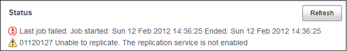

# Configuring content replication

You can configure Alfresco to replicate content between source and target repositories.

1.  Shut down the Alfresco server on the source and target repositories.

2.  In the source repository, open the alfresco-global.properties file and make the following updates:

    Set the `replication.enabled` property to `true`:

    ```
    replication.enabled=true
    ```

    **Note:** If this line is not present in the alfresco-global.properties file or the value is set to `false`, you will not be able to run any replication jobs. You might see this error message in Share:

    

    Alternatively, you can enable content replication from the Admin Console. See [Admin Console: Working with the replication service](../concepts/adminconsole-replication-config.md) for more information.

3.  Save the file.

4.  In the target repository, open the alfresco-global.properties file and make the following updates:

    1.  Set the `transferservice.receiver.enabled` property to `true`:

        ```
        transferservice.receiver.enabled=true
        ```

5.  Save the file.

6.  Restart Alfresco on both source and target repositories.

7.  Configure the Share URL to allow access to the source repository, as specified in [Opening locked content in the source repository](adminconsole-replication-lockedcontent.md).

8.  Create a transfer target, as specified in [Creating a new transfer target for content replication](adminconsole-replication-transfertarget.md).


**Parent topic:**[Setting up content replication](../concepts/admintools-replication-config.md)

