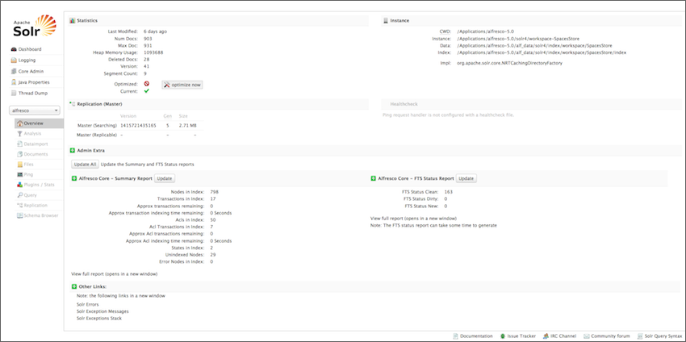

# Upgrading from Solr to Solr 4 search

This section describes how to upgrade from Alfresco Enterprise 4.x with the Solr
 search server to Alfresco One 5.0
 with the Solr 4 search server.

**Note:** In this documentation, we are referring to **Solr 1.4** search subsystem as **Solr**.

To determine the current search server, navigate to the Search Manager
 page at **Alfresco Share Admin Console \> Repository Services \> Search Service**. Select
 the desired search subsystem from the **Search Service In Use** list.


Follow the steps to migrate from Alfresco Enterprise 4.x with Solr search service to Alfresco One
 5.0 with Solr 4 search service.

1.  Upgrade to Alfresco One 5.0
 and continue to use Solr search service as before.

    For information on migrating the Solr 1 indexes with Alfresco One 4.x to Solr 1 with Alfresco One 5.0, see [Upgrading Solr 1 search service](upgrade-solr1.md).

2.  Configure Solr 4 to track the repository. For details, see the [Installing and Configuring Solr 4](solr4-install-config.md) topic.

3.  While Solr 4 builds its indexes, you can monitor progress using the `SUMMARY` report.

    ```
    [http://localhost:8080/solr4/admin/cores?action=SUMMARY&wt=xml](http://localhost:8080/solr4/admin/cores?action=SUMMARY&wt=xml) 
    ```

    For details, see the [Unindexed Solr
 Transactions](../concepts/solr-unindex.md) topic.

4.  Optionally, you can use the Solr Admin Web interface to view Solr configuration details, run queries, and analyze document fields.

    1.  Open the FireFox **Certificate Manager** by selecting **Firefox \> Preferences... \> Advanced \> Certificates \> View Certificates \> Your Certificates**.

    2.  Import the browser keystore `browser.p12` that is located in your <ALFRESCO\_HOME\>/alf\_data/keystore directory.

    3.  Enter the password `alfresco`.

        A window displays showing that the key store has been imported successfully. The **Certificate Manager** now contains the imported key store with the Alfresco repository certificate under the **Your Certificates** tab.

    4.  Close the **Certificate Manager** by clicking **OK**.

    5.  In the browser, navigate to a Solr URL.

        For example, use [http://localhost:8080/solr](http://localhost:8080/solr) for Solr and [http://localhost:8080/solr4](http://localhost:8080/solr) for Solr 4.

        The browser displays an error message window to indicate that the connection is untrusted. This is due to the Alfresco certificate not being tied to the server IP address. In this case, view the certificate and confirm that it is signed by the Alfresco Certificate Authority.

    6.  Expand **I understand the risks**.

    7.  Select **Add Exception**.

    8.  Click **View**.

        This displays the certificate.

    9.  Confirm that the certificate was issued by Alfresco Certificate Authority, and then confirm the **Security Exception**.

    Access to Solr/Solr 4 is then granted. The Solr Admin page is displayed. It is divided into two parts.

    The left-side of the screen is a menu under the Solr logo that provides navigation through various screens. The first set of links are for system-level information and configuration and provide access to Logging, Core Admin and Java Properties. At the end of this information is a list of Solr cores configured for this instance of Alfresco.

    The center of the screen shows the detail of the Solr core selected, such as statistics, summary report, and so on.

    

5.  Monitor the progress of both the Solr and Solr 4.0 subsystems via the JMX client or the `SUMMARY` report.

    **Important:** Do not use the Alfresco Share **Admin Console** tool to monitor the status of the subsystems as it will change the subsystem used for query. Only use the JMX client.

6.  When the index is updated as reported by the `SUMMARY` report, you can use the `REPORT` option and check the following:

    -   In the `REPORT` option, node count should match the number of live nodes in the repository \(assuming nothing is changing and the index is updated\). The index contains a document for failed nodes, so failures need to be considered separately.
    -   Any missing transactions; if there are issues, use the `FIX` option.

        ```
        [http://localhost:8080/solr4/admin/cores?action=FIX](http://localhost:8080/solr4/admin/cores?action=FIX)
        ```

        For more information, see the [Troubleshooting Solr Index](../concepts/solr-index-fix.md) topic.

    -   Find errors with specific nodes using `DOC_TYPE:ErrorNode` option.

        ```
        [https://localhost:8446/solr4/alfresco/afts?q=DOC\_TYPE:ErrorNode](https://localhost:8446/solr4/alfresco/afts?q=DOC_TYPE:ErrorNode) 
        ```

    -   If there are any issues, use the `REINDEX` option with the relevant node id.

        ```
        [
        http://localhost:8080/solr4/admin/cores?action=REINDEX&txid=1&acltxid=2&nodeid=3&aclid=4](http://localhost:8080/solr4/admin/cores?action=REINDEX&txid=1&acltxid=2&nodeid=3&aclid=4) 
        ```

        For more information, see the [Troubleshooting Solr Index](../concepts/solr-index-fix.md) topic.

7.  When the Solr 4 index is updated, you must enable the Solr 4 subsystem and disable the Solr
 subsystem.

8.  *\(Optional\)* To decommission \(now redundant\) Solr 1, follow the steps below:

    1.  Stop the Solr 1 search service.

    2.  Delete the solr directory from <ALFRESCO\_HOME\>/tomcat/webapps.

    3.  Delete the solr.xml file from <ALFRESCO\_HOME\>tomcat/conf/Catalina/localhost.

    4.  Delete the solr directory from <ALFRESCO\_HOME\>/alf\_data.


-   **[Upgrading the Solr 1 search service](../tasks/upgrade-solr1.md)**  
In order to upgrade to the Solr 4 search service, whilst the Solr 4 indexes are being built, you must transition from a previous version of Alfresco \(for example, Alfresco One 4.2.x\) with the Solr 1 search service to Alfresco One 5.0 with the Solr 1 search service.

**Parent topic:**[Upgrading search subsystems](../concepts/search-migration.md)

