# Tutorial: creating and using models in Alfresco Share

In this tutorial you will learn how to create custom models and implement content modeling in Alfresco using the Model Manager.

You will perform a step-by-step walk-through of creating and using models, custom types, aspects, and their properties in Alfresco Share.

In this tutorial we assume that Alfresco is implemented in a fictitious company called DemoCo as their ECM solution for managing content on their new website. DemoCo wants to add new types of content \(for example, white papers\) to their website and track metadata for all their files in the Alfresco repository.

For this purpose, DemoCo needs to create a new model, *Document* with a custom type called *whitePaper*. If a document is a white paper, then DemoCo would want to capture its writer's name and domain area. Also, for each document, DemoCo wants to determine if the content needs to be shown on their website. If yes, there should be a flag to indicates that the content is active and the date when the content was set to active.

So, let's start by creating a new model called *Document*. It has a custom type - *whitePaper* with properties *writer* and *domain*. The model has an aspect - *Webable* with properties *published* and *isActive*.

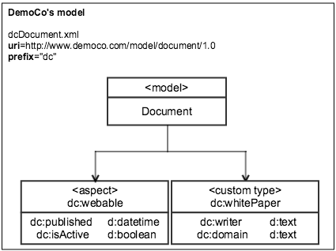

-   [Step 1: Navigate to Model Manager](admintools-cmm-tutorial.md#step1)
-   [Step 2: Create a new model, *Document*](admintools-cmm-tutorial.md#step2)
-   [Step 3: Create a new type, *whitePaper*](admintools-cmm-tutorial.md#step3)
-   [Step 4: Create new type properties, *writer* and *domain*](admintools-cmm-tutorial.md#step4)
-   [Step 5: Add new type properties to the Layout Designer](admintools-cmm-tutorial.md#step5)
-   [Step 6: Create new aspect, *webable*](admintools-cmm-tutorial.md#step6)
-   [Step 7: Create new aspect properties, *published* and *isActive*](admintools-cmm-tutorial.md#step7)
-   [Step 8: Add new aspect properties to the Layout Designer](admintools-cmm-tutorial.md#step8)
-   [Step 9: Activate the model, *Document*](admintools-cmm-tutorial.md#step9)
-   [Step 10: Apply type \(*whitePaper*\) and aspect \(*webable*\) to a file in Alfresco Share](admintools-cmm-tutorial.md#step10)

**Step 1: Navigate to Model Manager**

1.  Click **Admin Tools**.
2.  Under **Tools**, click **Model Manager**.

    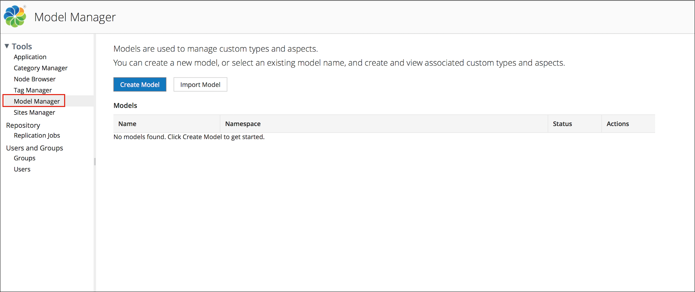

    The **Model Manager** page is displayed.

**Step 2: Create a new model, *Document***

1.  Click **Create Custom Model**.

    In the **Create Model** window, specify the following:

    -   Namespace: http://www.democo.com/model/document/1.0
    -   Prefix: dc
    -   Name: Document
    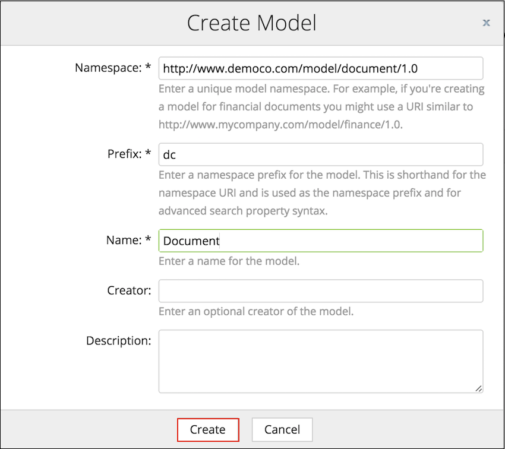

2.  Click **Create**.

    The new model, *Document* appears in the **Custom Models** table on the **Model Manager** page. The current status of the model is **Inactive**.

[back to top](admintools-cmm-tutorial.md#mm)

**Step 3: Create a new type, *whitePaper***

1.  Click the model, *Document*.

    The *Document* model page is displayed.

2.  To create a type - *whitePaper*, click **Create Custom Type**.

    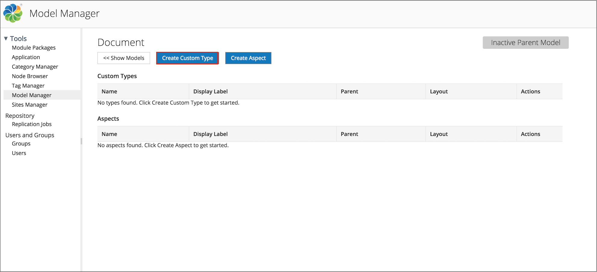

    The **Create Custom Type** window appears.

3.  In the **Name** field, enter whitePaper.
4.  In the **Display Label** field, enter White Paper.
5.  Specify other optional fields, if required.

    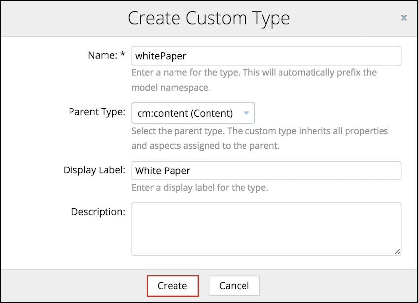

6.  Click **Create**.

    The new custom type, *dc:whitePaper* appears in the **Custom Types** table.

**Step 4: Create new type properties, *writer* and *domain***

1.  Under the **Custom Types** list, click *dc:whitePaper*.

    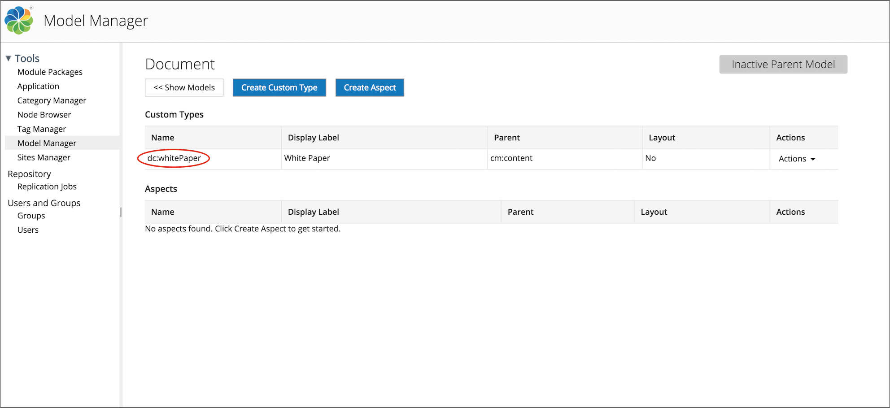

2.  Click **Create Property**.
3.  Enter the details of the new property, *writer*:
    -   In the **Name** field, enter writer.
    -   In the **Display Label** field, enter Writer.
    -   From the **Data Type** drop-down list, select **d:text**.
    -   To make the property mandatory in Alfresco Share, select **Mandatory** from the **Requirement** drop-down list.
    -   Specify other optional fields, if required.

        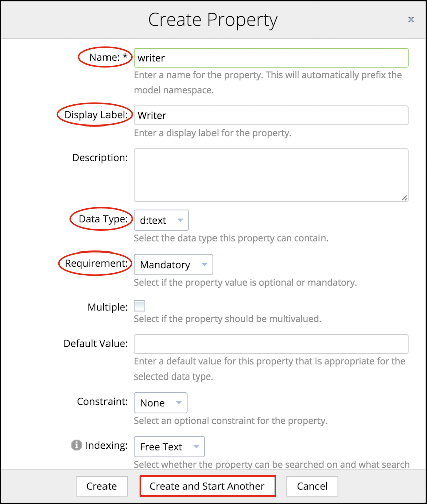

4.  Click **Create and Start Another**.
5.  Enter the details of the new property, *domain*:
    -   In the **Name** field, enter domain.
    -   In the **Display Label** field, enter Domain.
    -   From the **Data Type** drop-down list, select **d:text**.
    -   From the **Constraints** drop-down list, select **List of Values**.
    -   In the **List of Values** field, enter Engineering, Marketing, HR, Sales, Finance, and Operations in separate lines.
    -   Select **Sort Alphanumerically** to display the above specified values in an alphabetical order in Alfresco Share.
    -   Specify other optional fields, if required.

        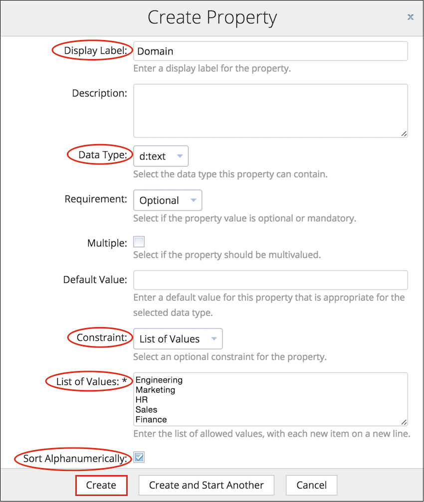

6.  Click **Create**.

    [back to top](admintools-cmm-tutorial.md#mm)

**Step 5: Add new type properties to the Layout Designer**

1.  Navigate to the page displaying the custom types list.
2.  Click **Layout Designer** from the **Actions** drop-down list for the type, *dc:whitePaper*.

    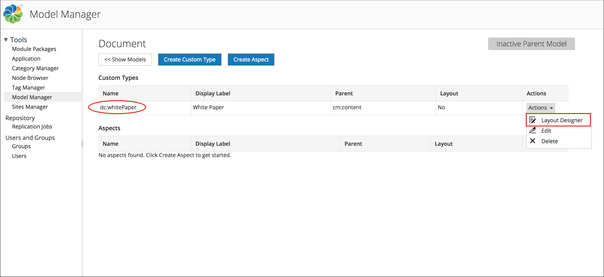

    The Layout Designer page is displayed.

3.  Drag the double column panel layout from top onto the layout area.
4.  To specify the panel label, click anywhere on the element's top panel displaying the label, **double column panel**.

    This displays the **Edit Properties** window.

5.  In the **Label** field, enter Details.
6.  Configure other optional fields, if required.
7.  Drag the properties, *writer* and *domain* onto the **Details** element.
8.  To configure the properties, click anywhere on the property.
9.  On the Layout Designer, click **Save**.

    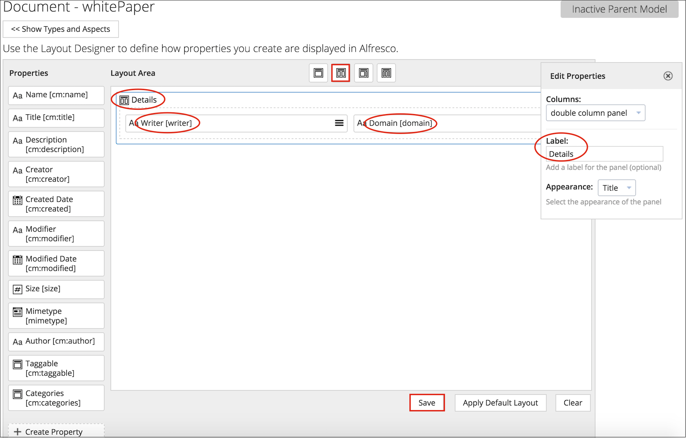

**Step 6: Create new aspect, *webable***

1.  Navigate to the **Model Manager** page.
2.  Click the model, **Document**.

    The *Document* model page is displayed.

3.  To create new aspect - webable, click **Create Aspect**.

    The **Create Aspect** window appears.

4.  In the **Name** field, enter webable.
5.  In the **Display Label** field, enter Webable.
6.  Specify other optional fields, if required.
7.  Click **Create**.

    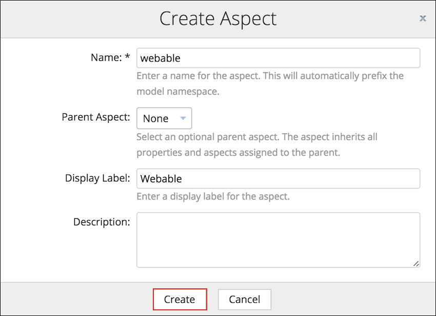

    The new aspect, *dc:webable* appears in the **Aspects** table.

    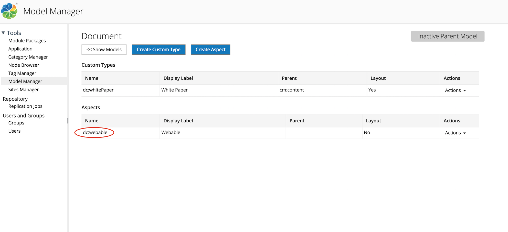

[back to top](admintools-cmm-tutorial.md#mm)

**Step 7: Create new aspect properties, *published* and *isActive***

1.  Under the **Aspects** list, click *dc:webable*.
2.  Click **Create Property**.
3.  Enter the details of the new property, *published*:
    -   In the **Name** field, enter published.
    -   In the **Display Label** field, enter Published.
    -   From the **Data Type** drop-down list, select **d:datetime**.
    -   Specify other optional fields, if required.
4.  Click **Create and Start Another**.

    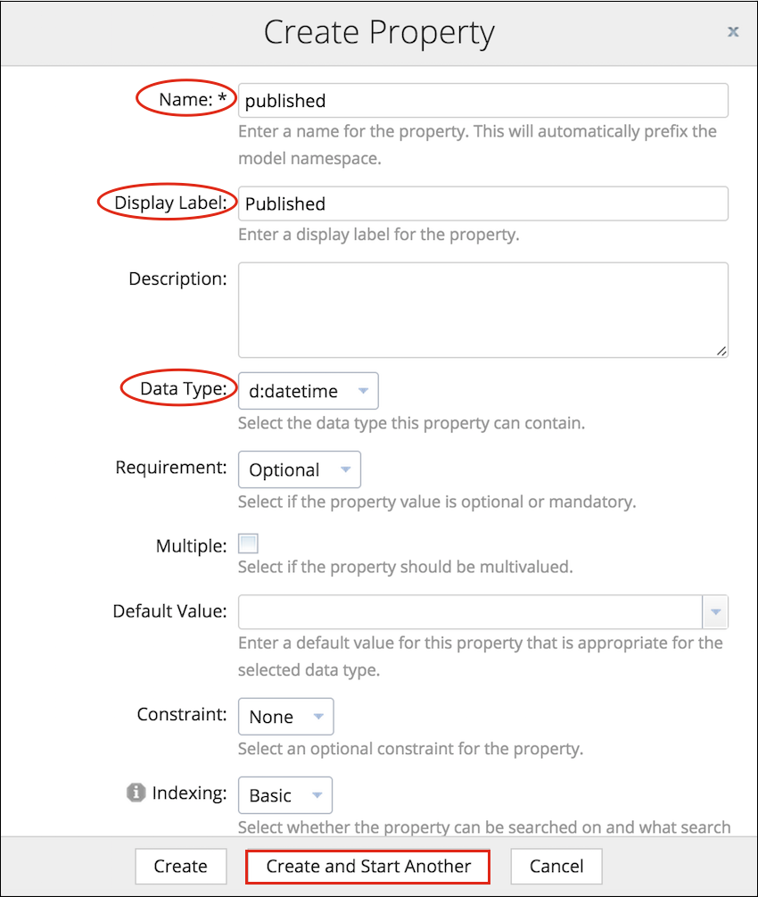

5.  Enter the details of the new property, *isActive*:
    -   In the **Name** field, enter isActive.
    -   In the **Display Label** field, enter Is Active.
    -   From the **Data Type** drop-down list, select **d:boolean**.
    -   From the **Default Value** drop-down list, select **False**.
    -   Specify other optional fields, if required.
6.  Click **Create**.

[back to top](admintools-cmm-tutorial.md#mm)

**Step 8: Add new aspect properties to the Layout Designer**

1.  Navigate to the page displaying the aspects list.
2.  Click **Layout Designer** from the **Actions** drop-down list for the aspect, *dc:webable*.

    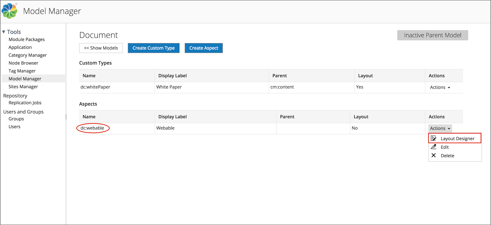

    The Layout Designer page is displayed.

3.  Drag the single column panel layout from top onto the layout area.
4.  To specify the panel label, click anywhere on the element's top panel displaying the label, *single column panel*.

    This displays the **Edit Properties** window.

5.  In the **Label** field, enter Publication details.
6.  Configure other optional fields, if required.
7.  Drag the properties, *published* and *isActive* onto the **Publication details** element.
8.  To configure the properties, click anywhere on the property.
9.  On the Layout Designer, click **Save**.

    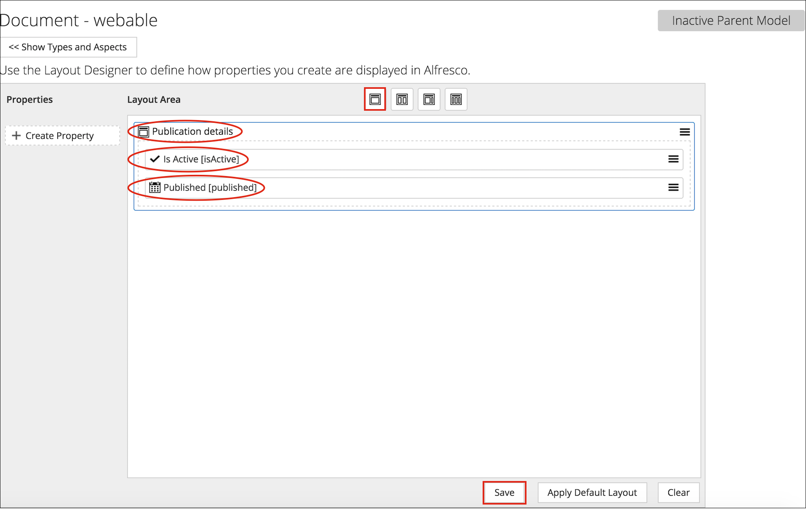

**Step 9: Activate the model, *Document***

1.  Navigate to the **Model Manager** page.
2.  Click the **Actions** drop-down list for the model, *Document*.
3.  Click **Activate**.

    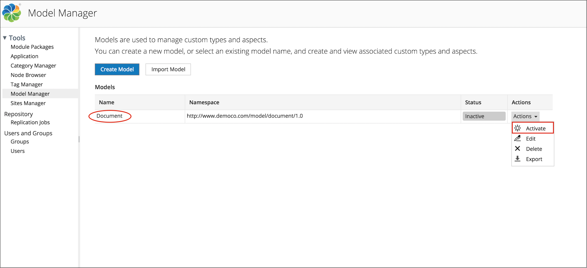

    The status of *Document* changes to **Active**.

    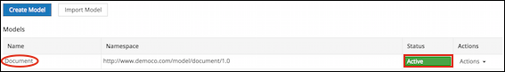

Now that we have created a new model with its custom type and aspect, let's see how we can use it to capture a file's metadata in Alfresco Share.

To do so, follow the steps below:

**Step 10: Apply type \(*whitePaper*\) and aspect \(*webable*\) to a file in Alfresco Share**

1.  In your site, click **Document Library** to access the library.
2.  Click on a file in the library to view it in the file preview screen.
3.  To apply the type, perform the following steps:
    1.  Under **Document Actions**, click **Change Type**.

        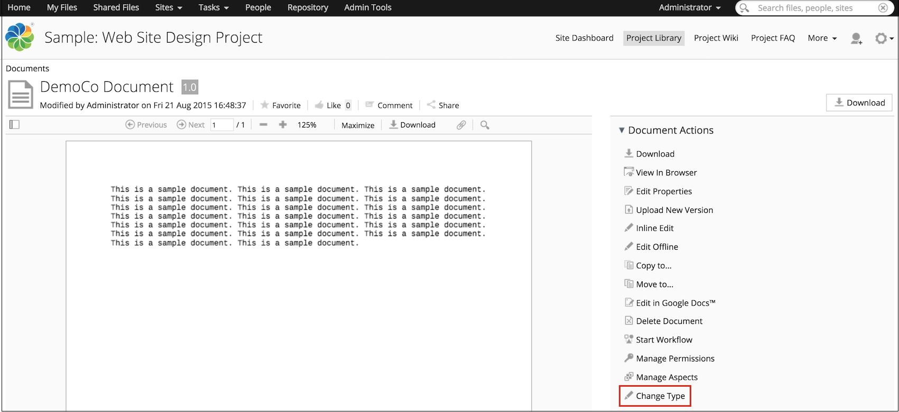

    2.  In the **Change Type** window, select *whitePaper \(dc:whitePaper\)* from the **New Type** drop-down list.

        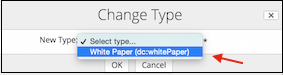

    3.  Click **OK**.

        The type \(*dc:whitePaper*\) and its properties \(*writer* and *domain*\) are successfully applied to your file.

        The type properties are displayed on the file preview page, under **Properties**. You can edit these properties using **Edit Properties** under **Document Actions**.

        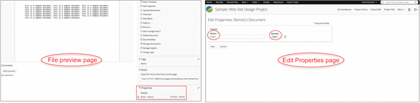

    4.  In the **Writer** field, enter User1.
    5.  In the **domain** field, select Sales.
    6.  Click **Save**.
4.  To apply the aspect, perform the following steps:

    1.  Under **Document Actions**, click **Manage Aspects**.
    2.  In the **Available to Add** list, click  next to **Webable**.

        Click  to remove any existing aspects from the **Currently Selected** list.

        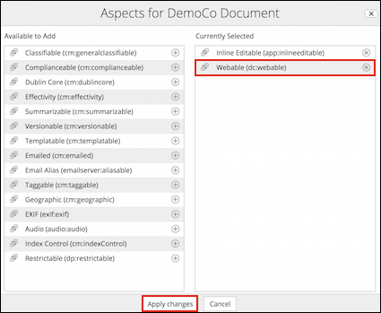

    3.  Click **Apply changes**.

        The aspect \(*Webable*\) and its properties \(*Published* and *Is Active*\) are successfully applied to the file.

        The aspect properties are displayed on the file preview page, under **Properties**. You can edit these properties using **Edit Properties** under **Document Actions**.

    4.  Select **Is Active**.
    5.  In the **Published** field, enter the date and time as 31/07/2015 and 10:00, respectively.
    6.  Click **Save**.
    The updated information is displayed on the file preview page, under **Properties**.

    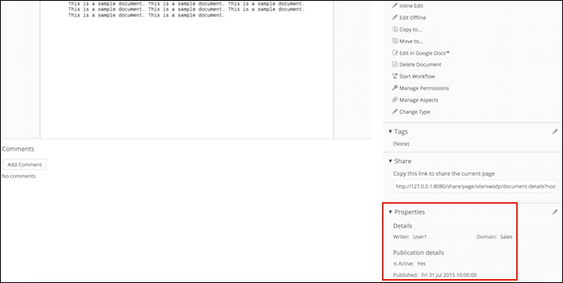

    In this tutorial, you learned how to create and apply models, custom types, and aspects using the Model Manager to capture metadata about files in Alfresco.

[back to top](admintools-cmm-tutorial.md#mm)

**Parent topic:**[Content modeling with Model Manager](../concepts/admintools-cmm-intro.md)

**Related information**  

[Model Manager video tutorials](cmm-video-tutorials.md)

