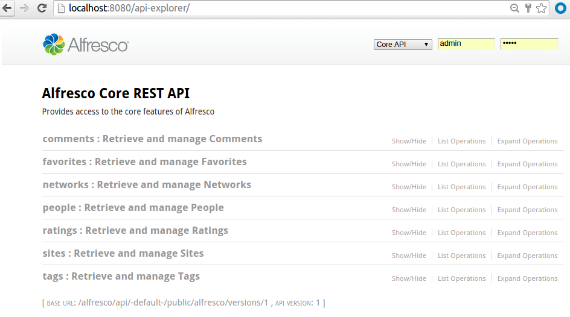
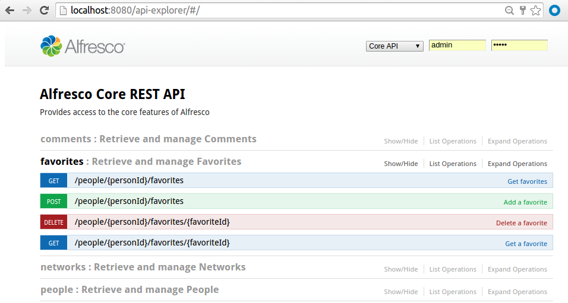
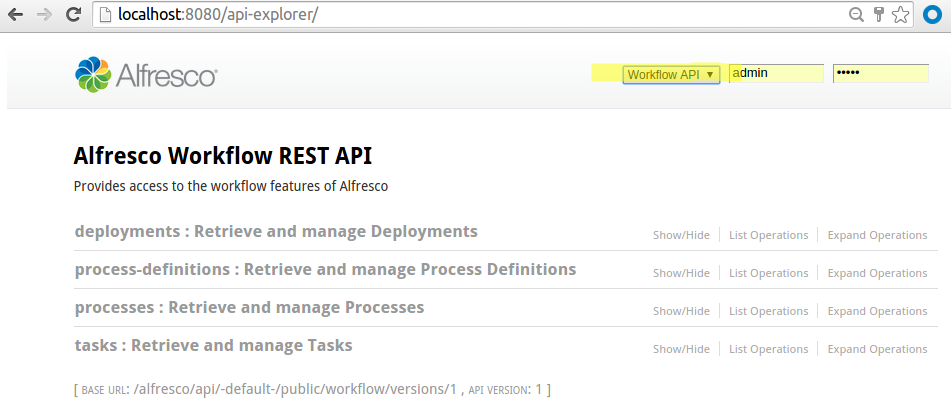

# Using the REST API Explorer

The Alfresco SDK comes with the Alfresco REST API Explorer web application built into the `run` profile for the All-In-One project.

The API Explorer is based on the OpenAPI Specification \([Swagger](http://swagger.io/)\) and provides an interactive \(live\) way of exploring the [Alfresco REST API](../pra/1/concepts/pra-resources.md). When the [All-In-One](alfresco-sdk-archetypes-aio.md) project is run the API Explorer is available via the `http://localhost:8080/api-explorer` URL to test the different APIs against the local running AIO instance.

The following screenshot shows an example of how the API Explorer home page looks like:

To explore a particular group of APIs, such as **favorites**, click on it:

From here you can click on each of the available operations and test them against the locally running Alfresco instance.

To run with another user than `admin` change the username and password in the upper right corner.

By default the explorer will show the Core API, if you are working with workflows click on the drop down box that says **Core API** and select the **Workflow API**, you should then see the following:

**Parent topic:**[Alfresco SDK 2.2.0](../concepts/alfresco-sdk-intro.md)

