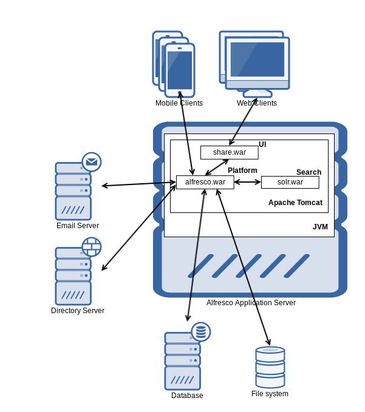
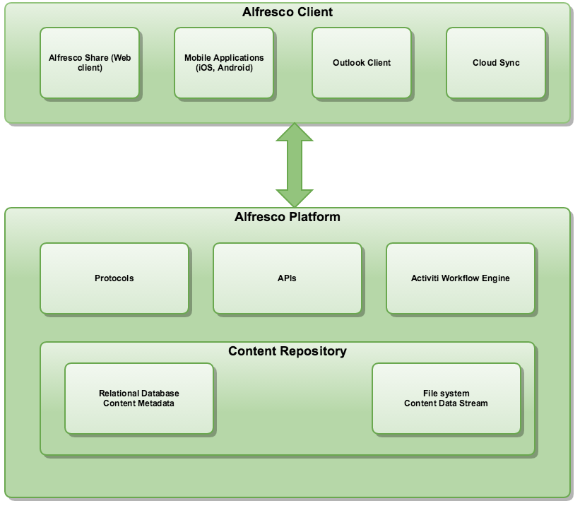

# Architecture

This gives a view of the architecture of Alfresco from the developer's perspective. Alfresco at its core is a repository that provides a store for content, and a wide range of services that can be used by content applications to manipulate the content.

The following diagram illustrates the idea that Alfresco One can be thought of as consisting of three main components, **Platform**, User Interface \(**UI**\), and **Search**. These components are implemented as separate web applications:

The main component with all the core Enterprise Content Management functionality is called the **Platform** and is implemented in the alfresco.war web application. It provides the repository where content is stored plus all the associated content services. Alfresco **Share** provides a web client interface \(that is a User Interface, UI\) for the repository and is implemented as the share.war web application. Share makes it easy for users to manage their sites, documents, users and so on. The search functionality is implemented on top of Apache **Solr 4** and provides the indexing of all content, which enables powerful search functionality. Besides the web clients accessing the Repository via Share there are also mobile clients that will access the content via REST APIs provided by the platform.

If we dive deeper into the platform \(packaged in alfresco.war\) we will see that it also supports workflow in the form of the embedded [Activiti Workflow Engine](http://docs.alfresco.com/activiti/topics/welcome.html). The platform is usually also integrated with a Directory Server \(LDAP\) to be able to sync users and groups with Alfresco. And most installations also integrates with an SMTP server so the Alfresco Platform can send emails, such as site invitations.

For more information about the internals of the Alfresco Platform, and specifically the content Repository, see the [concepts](dev-repository-concepts.md) section.

Besides Share there are also many other clients that can connect to the Alfresco repository, including any CMIS-compatible client, and via the Microsoft SharePoint protocol any SharePoint client. Alfresco Cloud Sync can synchronize content between an on-premise installation of Alfresco and Alfresco in the Cloud, under user control.

The Alfresco Platform also contains numerous [APIs](dev-api-intro.md), [Services](dev-services.md), and [Protocols](dev-protocols.md).

The following diagram illustrates this extended platform architecture:

Note that content metadata is stored in a relational database system such as PostgreSQL, MySQL, Oracle, and so on. The content itself is stored on the file system \(or other storage system such as Amazon S3\).

Alfresco provides a number of extension points to allow you to customize it. These extensions points have various formats, but include:

-   [Platform extension points and detailed architecture](dev-platform-arch.md)
-   [Share extension points and detailed architecture](dev-extensions-share-architecture-extension-points.md)
-   [Platform integration points and detailed architecture](dev-platform-integration-arch.md)
-   [APIs](dev-api-intro.md)
-   [Protocols](dev-protocols.md)
-   [Services](dev-services.md)

The links in the list above provide further information on each of these topics.

-   **[Access protocols](../concepts/dev-protocols.md)**  
Alfresco supports a number of different protocols for accessing the content repository. Their availability extends the options available to developers, when building their own applications and extensions.
-   **[Repository concepts](../concepts/dev-repository-concepts.md)**  
It is important as a developer to have a good understanding of the fundamental concepts of Alfresco when implementing extensions. Important concepts covered include repository, nodes, stores, types, aspects and so on.
-   **[Mini glossary](../concepts/dev-glossary.md)**  
Terms and concepts used when developing for Alfresco.

**Parent topic:**[Developer guide](../concepts/dev-for-developers.md)

