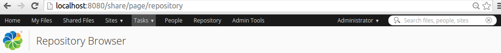

# Aikau Menus

The main menu of Share is implemented with the new Aikau UI development framework. It is possible to customize this menu, so you can navigate to new custom pages for example.

|Extension Point|Aikau Menus|
|---------------|-----------|
|Support Status|[Full Support](http://docs.alfresco.com/support/concepts/su-product-lifecycle.html)|
|Architecture Information|[Share Architecture](dev-extensions-share-architecture-extension-points.md).|
|Description|The main menu and title in Share is implemented in Aikau, it looks like this:

 

 Adding and removing menu items from the menu is a common task. To do this we use a [Surf Extension Module](dev-extensions-share-surf-extension-modules.md). It will look something like this:

```
<extension>
  <modules>
    <module>
      <id>Add custom menu item to header</id>
      <version>1.0</version>
      <auto-deploy>true</auto-deploy>  
      <customizations>
        <customization>
          <targetPackageRoot>org.alfresco.share.header</targetPackageRoot>
          <sourcePackageRoot>com.example.header</sourcePackageRoot>
        </customization>
      </customizations>
    </module>
  </modules>
</extension>   
```

So we are targeting the /share/WEB-INF/classes/alfresco/site-webscripts/org/alfresco/share/header/share-header.get.js Web Script controller file, which implements the menu JSON model. Now, if we want to for example add a menu item we need to create a file with the same name and put it in alfresco/web-extension/site-webscripts/com/example/header. The file will look like this:

```
var headerMenu = widgetUtils.findObject(model.jsonModel, "id", "HEADER_APP_MENU_BAR");
if (headerMenu != null) {
    headerMenu.config.widgets.push({
        id: "HEADER_CUSTOM_PROFILE_LINK",
        name: "alfresco/menus/AlfMenuBarItem",
            config: {
                label: "My profile",
                targetUrl: "user/" + encodeURIComponent(user.name) + "/profile"
            }
    });
}   
```

This is all that is required to extend an existing JSON model. We're using `widgetUtils` to find the `HEADER_APP_MENU_BAR` widget. Once we have it, we simply push a widget into it.

|
|Deployment - App Server|\(Untouched by re-depolyments and upgrades\) -   tomcat/shared/classes/alfresco/web-extension/site-webscripts/ - put the files that are overriding here
-   tomcat/shared/classes/alfresco/web-extension/site-data/extensions - put the Extension Module here.

|
|[Deployment - SDK Project](../tasks/alfresco-sdk-tutorials-share-amp-archetype.md)|-   share-amp/src/main/amp/config/alfresco/web-extension/site-webscripts/ - put the files that are overriding here
-   share-amp/src/main/amp/config/alfresco/web-extension/site-data/extensions - put the Extension Module here.

|
|More Information|-   [Creating an Aikau page with Menus](dev-extensions-share-page-creation.md)
-   [Aikau Widget Reference](http://dev.alfresco.com/resource/docs/aikau-jsdoc/) - this is the place to look for menu widgets that you can use.

|
|Tutorials|-   [Customizing the Admin Tools Menu](../tasks/dev-extensions-share-tutorials-custom-header-admin-menu.md)
-   [Customizing the Sites Menu](../tasks/dev-extensions-share-tutorials-custom-header-sites-menu.md)
-   [Removing Menu Items](../tasks/dev-extensions-share-tutorials-custom-header-menu-item-removal.md)
-   [Aikau Tutorials on GitHub](https://github.com/Alfresco/Aikau/blob/master/tutorial/chapters)

|
|Alfresco Developer Blogs|-   [Creating a simple Aikau page with Cascading Menu](http://blogs.alfresco.com/wp/developer/2013/02/21/simple-page-creation-in-share/)
-   [Extending the Share Main Menu](http://ohej.github.io/alfresco-tutorials/tutorial/aikau/tutorial.html#part-three-extending-json-models)

|

**Parent topic:**[Share Extension Points](../concepts/dev-extensions-share-extension-points-introduction.md)

