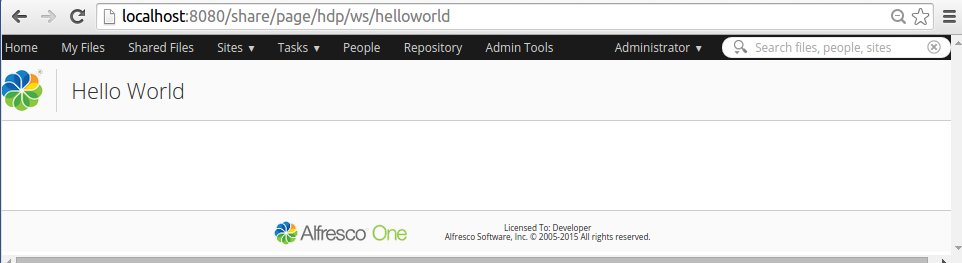
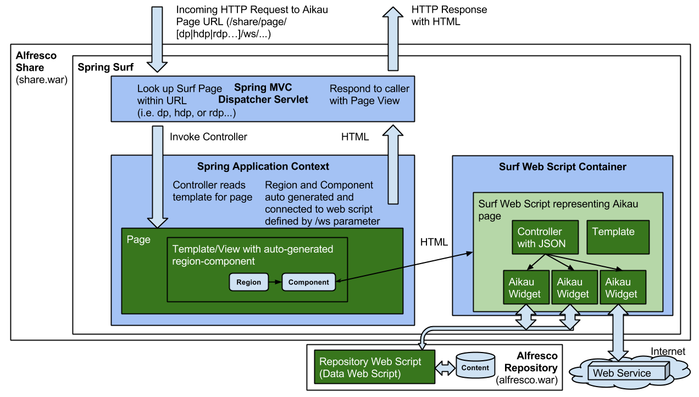

# Aikau Pages

The Share web application is built up of a main menu from which you can navigate to a number of pages. These pages are implemented mostly in the Surf development framework. However, a number of pages, such as Search, have been converted and implemented with the new Aikau development framework, see architecture section.

|Extension Point|Aikau Pages|
|---------------|-----------|
|Support Status|[Full Support](http://docs.alfresco.com/support/concepts/su-product-lifecycle.html)|
|Architecture Information|[Share Architecture](dev-extensions-share-architecture-extension-points.md).|
|Description|Aikau pages are the new type of pages that the Share UI will use in the future. Currently only the following pages are implemented in Aikau:

-   Live Search
-   Filtered Search Page
-   Search Management Page
-   Site Management Page
-   Analytics and Reporting Widgets
-   Document List prototype

Implementing an Aikau page is greatly simplified compared to creating a [Surf page](dev-extensions-share-surf-pages.md). The only thing you need to do is implement a [Surf Web Script](dev-extensions-share-surf-web-scripts.md) and zero or more [Aikau Widgets](dev-extensions-share-aikau-widgets.md).

The Web Script controller is where all the fun happens. It is where you define your page layout in JSON, including all the Aikau Widgets that make up the page. It will look something like this for a Hello World page:

```
model.jsonModel = {
    widgets: [
        {
            id: "SET_PAGE_TITLE",
            name: "alfresco/header/SetTitle",
            config: {
                title: "Hello World"
            }
        }
    ]
};   
```

The template will be very simple and the only thing it does is this:

```
<@processJsonModel />   
```

It basically just processes the JSON model that we set-up in the controller. Here we have used an out of the box Aikau widget called `alfresco/header/SetTitle`, and the only thing left to do is to create the Web Script descriptor:

```
<webscript>
    <shortname>Hello World</shortname>
    <description>Hello World page definition</description>
    <family>Share</family>
    <url>/helloworld</url>
</webscript>   
```

Now this is all there is to it. The page can be accessed via the `http://localhost:8080/share/page/hdp/ws/helloworld` URL. You should see the following page in Share: 

An Aikau page is processed and generated via the Spring Surf and Spring MVC framework. The following picture gives an overview of how it works:



As we can see in the picture, all dynamic content that should go onto the page is fetched indirectly via Aikau Widgets, which can get the content from either the Alfresco Repository or from some other remote Web Service. Worth noting here is that we are actually using a Surf Page when we are invoking an Aikau page, in the Hello World example we are used the hybrid dynamic page \(hdp\) to get the Share header and footer included.

|
|Deployment - App Server|-   tomcat/shared/classes/alfresco/web-extension/site-webscripts/ \(Untouched by re-depolyments and upgrades\)
-   tomcat/shared/classes/alfresco/web-extension/site-data/extensions \(Untouched by re-depolyments and upgrades\)
-   tomcat/webapps/share/js/ \(when web resources are included, such as Aikau Widgets, you need to put them directly into the exploded webapp, this is **NOT** recommended.\)

|
|[Deployment - SDK Project](../tasks/alfresco-sdk-tutorials-share-amp-archetype.md)|-   share-amp/src/main/amp/config/alfresco/web-extension/site-webscripts/ - Aikau page Web Scripts
-   share-amp/src/main/amp/config/alfresco/web-extension/site-data/extensions/ - Extension modules with Dojo package definitions
-   share-amp/src/main/amp/web/js/<dojo package\> - web resources, such as Aikau Widgets

|
|More Information|-   [Introduction to Aikau Pages](dev-extensions-share-architecture-extension-points-intro-aikau-pages.md) - This page contains a walk-through on how to create an Aikau page, and it also has links to a page that shows how to create the same page with old-school Surf.
-   [Introduction to Aikau](aikau-intro.md)
-   [Creating an Aikau page with Menus](dev-extensions-share-page-creation.md)
-   [Aikau Widget Reference](http://dev.alfresco.com/resource/docs/aikau-jsdoc/) - this is the place to look for widgets that you can use in your pages.

|
|Tutorials|-   [Adding new AMD packages for Aikau Widgets](../tasks/dev-extensions-share-tutorials-amd-packages-via-extension.md)
-   [Aikau Tutorials on GitHub](https://github.com/Alfresco/Aikau/blob/master/tutorial/chapters)

|
|Alfresco Developer Blogs|-   [Creating a simple Aikau page with Cascading Menu](https://community.alfresco.com/community/ecm/blog/2013/02/21/simple-page-creation-in-share/)
-   [Creating a simple Aikau page with a button on it](http://ohej.github.io/alfresco-tutorials/tutorial/aikau/tutorial.html#part-one-creating-a-page)
-   [Aikau background and concepts](https://community.alfresco.com/community/ecm/blog/2013/02/20/latest-updates-to-share-and-surf)
-   [Deep dive into Dojo, Dijit, and Aikau development](https://docs.google.com/document/d/1q25jA5EQ5PRYekr8tpM3ELlwOQ8Ht3Ng6D4VWsKoZtY/pub)
-   [Aikau Tutorial](http://ohej.github.io/alfresco-tutorials/tutorial/aikau/tutorial.html)

|

-   **[Creating Aikau Pages with Menus](../concepts/dev-extensions-share-page-creation.md)**  
You can add a page to Share using the new Aikau UI framework.

**Parent topic:**[Share Extension Points](../concepts/dev-extensions-share-extension-points-introduction.md)

