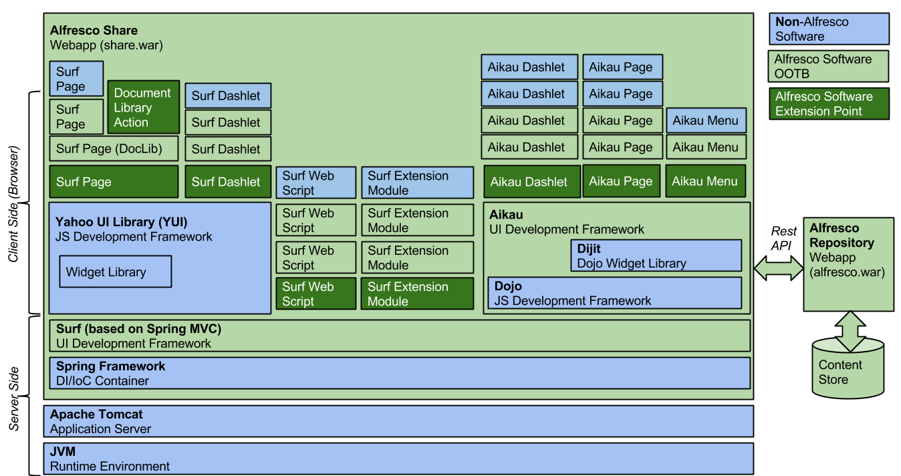
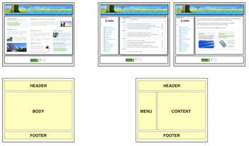
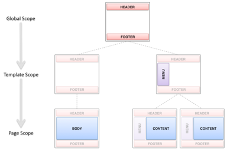
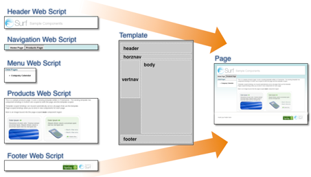
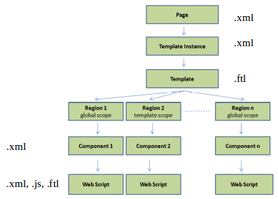

# Share Architecture

When developing for Share it is important to understand the application architecture and the underlying development frameworks. It is also important to know what extension points that are available to you for customizing the UI in a supported way.

## Introduction

Alfresco Share \(share.war\) is a web application that runs on the Java Platform. In a development environment it is usually deployed and run on top of Apache Tomcat. Share is built up of a main menu that leads to pages, which is similar to most other web applications that you might come across. However, there is one special page type called Dashboard that contains Dashlets. A Dashboard page can be configured by the end-user, who can add, remove, and organize the Dashlets on the page.

Share pages and Dashlets are implemented with something called Web Scripts, which is basically Rest-based APIs. These APIs are called Surf Web Scripts when you are dealing with the Alfresco Share web application. There is also Repository Web Scripts that are used to extend the Alfresco Repository web application \(i.e. alfresco.war\) with Rest-based APIs. We usually refer to the Surf Web Scripts as *Presentation Web Scripts* and the Repository Web Scripts as *Data Web Scripts*.

The Share Web Scripts, pages, and Dashlets are implemented with a user interface \(UI\) development framework called Surf. This framework was originally developed by Alfresco, then donated to the Spring Source foundation, and finally brought back into Alfresco. It provides a way of breaking a HTML page into re-usable component parts. Surf is built on top of the Spring Web MVC technology, which in turn uses the Spring Framework.

Developers can also add completely new pages and Dashlets to the Share UI when content should be viewed or handled in a specific way. Sometimes it is also required to modify existing pages. To customize the Share UI developers use so called *[Extension Points](dev-extensions-share-extension-points-introduction.md)*, which are supported ways of injecting new custom code that should alter the functionality of the Share web application.

The following picture gives an overview of the Alfresco Share application architecture, note that not all available extension points are illustrated in this picture:



Alfresco Share gets the content that it should display in pages and Dashlets by calling Alfresco Repository Web Scripts, which returns JSON or XML that can be incorporated into the presentation. The presentation is actually put together with two different kinds of JavaScript frameworks, Yahoo UI library \(YUI\) and the new one called Aikau, which is based on Dojo. Moving forward Aikau will replace more and more of the Surf pages and Dashlets, eventually taking over as the main client side development framework. An Aikau page is based on Surf but it makes page composition much easier than with pure Surf pages.

You can focus solely on Aikau if the only thing you are going to do is add new stuff to the Share UI. However, if you need to alter behaviour of existing pages, then you might also need to get up to speed on the details of the Surf page model, as only the following stuff has been converted to Aikau:

-   Share Header Menu and Title \(4.2\)
-   Live Search \(5.0\)
-   Filtered Search Page \(5.0\)
-   Search Management Page \(5.0\)
-   Site Management Page \(5.0\)
-   Analytics and Reporting Widgets \(5.0\)
-   Document List prototype \(5.0\)

The following sections get into a bit more details around Surf pages and Aikau pages.

## Server Side Framework \(Alfresco Surf\)

The layout of a Share page is defined with the Surf development framework, which is a server side framework \([Surf deep dive](surf-fwork-intro.md)\). This means that the involved files are processed on the server side \(compared to Browser processing of JavaScript files\). Surf is based on the Model View Controller \(MVC\) pattern where the controller\(s\) is mostly implemented in server side JavaScript \(The Rhino JavaScript engine is included on the server side\). The template is written in FreeMarker, and the model is a hash map that is set up in the controller\(s\) and available in the template.

Each page template defines one or more regions for things like header, footer, body, navigation etc, see the following picture:



To be able to reuse regions we can scope them to page, template, or global usage:



Each region is implemented as a reusable component. A component implementation is done with a Surf Web Script, which is the same thing as the REST-based request and response model, the predominant Web Service design model. The component Web Scripts will typically return HTML fragments that make up different parts of the page:



With all these different objects we might expect there to be some form of model that makes up the whole Surf UI development framework. It looks like this:



The model is referred to as the `siteData` and has more stuff than just pages and templates \([siteData Reference](../references/surf-object-xml-reference.md)\). You will however mostly be dealing with component, page, and template-instance files, which are simple XML files:

```

/WEB-INF/classes/alfresco
  /site-data
    /chrome
    /components
      ...
      global.header.xml
    /component-types
    /configurations
    /content-associations
    /extensions
    /page-associations
    /pages
      ...
      documentlibrary.xml
      ...
      search.xml
      ...
      task-details.xml
      ...
    /page-types
    /template-instances
        1-column.xml
        2-columns.xml
        3-columns.xml
        ...
        content-viewer.xml
        ...
        search.xml
        ...
    /template-types
    /themes
    
```

The Site Data model defines the [page in XML](../references/surf-object-xml-reference-page.md), like in the following example for Search \(alfresco/tomcat/webapps/share/WEB-INF/classes/alfresco/site-data/pages/search.xml\):

```

<?xml version='1.0' encoding='UTF-8'?>
<page>
   <title>Search</title>
   <title-id>page.search.title</title-id>
   <description>Search view</description>
   <description-id>page.search.description</description-id>
   <template-instance>search</template-instance>
   <authentication>user</authentication>
   <components>

      <!-- Title -->
      <component>
         <region-id>title</region-id>
         <url>/components/title/search-title</url>
      </component>

      <!-- Search -->
      <component>
         <region-id>search</region-id>
         <url>/components/search/search</url>
      </component>

   </components>
</page>

```

Here we can see that some [components](../references/surf-object-xml-reference-component.md) have been defined inline in the search page definition, instead of in the `/components` directory as separate files. The name of the page definition file is implicitly setting the page id to `search`. A corresponding [template instance](../references/surf-object-xml-reference-template-instance.md) file is expected to be present in the `template-instances` directory. In our case it will be a file called `search.xml`:

```

<?xml version='1.0' encoding='UTF-8'?>
<template-instance>
   <template-type>org/alfresco/search</template-type>
</template-instance>
```

It will have a link to the physical template that contains the layout of the page. The template files are located under a different directory called `/templates`, which is on the same level as the `site-data` directory:

```

/WEB-INF/classes/alfresco
  /site-data
  /templates
    /org
      /alfresco
        1-column.ftl
        2-columns.ftl
        3-columns.ftl
        ...
        content-viewer.ftl
        ...
        search.ftl
        ...
      
```

The `search.ftl` template file looks like this with the regions etc:

```

<#include "include/alfresco-template.ftl" />
<@templateHeader />

<@templateBody>
   <@markup id="alf-hd">
   <div id="alf-hd">
      <@region scope="global" id="share-header" chromeless="true"/>
   </div>
   </@>
   <@markup id="bd">
   <div id="bd">
      <div class="yui-t1">
         <div id="yui-main">
            <@region id="search" scope="page" />
         </div>
      </div>
   </div>
   </@>
</@>

<@templateFooter>
   <@markup id="alf-ft">
   <div id="alf-ft">
      <@region id="footer" scope="global" />
   </div>
   </@>
</@>

```

The search page reuses the global header and footer components and then defines a page specific region called search. The Web Scrip to call for the search component is already defined in the page definition XML above \(i.e. /components/search/search\). The controller file for the search Web Script looks like this \(alfresco/tomcat/webapps/share/WEB-INF/classes/alfresco/site-webscripts/components/search/search.get.js\):

```

/**
 * Search component GET method
 */

function main()
{
   // fetch the request params required by the search component template
   var siteId = (page.url.templateArgs["site"] != null) ? page.url.templateArgs["site"] : "";
   var siteTitle = null;
   if (siteId.length != 0)
   {
      // Call the repository for the site profile
      var json = remote.call("/api/sites/" + siteId);
...

```

This is server side JavaScript code that sets up a model with data for the template. The template looks like this \(alfresco/tomcat/webapps/share/WEB-INF/classes/alfresco/site-webscripts/components/search/search.get.html.ftl\):

```

<@markup id="css" >
   <#-- CSS Dependencies -->
   <@link href="${url.context}/res/components/search/search.css" group="search"/>
</@>

<@markup id="js">
   <#-- JavaScript Dependencies -->
   <@script src="${url.context}/res/components/search/search-lib.js" group="search"/>
   <@script src="${url.context}/res/components/search/search.js" group="search"/>
</@>

<@markup id="widgets">
   <@createWidgets group="search"/>
</@>

<@markup id="html">
   <@uniqueIdDiv>
      <#assign el=args.htmlid>
      <#assign searchconfig=config.scoped['Search']['search']>
      <div id="${el}-body" class="search">
         <#assign context=searchconfig.getChildValue('repository-search')!"context">
         <#if searchQuery?length == 0 && context != "always">
         <div class="search-sites">
...

```

The template is where we will find references to client side code/resources. The `css` and `js` sections above points to the client side CSS and JS that should be part of the `<head>` section in the web page, and downloaded and executed by the browser to create the user interface. So as we are starting to talk about the client side, let's dig into it a bit more in the next section.

## Client Side Frameworks \(Surf Pages and Aikau Pages\)

To get an idea of the differences between the old school Surf pages, and the new Surf pages called Aikau, we will implement a simple page in both client side frameworks. The thing that might be a bit confusing to start with is that Aikau pages are also old school Surf pages under the hood. An Aikau page actually uses a predefined Surf page as a starting point. Now let's start with an old school Hello World page and see how we can add it to the Share UI.

**Hello World Old School Surf Page**

The following steps are needed to add a Surf Page:

-   Add a Surf Page definition file \(XML\)
-   Add a Template Instance file \(XML\)
-   Add a physical Template file \(FTL\)
-   Add a properties file \(.properties\) - Optional but good practice
-   Add Web Script\(s\) that fetches content to display \(if you have `page` scoped regions and use an existing template\)

The full tutorial, and introduction to Surf Pages, can be found \([here](dev-extensions-share-architecture-extension-points-intro-surf-pages.md)\).

Next we will have a look at how to implement the same Hello World page with Aikau.

**Hello World Aikau Page**

To implement the Hello World page in Aikau we have to go through the following steps:

-   Add a Web Script descriptor \(XML\)
-   Add a Web Script template \(FTL\)
-   Add a Web Script controller \(JS\) with page layout/model
-   Add Widget to display content
-   Choose what Surf Page you want to use as a basis \(dp, hdp, rdp etc\)

The full tutorial, and introduction to Aikau Pages, can be found \([here](dev-extensions-share-architecture-extension-points-intro-aikau-pages.md)\).

## Extension Points in Alfresco Share

As you can imagine, there are loads of extension points that you can use in the Alfresco Share UI to build a customized version of the user interface. In this article we have looked at the major ones, which are old school Surf Pages, Aikau Surf pages, Aikau widgets, Web Scripts, Surf Module extensions, and Dashlets. I know we did not explicitly look at how to implement Dashlets, but it is the same thing as implementing a Web Script.

There are many more extension points though, for example the Document Library page in a site can be extended via something called Document Library Actions. It is important to know about these supported extension points, and follow them, as otherwise your code might not work in a future release of Alfresco, and you might have trouble getting the support you need.

Here is a list of each supported extension point in Alfresco Share, for a comprehensive description of each one go to the [Share Extension Points](dev-extensions-share-extension-points-introduction.md) section \(OOTB = Out-of-the-box functionality\):

|Extension Point Name|
|--------------------|
|[Share Configuration](dev-extensions-share-configuration.md)|
|[Form Controls](dev-extensions-share-form-controls.md)|
|[Form Filters](dev-extensions-share-form-filters.md)|
|[Form Field Validation Handlers](dev-extensions-share-form-field-validation-handlers.md)|
|[Evaluators](dev-extensions-share-evaluators.md)|
|[Site Presets](dev-extensions-share-site-presets.md)|
|[Share Themes](dev-extensions-share-themes.md)|
|[Document Library](dev-extensions-share-doclib-actions.md)|
|[Surf Extension Modules](dev-extensions-share-surf-extension-modules.md)|
|[Surf Web Scripts](dev-extensions-share-surf-web-scripts.md)|
|[Surf Web Script JavaScript Root Objects](dev-extensions-share-surf-web-script-js-root-objects.md)|
|[Surf Pages](dev-extensions-share-surf-pages.md)|
|[Surf Dashlets](dev-extensions-share-surf-dashlets.md)|
|[Surf Widgets](dev-extensions-share-surf-widgets.md)|
|[Aikau Menus](dev-extensions-share-aikau-menus.md)|
|[Aikau Pages](dev-extensions-share-aikau-pages.md)|
|[Aikau Dashlets](dev-extensions-share-aikau-dashlets.md)|
|[Aikau Widgets](dev-extensions-share-aikau-widgets.md)|
|[Modifying OOTB Surf Pages](dev-extensions-share-override-ootb-surf-pages.md)|
|[Modifying OOTB Surf Dashlets](dev-extensions-share-override-ootb-surf-dashlets.md)|
|[Modifying OOTB Surf Widgets](dev-extensions-share-override-ootb-surf-widgets.md)|
|[Modifying OOTB Aikau Pages](dev-extensions-share-override-ootb-aikau-pages.md)|
|[Modifying OOTB Aikau Dashlets](dev-extensions-share-override-ootb-aikau-dashlets.md)|
|[Modifying OOTB Aikau Widgets](dev-extensions-share-override-ootb-aikau-widgets.md)|
|[Modifying OOTB Surf Web Scripts](dev-extensions-share-override-ootb-surf-webscripts.md)|

-   **[Introduction to Surf Pages](../concepts/dev-extensions-share-architecture-extension-points-intro-surf-pages.md)**  
Use this information for a brief introduction to Spring Surf Pages.
-   **[Introduction to Aikau Pages](../concepts/dev-extensions-share-architecture-extension-points-intro-aikau-pages.md)**  
Use this information for a brief overview of Aikau Pages.
-   **[Surf Framework Guide](../concepts/surf-fwork-intro.md)**  
Alfresco Surf lets you build user interfaces for web applications using server-side scripts and templates without Java coding, recompilation, or server restarts. Surf follows a content-driven approach, where scripts and templates are simple files on disk so that you can make changes to a live site in a text editor.
-   **[Advanced Surf Topics](../concepts/dev-extensions-share-advanced-surf-topics.md)**  
Advanced topics in the Alfresco Surf development framework.

**Parent topic:**[Share extensions](../concepts/dev-extensions-share.md)

[Spring Framework](http://spring.io/)

[Spring MVC](http://docs.spring.io/spring/docs/current/spring-framework-reference/html/mvc.html)

[Dojo Toolkit](https://dojotoolkit.org/)

[Dijit Widget Library](https://github.com/dojo/dijit)

[Programming with Surf](surf-fwork-intro.md)

