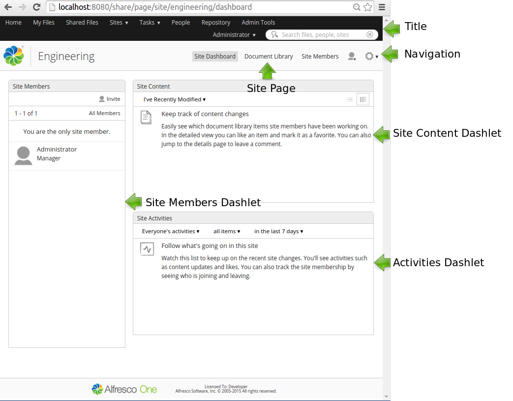

# Site Presets

A site preset contains the initial configuration for a Share Site, such as the site Dashboard layout.

|Extension Point|Site Presets|
|---------------|------------|
|Support Status|[Full Support](http://docs.alfresco.com/support/concepts/su-product-lifecycle.html)|
|Architecture Information|[Share Architecture](dev-extensions-share-architecture-extension-points.md).|
|Description|When you access a Share Site the Dashboard layout, with the Dashlets in different columns, is determined by the Site Preset that has been set for the Site type. It looks something like this for the Collaboration site type:

 ```
<?xml version='1.0' encoding='UTF-8'?>
<presets>
   <!-- Well known preset used to generate the default Collaboration Site dashboard -->
   <preset id="site-dashboard">
      <components>         
         <!-- title -->
         <component>
            <scope>page</scope>
            <region-id>title</region-id>
            <source-id>site/${siteid}/dashboard</source-id>
            <url>/components/title/collaboration-title</url>
         </component>
         <!-- navigation -->
         <component>
            <scope>page</scope>
            <region-id>navigation</region-id>
            <source-id>site/${siteid}/dashboard</source-id>
            <url>/components/navigation/collaboration-navigation</url>
         </component>
         <!-- dashboard components -->
         <component>
            <scope>page</scope>
            <region-id>component-1-1</region-id>
            <source-id>site/${siteid}/dashboard</source-id>
            <url>/components/dashlets/colleagues</url>
            <properties>
               <height>504</height>
            </properties>
         </component>
         <component>
            <scope>page</scope>
            <region-id>component-2-1</region-id>
            <source-id>site/${siteid}/dashboard</source-id>
            <url>/components/dashlets/docsummary</url>
         </component>
         <component>
            <scope>page</scope>
            <region-id>component-2-2</region-id>
            <source-id>site/${siteid}/dashboard</source-id>
            <url>/components/dashlets/activityfeed</url>
         </component>
      </components>
      <pages>
         <page id="site/${siteid}/dashboard">
            <title>Collaboration Site Dashboard</title>
            <title-id>page.siteDashboard.title</title-id>
            <description>Collaboration site's dashboard page</description>
            <description-id>page.siteDashboard.description</description-id>
            <template-instance>dashboard-2-columns-wide-right</template-instance>
            <authentication>user</authentication>
            <properties>
               <sitePages>[{"pageId":"documentlibrary"}]</sitePages>
            </properties>
         </page>
      </pages>
   </preset>
   ...    
```

 Here we can see some Surf component configuration again, if you are not up to speed on Surf and the Share architecture, then read the [Architecture section](dev-extensions-share-architecture-extension-points.md). The first two `component` definitions sets the title and navigation bar for the site. The rest of the component definitions sets the different Dashlets that should be displayed on the Dashboard. The last `pages` section is used to include the Dashboard page with layout and the different site pages.

 This Site preset looks like this:

 

 The default preset configuration for Share is specified in the tomcat/webapps/share/WEB-INF/classes/alfresco/site-data/presets/presets.xml file.

 When a new custom page has been added to Share it is not automatically visible in the Navigation bar after a site has bee created. To have a custom page be part of every new site that is created you can override the site preset for the site type.

 Here is an example of how to add a custom page to a site:

 ```
<preset id="site-dashboard">
  <components>         
    ...
  </components>
  <pages>
     <page id="site/${siteid}/dashboard">
        <title>Collaboration Site Dashboard</title>
        <title-id>page.siteDashboard.title</title-id>
        <description>Collaboration site's dashboard page</description>
        <description-id>page.siteDashboard.description</description-id>
        <template-instance>dashboard-2-columns-wide-right</template-instance>
        <authentication>user</authentication>
        <properties>
           <sitePages>[{"pageId":"documentlibrary"},{"pageId":"helloworld"}]</sitePages>
        </properties>
     </page>
  </pages>
</preset>
```

 In this case we have added a custom page called `helloworld` to the site, and this page will be directly accessible from inside the site.

|
|Deployment - App Server|tomcat/shared/classes/alfresco/web-extension/site-data/presets/presets.xml \(Untouched by re-depolyments and upgrades\)|
|[Deployment - SDK Project](../tasks/alfresco-sdk-tutorials-share-amp-archetype.md)|share-amp/src/main/amp/config/alfresco/web-extension/site-data/presets/presets.xml|
|More Information| |
|Tutorials|-   [Adding a new Preset](../tasks/dev-extensions-share-tutorials-js-customize.md) - this tutorial is not really about presets, but it starts off by setting up a new preset.

|
|Alfresco Developer Blogs|-   [Spring Surf Presets](http://blogs.alfresco.com/wp/developer/2011/11/01/spring-surf-presets/)

|

**Parent topic:**[Share Extension Points](../concepts/dev-extensions-share-extension-points-introduction.md)

