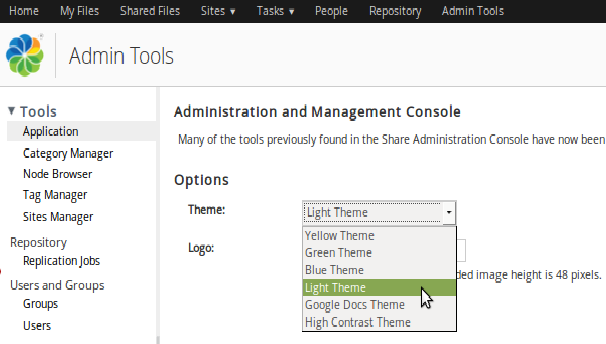

# Share Themes

The Share web application comes with a number of themes that can be used to set the look and feel of the application. It is also possible to create your own custom UI themes.

|Extension Point|Share Themes|
|---------------|------------|
|Support Status|[Full Support](http://docs.alfresco.com/support/concepts/su-product-lifecycle.html)|
|Architecture Information|[Share Architecture](dev-extensions-share-architecture-extension-points.md).|
|Description|The look and feel of the Share user interface is determined by what theme that is currently active, it provides the default CSS and image assets used across all pages. There are number of themes available out-of-the-box:

-   Light Theme \(Default\)
-   Google Docs
-   Green
-   Blue
-   High Contrast Black
-   Yellow

 The default theme can be changed via the Share Admin Console: 

 You set the theme for the whole Share UI, but you can also configure a theme per site.

It is possible to create a new custom theme based on one of these existing themes. The way to do that is to start by copying one of the themes under alfresco/tomcat/webapps/share/themes directory to a new directory under share-amp/src/main/amp/web/themes. Then update it with a new Theme ID and define the new Theme for Surf by adding a file to the alfresco/web-extension/site-data/themes directory. This XML file looks something like this:

```
<?xml version='1.0' encoding='UTF-8'?>
<theme>
    <title>My Red Theme</title>
    <title-id>theme.redTheme</title-id>
</theme>   
```

When a custom theme has been created based on an existing theme it is time to configure the look and feel for it. This involves two steps as the Share UI contains both Aikau components and YUI components, and they are styled in different ways. See the tutorials section for more information on this.

**Important:** If you are upgrading to a newer Alfresco version, and you are using a custom theme, then it is important to make sure that whatever out-of-the-box theme your custom theme is based on \(such as Green Theme\) has not changed between Alfresco versions. For example, upgrading from Alfresco version 5.0 to 5.1 will mean that all the out-of-the-box themes will have an extra images/logo-enterprise.png file. So if you upgrade to a newer Alfresco version you will also have to upgrade your custom theme to match.

|
|Deployment - App Server|It's not recommended to manually install a custom Theme directly into the application server and the exploded Share WAR.It would mean copying all the theme resource files into tomcat/webapps/share/themes, which means the files would be gone after a re-deployment or upgrade. Use a [Share AMP](../tasks/alfresco-sdk-tutorials-share-amp-archetype.md) project instead.

|
|[Deployment - SDK Project](../tasks/alfresco-sdk-tutorials-share-amp-archetype.md)|-   share-amp/src/main/amp/web/themes - the theme's resource files goes here, pretty much the stuff you copy from alfresco/tomcat/webapps/share/themes
-   share-amp/src/main/amp/config/alfresco/web-extension/site-data/themes - the theme XML file goes here

|
|More Information|-   [Introduction to Share themes](themes-intro.md)

|
|Tutorials|[Adding a custom theme](../tasks/dev-extensions-share-tutorials-add-theme.md)|
|Alfresco Developer Blogs|-   [Share Header Colour Customization](https://www.alfresco.com/blogs/developer/2015/05/19/share-header-colour-customization/) - Customizing the Share header via LESS variable override
-   [Why Alfresco 5.0.d will be a game changer for UI development](https://www.alfresco.com/blogs/developer/2015/03/24/why-alfresco-5-0-d-will-be-a-game-changer-for-ui-development/) - Aikau is from now on in its own JAR
-   [Install new Share theme via JAR file](http://blogs.alfresco.com/wp/developer/2010/11/26/install-new-share-theme-via-jar-file/)

**Note:** This tutorial does not include information about how to style Aikau components, such as the header.


|

**Parent topic:**[Share Extension Points](../concepts/dev-extensions-share-extension-points-introduction.md)

