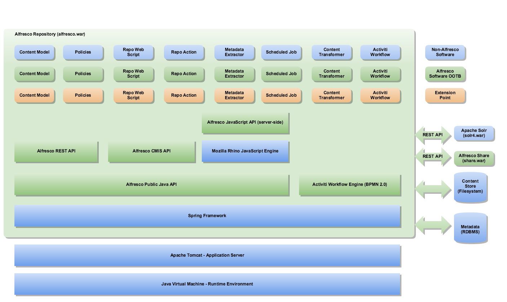

# Platform Architecture

The platform architecture consists of the repository and related services. The platform contains the key extension points for building your own extensions.

The following diagram illustrates the platform architecture and [extension points](dev-platform-extension-points.md). Note that this does not represent a complete list of [extension points](dev-platform-extension-points.md):

The Alfresco Platform consists of the repository and all services, developer [extension points](dev-platform-extension-points.md), and [APIs](dev-api-intro.md). The Alfresco repository provides storage for documents and other content. The content metadata is stored in a relational database, while the content itself is stored directly on the file system. The relationships between content items, and their various properties \(metadata\) are defined in one or more [content models](../references/dev-extension-points-content-model.md).

[Content models](../references/dev-extension-points-content-model.md) can be thought of as describing types of content and the relationships between pieces of content. For example, there is a relationship between a content that has a container functionality \(that is, folder\), and the piece of content contained within it \(that is, sub-folders and files\). There might be constraints defined in the content model, such as a content type cannot contain other content unless it is a container type.

As well as the basic content storage functionality, the platform provides a wide range of content-related services. These include core services such as the Node Service, and the Version Service. There are also higher-level services such as Thumbnail Service \(for creating thumbnail images and renditions of documents\), the Site Service used for creating and managing sites in the Share application, and the Tagging Service, which provides the ability to tag content with keywords. The following sections of this documentation provide a brief tour of the available services.

Typically these services are implemented in Java, and expose an API described by the [Public Java API](http://dev.alfresco.com/resource/AlfrescoOne/5.0/PublicAPI/).

The Alfresco platform is highly extensible. You can write extensions in Java, JavaScript, and FreeMarker, and you can write client applications in any language using the [REST API](../pra/1/topics/pra-welcome.md). You can create new [content models](../references/dev-extension-points-content-model.md) that define new content types, metadata, and relationships. You can create business workflow processes using [Activiti BPMN](../references/dev-extension-points-workflow.md), and define [custom actions](../references/dev-extension-points-actions.md) that the repository will carry out when certain events happen \(such as when new content is added to the repository\). You can even create entirely new services, if required.

The following sections of this documentation look at various extension points, the services provided by the Alfresco platform, the [APIs you can leverage](dev-api-intro.md), and even how you can customize and [extend web client applications such as Share](dev-extensions-share.md). There are many tutorials, as well as reference materials to study.

**Parent topic:**[Platform extensions](../concepts/dev-platform-extensions.md)

