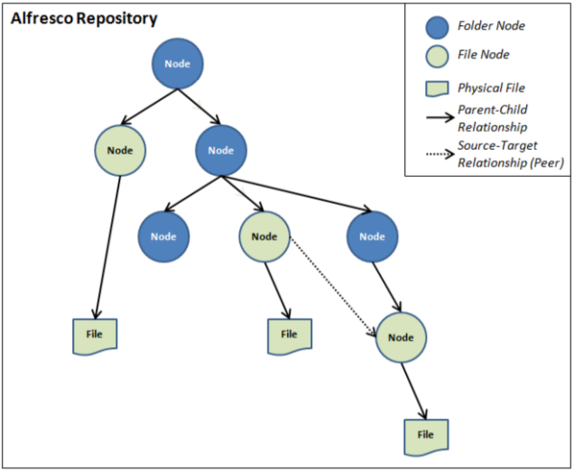
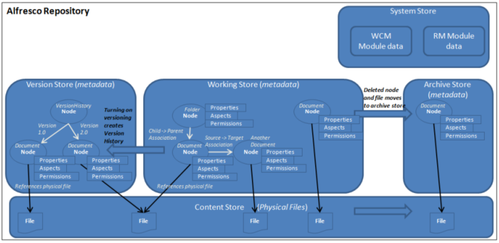
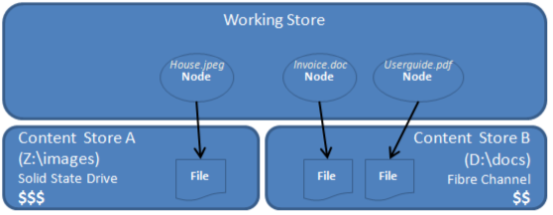
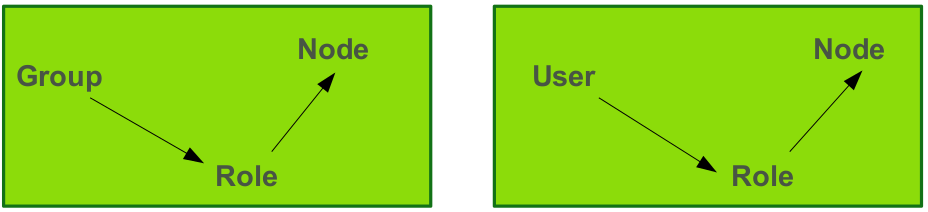
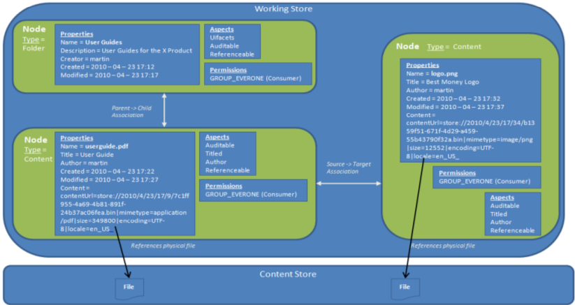

# Repository concepts

It is important as a developer to have a good understanding of the fundamental concepts of Alfresco when implementing extensions. Important concepts covered include repository, nodes, stores, types, aspects and so on.

*Key Concepts*

All files that are stored in the Alfresco content management system are stored in what is referred to as the **repository**. The repository is a logical entity that consists of three important parts:

1.  The physical content files that are uploaded
2.  The index files created when indexing the uploaded file so it is searchable
3.  The metadata/properties for the file, which are stored in a relational database management system \(RDBMS\).

When a file is uploaded to the Alfresco repository it is stored on disk in a special directory structure that is based on the date and time of the upload. The file name is also changed to the UUID \(Universally Unique Identifier\) assigned to the file when it is added to the repository. The file's metadata is stored in an RDBMS such as PostgreSQL. Indexes are also stored on the disk. When the file is added to the repository it is stored in a folder, and in the Alfresco a folder has domain specific metadata, rules, and fine grained permissions. The top folder in the Alfresco repository is called **Company Home**, although it will be referred to with the name **repository** in the Alfresco Share user interface.

*Logical Structure*

All the files and folders that are uploaded and created in the Alfresco repository are referred to as **nodes**. Some nodes, such as folders and rules, can contain other nodes \(and are therefore known as container nodes\). Nodes can also be associated with other nodes in a peer to peer relationship, in a similar fashion to how an HTML file can reference an image file. All nodes live in a **Store**. Each store has a root node at the top, and nodes can reference specific files, as shown in the following diagram:



*Stores Overview*

The Repository contains multiple logical stores. However, a node lives only in one store. Most of the stores are implemented as data in the connected RDBMS, only the **Content Store** is implemented so as to store items on disk:



*The main stores*

The **Working Store** \(`workspace://SpacesStore`\) contains the metadata for all active/live nodes in the Repository. This store is implemented using a database \(RDBMS\).

The **Content Store** contains the physical files uploaded to the Repository and is located in the \{Alfresco install dir\}/alf\_data/contentstore directory on the filesystem by default, but can also be configured to use other storage systems, for example, Amazon S3. It is also possible to define content store policies for storing files on different storage systems, effectively defining more than one physical content store.

Whenever a node is deleted, the metadata for the node is moved to the **Archive Store** \(`archive://SpacesStore`\), which uses the configured database. The physical file for a deleted node is moved \(by default after 14 days\) to the \{Alfresco install dir\}/alf\_data/contentstore.deleted directory, where it stays indefinitely. However, a clean-up job can be configured to remove the file at a certain point in time \(referred to as eager clean-up\).

When the `versionable` aspect is applied to a node, a version history is created in the **Version Store** \(`workspace://version2Store`\). Versioned node metadata is stored in the database and files remain in the \{Alfresco install dir\}/alf\_data/contentstore directory. Versioning is not applicable to folder nodes.

The **System Store** is used to save information about installed Alfresco extension modules.

*Content Store Implementation*

When considering file storage, it should be noted that files added to Alfresco can be of almost any type, and include images, photos, binary document files \(Word, PPT, Excel\), as well as text files \(HTML, XML, plain text\). Some binary files such as videos and music files can be relatively large. Content store files are located on the disk, rather than in the database as BLOBs. There are several reasons for this:

1.  It removes incompatibility issues across database vendors.
2.  The random file access support \(as required by CIFS and other applications\) cannot be provided by database persistence without first copying files to the file system.
3.  Possibility of real-time streaming \(for direct streaming of files to browser\).
4.  Standard database access would be difficult when using BLOBs as the most efficient BLOB APIs are vendor-specific.
5.  Faster access.

*Content Store Selectors*

The *content store selector* provides a mechanism to control the physical location on disk for a content file associated with a particular content node. This allows storage polices to be implemented to control which underlying physical storage is used, based on your applications needs or business policies.

For example, it is possible to use a very fast tier-1 Solid State Drive \(SSD\) for our most important content files. Then, based on business policies that have been decided, gradually move the data, as it becomes less important, to cheaper tier-2 drives such as Fiber Channel \(FC\) drives or Serial ATA drives. In this way, it is possible to manage the storage of content more cost effectively:



*Store Reference*

When working with the APIs a store is accessed via its **store reference**, for example `workspace://SpacesStore`. The store reference consists of two parts: the protocol and the identifier. The first part \(for example `workspace`\) is called the protocol and indicates the content you are interested in, such as live content \(`workspace://SpacesStore`\) or archived content \(`archive://SpacesStore`\). The second part is the identifier \(the type of store\) for the store, such as `SpacesStore`, which contains folder nodes \(previously called spaces\) and file nodes data, or for example `lightWeightVersionStore` that contains version history data.

**Important:** The reason some things are referred to as spaces \(for example SpacesStore\) is that in previous versions of Alfresco a folder used to be called a space. The Share user interface has generally been changed to use the name folder instead of the name space. However, there is functionality, such as Space Templates, that still uses the term "space". A space can simply be thought of as a folder.

*Node Information*

A node usually represents a folder or a file. Each store also contains a special root node at the top level with the type `sys:store_root`. The root node can have one or more child nodes, such as the Company Home folder node. Each node has a primary path to a parent node and the following metadata:

-   **Type**: a node is of one type, such as Folder, File, Marketing Document, Rule, Calendar Event, Discussion, Data List and so on.
-   **Aspects**: a node can have many aspects applied, such as Versioned, Emailed, Transformed, Classified, Geographic and so on.
-   **Properties**: both types and aspects define properties. If it is a file node then one of the properties points to the physical file in the content store.
-   **Permissions**: access control settings for the node.
-   **Associations**: relationships to other nodes \(peer or child\).

*Node Reference*

A node is uniquely identified in the Repository via its **node reference**, also commonly referred to as *NodeRef*. A node reference points to a store and a node in that store. A node reference has the following format: `{store protocol://store identifier}/UUID` such as for example `workspace://SpacesStore/986570b5-4a1b-11dd-823c-f5095e006c11`. The first part is the store reference and the second part is a Universally Unique Identifier \(UUID\) for that store. Node references are used a lot in the available APIs so it is good to have an idea of how they are constructed.

*Node Properties*

The node properties, also referred to as the node's **metadata**, contains the majority of the information for a node. The `sys:store-protocol`, `sys:store-identifier`, and `sys:node-uuid` properties contains all the data needed to construct the NodeRef, uniquely identifying the node. The special property called `cm:content` points to where the physical content file is stored on disk \(unless it is a folder or other contentless node type\). All properties are either contained in a type or in an aspect defined in a content model. When a node is created some properties are automatically set by the system and cannot be easily changed, they are called **audit properties** \(from the `cm:auditable` aspect\) and are Created Date, Creator, Modified Date, Modifier, and Accessed. Defining new domain specific node properties, together with the types and aspects that contain them, is the primary way of classifying a node so it can be easily found via searches.

*Metadata/Property Extractors*

Some of the properties of a file node are set automatically when it is uploaded to the Repository, such as *author*. This is handled by **metadata extractors**. A metadata extractor is set up to extract properties from a specific file MIME type. There are numerous metadata extractors available out-of-the-box covering common MIME types such as MS Office document types, PDFs, Emails, JPEGs, HTML files, DWG files and more. The metadata extractors are implemented via the Tika library, although custom metadata extractors are available. Each metadata extractor implementation has a mapping between the properties it can extract from the content file, and what content model properties that should be set as node metadata.

*Node Associations*

There are two types of associations:

-   **Parent** to **Child** associations - these are for example folder to file associations where deleting the folder will cascade delete its children.
-   **Peer** to **Peer** - an example could be article to image associations where deleting the article does not affect the related image node\(s\). These associations are also referred to as source to target associations.

*QName*

All properties are defined within a specific content model, which also defines a unique **namespace**. For example, a property called `description` can be part of many namespaces \(content models\). To uniquely identify what `description` property is being referenced, a fully qualified name, or a `QName`, is used. A QName has the following format: `{namespace URL}property local name`, for example:

```
{http://www.alfresco.org/model/content/1.0}description
```

The first part in curly braces is the namespace identifier defining the content model that the property is part of. The second part is the local name of the property \(that is *description* in this case\).

A QName is used for types, aspects, properties, associations, constraints and so on. The QName for the generic folder type that is part of the out-of-the-box document content model is `cm:folder`. Note the use of `cm` to denote the namespace. Each content model defines a prefix for each namespace that is used in the content model. Each type, aspect, property and so on in the content model definition uses the namespace prefix instead of the full namespace URL. You will also use the prefix when referring to entities such as types, aspects, properties, in the different APIs.

*Permissions*

Permissions are set up per node and a node can inherit permissions from its parent node. A Role \(Group\) Based Access Control configuration is the preferred way to set up permissions in the repository. However, permissions can also be set for an individual user. Groups and users can be synchronized with an external directory such as LDAP or MS Active Directory. Some groups are created automatically during installation:

-   **EVERYONE** – all users in the system
-   **ALFRESCO\_ADMINISTRATORS** – administrators with full access to everything in the Repository.
-   **ALFRESCO\_SEARCH\_ADMINISTRATORS** – can access the Search Manager tool and set up search filters \(facets\).
-   **SITE\_ADMINISTRATORS** – can access the Site Manager tool and change visibility of sites, delete sites, and perform site related operations.
-   **E-MAIL\_CONTRIBUTORS** – users that can send email with content into Alfresco.

Permission settings involve three entities:



There are a number of out-of-the-box roles:

1.  Consumer
2.  Contributor
3.  Editor
4.  Collaborator
5.  Coordinator

Whenever a Share site is created there are also four associated groups created that are used to set up permissions within the site. In the repository, groups are prefixed with `GROUP_` and roles with `ROLE_`, this is important when referring to a group or role when using one of the APIs.

**Important:** A **Site** is a collaboration area in Alfresco Share where a team of people can collaborate on content.

*Owner*

The Repository contains a special authority called owner. Whoever creates a node in the repository is called the owner of the node. Owner status overrides any other permission setting. As owner you can do any operation on the node \(basically the same as being coordinator/admin\). Anyone with Coordinator or Admin status can take ownership of a node \(`cm:ownable` is then applied\).

*Folder Node and File Node Overview*

The diagram illustrates a typical folder node with a child file node when it has been classified with the out-of-the-box default document content model:



**Parent topic:**[Architecture](../concepts/dev-arch-overview.md)

