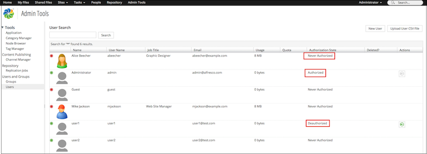

# Working with Alfresco licenses

Access to Alfresco One is licensed on a per user basis.

You can register any number of users in Alfresco \(see [Setting up Alfresco authentication and security](auth-intro.md)\) and a license is only consumed when the registered user logs in to Alfresco and is authorized.

You can see a list of users along with their authorization states on the **Admin Console \> Users and Groups \> Users** page. A registered user can have any one of the following states:

-   **Never Authorized**: Specifies that the user has been registered but never logged in to Alfresco.
-   **Authorized**: Specifies that the user has successfully logged in to Alfresco.
-   **Deauthorized**: Specifies that the Administrator has removed the user from the authorization list.

If a user attempts to login for the first time and the user license limit has been exceeded, the login attempt will fail.

-   **[Uploading a new license](../tasks/at-adminconsole-license.md)**  
The access and use of Alfresco is managed by your license. The license is a file that you upload into Alfresco, which sets limits on the maximum number of users and a maximum number of content objects that you can use. Your limitations are set when you purchase the license from Alfresco. To increase the limitations, contact Alfresco to obtain a new license.
-   **[Authorize users](../tasks/license-authorize.md)**  
Registered users are authorized the first time they login to Alfresco unless they are Alfresco administrators, in which case they are pre-authorized.
-   **[Deauthorize an authorized user](../tasks/license-deauthorize.md)**  
You can remove authorized users from the authorization list by deauthorizing them.

**Parent topic:**[Administering](../concepts/ch-administering.md)

