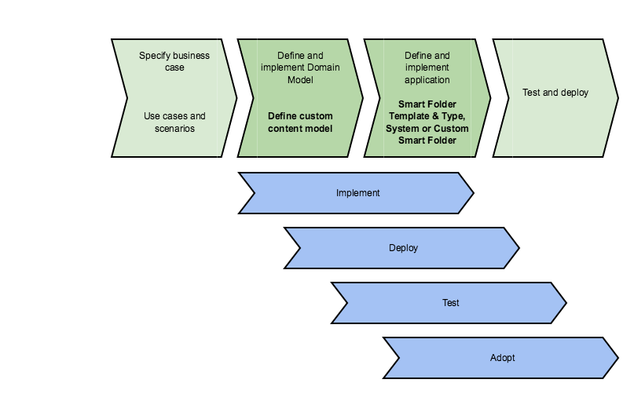

# Planning and implementing Smart Folders

Consider the business requirements for creating Smart Folders in Alfresco.

This information is primarily for business analysts, who are responsible for creating and defining the business scenario that requires Smart Folders.

Before you use Smart Folders, consider the use cases and scenarios that are appropriate to your business problem. Then you can:

-   Define a custom content model. To get you started, you can use the example model that is provided with the Smart Folders tutorial. See [Smart Folders tutorial](../tasks/sf-tutorial.md) for more information. For more information on content models in Alfresco, see [Content modeling with Model Manager](admintools-cmm-intro.md).
-   Create a Smart Folder Template, which defines the queries and filing rule for your Smart Folder structure, and property propagation rules for file uploads. The Smart Folder Template is a JSON file. See [Smart Folder Template syntax](sf-ref-template-guidance.md) for more information.
-   Choose Type-based, System, or Custom Smart Folders to associate a Smart Folder Template with a physical repository folder. See [Type-based, System, and Custom Smart Folders](sf-folder.md) for more information.
-   In an advanced setup, you might need to:
    -   Enable Share actions in the `share-config-custom.xml` file. See [Configuring Share Actions with Smart Folders](sf-share-actions.md) for more information.
    -   Configure other Smart Folders properties in the `alfresco-global.properties` file. See [Smart Folders global properties settings](sf-ref-global-props.md) for more information.

You can then test and deploy your solution. Use the [Smart Folders tutorial](../tasks/sf-tutorial.md) to understand more about the basic Smart Folders setup.

This diagram shows the recommended workflow:

**Parent topic:**[Configuring Smart Folders](../concepts/sf-intro.md)

