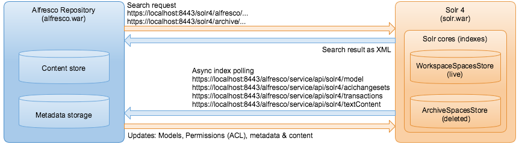

# Solr overview

Alfresco supports use of the Solr search platform for searching within the Alfresco repository.

Solr is an open source enterprise search platform that uses lucene as indexing and search engine. Solr is written in Java and runs as a standalone search server. Alfresco sends HTTP and XML input to Solr and searches for content. Solr updates the cores or indexes and returns the result of the query in XML or JSON format.

**Note:** To confirm which application servers Alfresco supports for running the Solr application on, see the [Supported Platforms](http://www.alfresco.com/services/subscription/supported-platforms) matrix for your version of Alfresco One.

There are two cores or indexes in Solr:

-   **WorkspaceStore**: used for searching all live content stored at alfresco/solr4 within the Solr search server.

-   **ArchiveStore**: used for searching content that has been marked as deleted at alfresco/solr4 within the Solr search server.

**Note:** Solr 4 is the default search mechanism for new installations installed with the Setup Wizard. Also, the Solr 4 server is supported only when running in a Tomcat application server. Therefore, if you are running Alfresco within a different application server and you wish to use Solr 4 search, you must install Tomcat.

**Important:** Every Alfresco installation is supplied with a generic certificate and SSL keys. For security reasons, it is advised that you generate a new set of keys to secure your Solr communication and access to the Solr Admin Console. For more information, see [Configuring Solr](configure-solr4.md) and [Generating secure keys for Solr communication](../tasks/generate-keys-solr4.md).

-   **[Advantages of Solr 4 over Solr 1.4 search](../concepts/solr-benefits.md)**  
Solr 4 search server brings improvements and new features over Solr 1.4 with respect to scalability, performance, and flexibility.
-   **[Eventual consistency](../concepts/solr-event-consistency.md)**  
Alfresco One 5.1.5 introduces the concept of eventual consistency to overcome the scalability limitations of in-transaction indexing.

**Parent topic:**[Configuring search](../concepts/solr-home.md)

