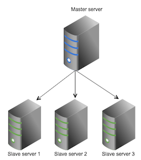

# Solr replication

Solr replication uses the master-slave model to distribute complete copies of a master index to one or more slave servers.

The master server receives all updates and all changes \(such as inserts, updates, or deletes\) are made against a single master server. Changes made on the master are distributed to all the slave servers which service all query requests from the clients. This division of labor enables Solr to scale to provide adequate responsiveness to queries against large search volumes.

The master server tracks the models, metadata, permissions, and content where as the slave server only tracks the models.

The figure below shows a Solr configuration using index replication. The master server's index is replicated on the slaves.

The master-slave replication requires non-SSL communication between the master server and the slave server.

-   **[Solr replication: advantages and disadvantages](../concepts/solr-replication-adv.md)**  
There are advantages and disadvantages of using a master-slave replication.
-   **[Solr replication configuration](../concepts/solr-replication-conf.md)**  
The Solr replication feature is implemented as a `RequestHandler`. The simplest configuration involves one Alfresco node, one Solr master, and one Solr slave.
-   **[Solr master-slave reconfiguration](../concepts/master-slave-reconf.md)**  
There are additional master-slave configuration requirements for Solr, such as adding a slave server and promoting a slave server.

**Parent topic:**[Configuring search](../concepts/solr-home.md)

