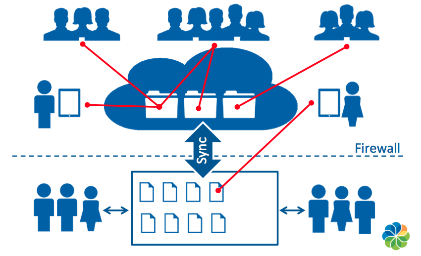

# Alfresco One overview

Alfresco One is a hybrid cloud Enterprise Content Management \(ECM\) platform that manages and synchronizes content across on-premises and cloud repositories. Industry-leading mobile support and a wide range of application integrations allow users to access and collaborate on content wherever and however they work. Alfresco One’s open, modern architecture maximizes flexibility, allowing companies to meet unique and evolving business needs with much less effort and expense than proprietary ECM systems require.

With Alfresco One, document management, collaboration, and process automation can be synced to the cloud, avoiding the risks associated with uncontrolled consumer file sharing and enabling secure collaboration outside of the firewall.

Alfresco is an enterprise content platform that you can use in the cloud or behind your firewall. It helps you to store and share the documents that every business depends on.

The Alfresco content platform allows you to manage any type of content: from simple office documents, to scanned images, photographs, and even large video files. The built-in workflow feature allows companies to automate document-intensive business processes, saving time and money. The native collaboration features enable secure collaboration, inside or even outside the firewall.

Technical capabilities include:

-   [Search and discovery](solr-home.md): split searching across multiple index servers for performance gains on both query concurrency and for large indexes, and use Solr sharding to further extend capabilities
-   [Scale](http://docs.alfresco.com/s3connector1.3/concepts/S3content-intro.html): one billion document scalability using the Alfresco S3 connector and Amazon Web Services, with the capability to ingest over 1000 documents per second
-   [Encrypting content](manage-cs-home.md): Secure your business critical content with content stores and Alfresco Content Encryption
-   [Modularity](dev-for-developers.md): extend Alfresco using API extension points, and release and install Share separately
-   [Smart Folders](sf-intro.md): flexible, contextual view of content, combining the power of search queries with the simplicity of presenting content in folders
-   [Content modeling](admintools-cmm-intro.md): easy creation of custom metadata models \(aspects, types and forms\), flexible content organization and actions
-   [Integrations](library-items-individual.md): work seamlessly with Microsoft Office and Google Docs
-   [Share and collaboration](manage-share.md): easy web-based collaboration on content and workflow
-   [Workflows](../topics/wf-howto.md): powerful in-built Alfresco workflow, that you can extend to full business process management with Activiti
-   [Enterprise to Cloud Sync](cloud-sync-intro.md): synchronize your content to Alfresco in the Cloud
-   [Mobile](../topics/mobile-config.md): Work from anywhere with Android and iOS apps
-   [Modules](install-integrations-overview.md): extend Alfresco with a variety of features including Alfresco Records Management, Analytics, Media Management, and Outlook Integration modules
-   [Transformations](managing-transformations.md): transform from one file type to another; for example, when using Alfresco Document Transformation Server
-   [Security and authentication](auth-intro.md): range of security options supported, including LDAP and Active Directory, with SSL encryption
-   [Monitoring](monitoring-intro.md): use a variety of tooling to monitor and trace activity
-   [Importing and transferring files](import-transfer.md): Publish content to other applications
-   [Administering](configuration-overview.md): ability to administer your Alfresco system using the Admin Console, or by using properties files, or JMX settings
-   [Migrating](migrating.md): you can migrate your Alfresco servers and databases
-   [Backing up and restoring](ch-backup-restore.md): back up the Alfresco repository
-   [Auditing](audit-intro.md): you can enable audit activity in Alfresco
-   [Replicating content](admintools-replication-config.md): automatically replicate folders and content between repositories
-   [Clustering](ha-intro.md): implement multiple Alfresco instances in a clustered environment
-   [Multi-tenancy](mt-intro.md): you can configure Alfresco as a single-instance, multi-tenant environment

-   **[Content applications](../concepts/apps-content-about.md)**  
 Alfresco can be used for building most ECM applications. Aside from the major applications such as document, image, records, digital asset, and web content management, there are a number of specific applications and use cases that add value to the enterprise.
-   **[Alfresco One architecture](../concepts/alfresco-arch-about.md)**  
At the core of the Alfresco system is a repository supported by a server that persists content, metadata, associations, and full text indexes. Programming interfaces support multiple languages and protocols upon which developers can create custom applications and solutions. Out-of-the-box applications provide standard solutions such as document management and records management.

**Parent topic:**[Alfresco One](../concepts/welcome.md)

