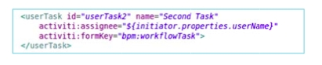

# Specifying the task type

Each task in a process definition must correspond to a type in the task model. These tasks have properties which the workflow and user interface can use to present and gather information from the user, change the behavior of the workflow, and monitor the workflow. Tasks interact with the form system to display the forms that the user sees in Alfresco Share.

You specify the task type using the **formKey** attribute on a userTask element. If you are developing your BPMN from scratch you can specify this in your XML. If you are using the Activiti designer you can specify it under the main configuration for a task.

**Parent topic:**[Task model](../concepts/wf-task-model.md)

