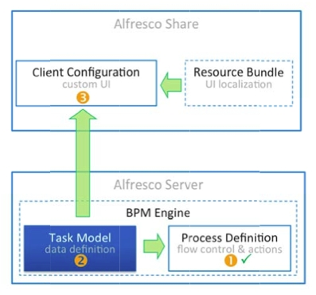
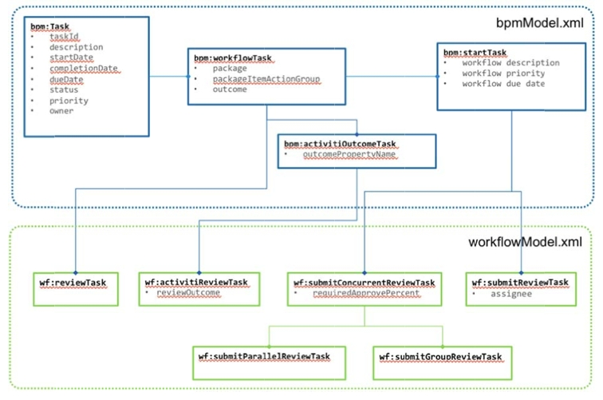
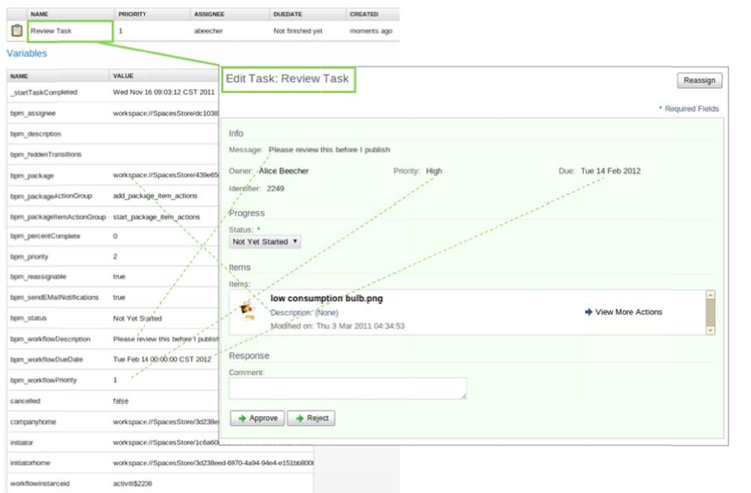

# Task model

The task model is a description of each task in a workflow. It defines attributes associated with that task. A user interface component can use this description to automatically generate an interface suitable for displaying the task information, in addition to initializing a newly created task instance.

The client configuration allows for customization of the UI component that is used for presenting workflow‐related information to the user and taking inputs from the user. Alfresco uses resource bundles to select the text that displays. Resource bundles allow language-specific strings to be used to display information about a workflow or task. The following diagram shows the relationship between the process definition and the task model on the server, and the client configurations and resource bundle in the client.

When creating workflows you will need to create the process definition using the graphical designer, create a task model to define your specific metadata items required on a task, and optionally look at customizing the user interface to support the custom task model that you have defined. Using a resource bundle is optional.

Alfresco ships with two default workflow models that support the default set of process definitions.

-   **bpmModel.xml**

    is the basic workflow content model

-   **workflowModel.xml**

    contains more detailed tasks and specializes the basic tasks from the BPM model

The task model is important when considering user interfaces, as the properties from task types are the only properties which can be shown to the user. The following diagram shows how a review task, which is of type **wf:activitiReviewTask** maps to the user interface. The property list in the background is taken from the Activiti workflow explorer.

-   **[Specifying the task type](../concepts/wf-specifying-task-type.md)**  
Each task in a process definition must correspond to a type in the task model. These tasks have properties which the workflow and user interface can use to present and gather information from the user, change the behavior of the workflow, and monitor the workflow. Tasks interact with the form system to display the forms that the user sees in Alfresco Share.

**Parent topic:**[Creating and managing workflows](../topics/wf-howto.md)

