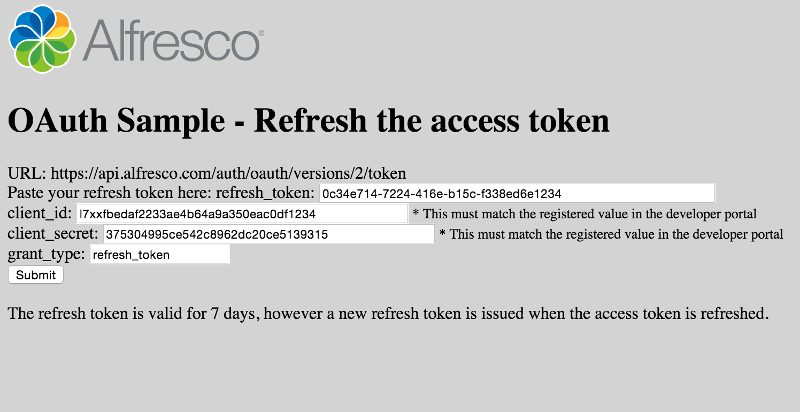

# Refreshing an access token

After one hour, your application's access token becomes invalid. You can use the refresh token to request a new access token without having to re-authenticate with the user. The refresh token is valid for 28 days or until a new access token is requested.

When the access token expires, API requests will receive an HTTP 401 response with the following body:

```

{
  "error":"invalid_request",
  "error_description":"The access token expired"
}
```

**Note:** The error description `The access token expired` is the only way your application can recognize this error. Your application should request a new access token using the refresh token.

The following screenshot is from the Alfresco OAuth sample. The refresh token is copied and pasted from the JSON response returned when the original access token was granted.



The response will have a body that looks like this:

```

{
  "access_token":"28f88a82-a62b-4e44-9312-16a4a5d2e71c",
  "token_type":"Bearer",
  "expires_in":3600,
  "refresh_token":"e98f372c-e5a6-49e5-ba55-a0358d877eb2",
  "scope":"public_api"
}
```

You can refresh the access token at any time before the timeout expires. The old access token becomes invalid when the new one is granted. The new refresh token supplied in the response body can be used in the same way.

**Parent topic:**[Authentication for Alfresco Cloud](../../../pra/1/concepts/pra-authentication-cloud.md)

