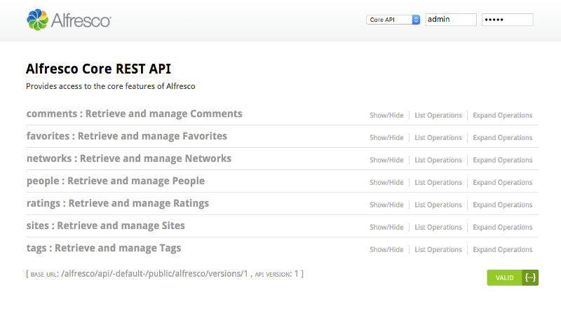
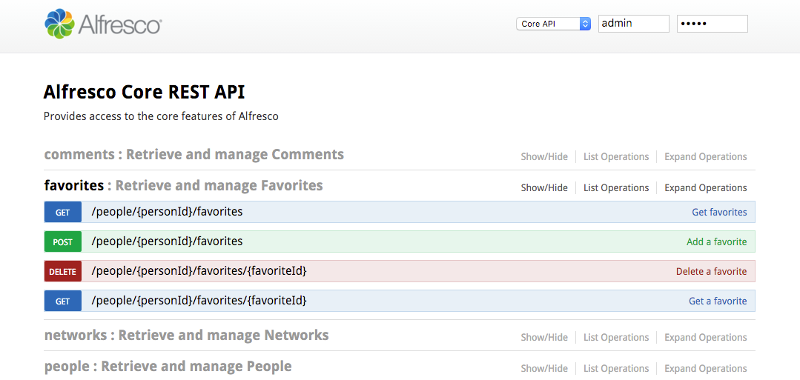

# The REST API Explorer

The REST API Explorer documents all the API methods available to you, and lets you try those methods out.

The REST API Explorer, based on the [OpenAPI initiative](https://openapis.org/), gives you interactive documentation for the [Alfresco REST API](../topics/pra-welcome-aara.md). You can access our online REST API Explorer at [https://api-explorer.alfresco.com/51](https://api-explorer.alfresco.com/51), and if you have the Alfresco SDK you can also [run the Explorer on your local machine](../../../concepts/alfresco-sdk-tutorials-using-rest-api-explorer.md).

This screenshot shows what the REST API Explorer looks like:

Use the userid admin and password admin if your are using the online REST API explorer.

To explore the operations on a specific entity, for example **favorites**, just click on it:

Now you can click on each of the available operations and test them on Alfresco.

You can use the API with another user than `admin` by changing the username and password in the upper right corner of the screen

The REST API consists of two parts the Core API, and the Workflow API. You can switch between the two by clicking on the drop down box, and selecting **Core API** or **Workflow API**

**Parent topic:**[Alfresco REST API](../../../pra/1/topics/pra-welcome-aara.md)

